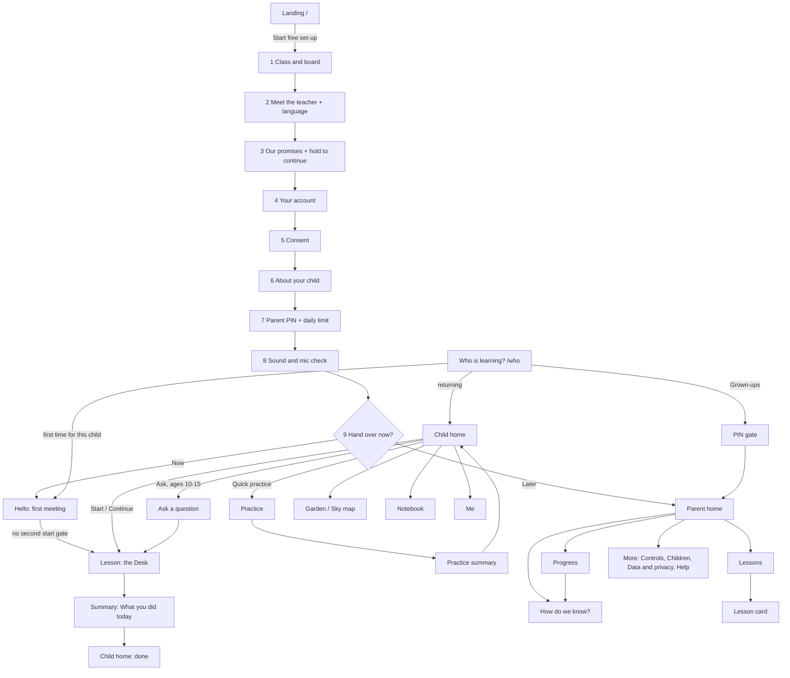

# PRODUCT-DESIGN-V2: the final product design spec for Taxila

**Date:** 2026-10-03 · **Status:** FINAL spec for build. It was chosen by the design director from two competing
directions, and it **replaces** the UI parts of `docs/research/design/PRODUCT-DESIGN.md` (v1) wherever the two
disagree. Wherever this file says nothing, v1 still holds: the dp-budget method, ReactionGate, the ledger, the
parent PX rules, the voice ladder and the safety predicates.
**Owner directive answered:** `context/decisions.md#owner-design-v2-directive`.
- Product design, UI and UX are "extremely weak right now", and signalling and the flows must be great.
- UI copy is English only.
- Rich illustration is welcome, generated through Codex.
- The teacher is a highly detailed, expressive, human-like animated face.

**Inputs:**
- `docs/design/audit/AUDIT.md`: 25 ranked problems and 174 production shots.
- `docs/design/directions/calm-mastery.md`, called **CM** below.
- `docs/design/directions/child-first-wonder.md`, called **CFW** below.
- `docs/design/teacher/TEACHER-VISUAL.md`, called **TV** below.
- `context/rejected.md`, `context/decisions.md` (`ds-*`, `avatar-*`) and the `src/` tree as it is today.

**Measured for this spec (2026-10-03):**
- Script: `docs/design/v2/tokens-check.py`. Output: `docs/design/v2/tokens-check-2026-10-03.json`.
- Every colour pair in the final token file passes WCAG 2: **0 failures in light and 0 in dark** (34 pairs per
  theme).
- Colour-blind (CVD) collisions are listed in §7.1.
- The lamp-hue lint, now with a saturation floor, found **4 tokens that collide with the lamp**. All four are
  removed or replaced here:
  - `--d5-haldi`;
  - the art "sand" tint;
  - the old parent `--p-yourturn-*` pair (two tokens).
- Font bytes come from CM's measurement: `calm-mastery-fonts-2026-10-03.json`, n = 1 fetch per family.

**Critique pass (2026-10-03, same day).** An adversarial review against the audit, the safety floor and the image pack
changed this file in place. The main changes:
- §12 no longer embeds its own (stale, 152-image) Codex prompt. `docs/design/assets/CODEX-PROMPT.md` and `MANIFEST.json`
  are the one source, and §12.2 maps every image to the screen that uses it.
- New designed states: **back online / sent** (§4.7 RC), **no offline pack** (T2), consent-dependent surfaces (§3.13),
  the child PIN (§6.5.4), "Talk to a grown-up at home" and "Show a grown-up" as real screens (§6.4.9, §6.3.5).
- The "AI teacher" disclosure is now visible in the Work and Keyboard layouts too (§6.3.4), not only under the large
  face. The `resting` copy no longer implies the teacher has a life outside lessons (§6.3.3).
- New server lint **G-LEAK-1** for leaked stage directions (audit §4.4). Audit #15 is marked partial until S3h lands.
- Low-end rules made explicit: no runtime blur or `backdrop-filter`, one preview clip audible at a time, no autoplay
  video on cellular or Save-Data (§6.3.4, §6.3.9, §6.1.1).

**Not measured:** no child, parent, TalkBack user or budget phone has seen anything in this file. Every timing and
size is a starting value. §15 names the test that replaces each one.

**Evidence tags:**
- **[M]** measured, with its method given.
- **[D]** a design decision this spec makes.
- **[G]** gated: it ships only if the named test passes.
- **[I]** a provisional number.
- **[R]** a change to an existing `context/` decision. Its reversal condition is in §15 and in
  `context/inbox/design-v2.json`.

**Copy law.**
- The UI strings in this file are rendered copy.
- **They must never be pasted into `compile()`, a persona or any prompt.** Repo law: anything sentence-shaped in a
  prompt gets recited.
- The teacher's speech appears here only as shapes, written like this: ⟨greets by name, asks one question⟩.
- Pronouns: "she" means the teacher only in this document's prose. In the product every teacher pronoun comes from
  the character record, and copy about the child uses their name or "they".

---

## 0. The decision on one page

1. **Base: Calm Mastery. Graft: the best of Child-First Wonder.** CM wins on signalling clarity, buildability,
   low-end performance and the onboarding flow. CFW wins on delight for ages 6–9, the receipt and watch states, the
   no-lost-answer outbox, the chalkboard as a real lesson surface, and the painted world. The scorecard is in §1.
2. **The Desk** is the one lesson layout, at every size. It has four zones that never overlap:
   - the **Teacher window**, holding her face;
   - the **Question card**, holding the ask, pinned;
   - the **Work tray**, holding a module, a chalkboard, picture tiles or a number pad, and only when one exists;
   - the **Answer dock**, holding how you answer.

   Her face is never drawn over content. A zone with nothing in it does not render. There are two geometries, Face
   and Work, plus a keyboard mode (§6.4).
3. **The Lamp is the turn signal.** Marigold `#FFB21E` lights exactly one element: the Answer dock, and only in
   YOUR TURN.
   - The words "Your turn" sit inside the lit dock.
   - On the same frame she leans in, a two-note chime plays and the phone ticks once.
   - Marigold appears nowhere else in the product: not on buttons, not in art, not in the parent corner. [D]
4. **The question never disappears.** Every hand-over carries `ui.ask`, the question in written form.
   - The ask is pinned on the Question card from the first frame she asks it until the item resolves.
   - "Hear the question" replays the ask itself, never the end of her turn.
   - Captions show what she is saying, and the card shows what she is asking. The two are never merged. [D]
5. **Eight floor states, each carried six ways: face, word, glyph/shape, sound, haptic, then colour.**
   - The states are idle, speaking, showing, yielding, your turn, listening, heard and thinking.
   - "heard" (a receipt inside 150 ms) and "showing" (watch, don't touch) are grafted from CFW.
   - A greyscale, muted screenshot must still say whose turn it is. [D]
6. **Nothing fails silently, and no answer is ever lost.**
   - Every answer is written to an IndexedDB outbox *before* it is sent, and retried at 1, 3 and 6 s.
   - Every failure maps to one of nine designed trouble states, each with a plain English sentence, one action and
     the state of the child's answer. [D]
7. **Her face is verdict-neutral, and the verdict lives on the work.** ReactionGate stands.
   - Her face plays the same program after a right answer and a wrong one.
   - A verified-correct answer gets a drawn tick on the child's answer chip and the concept payoff (the frog lands
     on 14).
   - A wrong answer gets no red and no cross. It gets "Let's look again" and a visible next step.
   - Delight fires only on effort or insight, under its budget.
   - CM's "delighted face on correct" and "curious face on wrong" are both **overruled**. [D]
8. **One teacher, one person, everywhere.**
   - One character record (`shared/tutors.js`) supplies name, pronouns, look, voice and stills to every surface.
   - The two 2D cartoon faces are retired.
   - The lesson renders the 3D rig at its tier (TV §10). Every plate, still and clip is rendered *from that rig*.
   - Class is asked first in onboarding, so the parent meets the actual teacher. [D]
9. **A painted world with a calm UI.** Gouache-look art (Codex-generated, §12) gives every child screen a place:
   - ages 6–9 get a sunlit courtyard;
   - ages 10–15 get a rooftop at dusk;
   - the lesson's Teacher window "lights down" to a dusk stage with a warm pool behind her.

   The UI on top stays quiet: paper, ink, one lamp. It settles and never bounces. [D]
10. **English chrome, her own voice.**
    - Every label, button, heading, notification and image is English and free of text.
    - She speaks Hindi, English or Hinglish as the family chose, and captions show exactly what she says.
    - Hindi words in the UI are removed, including brand-ish ones: "Kaise pata?" becomes "How do we know?". [D]
11. **Progress is a world that grows, never a score.**
    - Ages 6–9 see a Garden of plants; ages 10–15 see a Sky map of stars.
    - A **chapter seal** appears only when the ledger says every skill in a chapter is Got it or Secure. It is a
      state of the map, never a collectible. This answers the owner's "badges" request inside the motivation rules.
    - There are no points, streaks, coins, trophies or counts on child screens, apart from two gated exceptions for
      Older children (§15). [D]
12. **Launch target:** classes 4–7. The reference band is **B3 (classes 5–7)**, with **B2 (class 4)** a close
    second. Every screen is specified for B3 first and for Young second.

---

## 1. Scorecard: Calm Mastery vs Child-First Wonder

The scores are a design-director judgement on a 1–5 scale. "Because" names the deciding evidence. The weights favour
what the audit found broken: signalling and robustness count double.

| criterion (weight) | CM | CFW | because |
|---|---|---|---|
| **Signalling clarity** (×2) | **5** | 4 | **CM:** the lamp always lands on one element, the dock, so the child has one place to look and one meaning to learn. Caption and card stay separate, so the question survives a long follow-up. **CFW:** its ring moves between the Talk button, the tile group and the module frame, which is less predictable. CFW turns the caption into the card at the hand-over, so a hint or follow-up removes the question again. **CFW is better on:** the `heard` receipt and `showing` states, both grafted |
| **Flow quality** (×1.5) | **4.5** | 4 | **CM:** class first → meet the *actual* teacher, which fixes identity at the root (audit 4). It adds a sound and mic check before the child sits down. Hello runs ≤ 90 s and goes straight into lesson 1, and it keeps today's email/password account. **CFW:** a phone + OTP account needs a new SMS/WhatsApp auth provider. Its 7-step first visit is long before any teaching. The parent sees two teachers and does not know which one the child will get. **CFW is better on:** the plan-missing fallback and the parent locked-out flows, both grafted |
| **Child delight, ages 6–9** (×1) | 3.5 | **5** | **CFW:** the courtyard world, the concept payoffs, the protégé, "lights down" and the chalked answer. **CM:** restrained to the point of plain for a 7-year-old. All of these are grafted, inside CM's calm UI |
| **Child delight, ages 10–15** (×1) | **4** | **4** | **CM:** the study-tool home, Literata titles and the anti-babyish rules. **CFW:** the rooftop and Sky. Both are kept: CM's structure, CFW's rooftop place |
| **Parent trust** (×1.5) | **4.5** | 4.5 | **CM:** the headline-evidence gate (≥ 2 non-unaided attempts before "Still practising"), the 10-second read test, and safety alerts that never name the topic on the lock screen. **CFW:** "Too early to say", "Listen to this page", local time and "Locked to keep {child} out." Merged |
| **Buildability in this React codebase** (×1.5) | **4.5** | 3 | **CM:** 2 geometries plus keyboard (today's code has 5 in `layout.ts`), one ring target, concrete `UiDirectives` additions, existing auth, and a first build week that needs no art. **CFW:** 6 Young + 5 Older geometries, new phone auth, painted backdrops required on core screens, a per-route backdrop swap for lights down, and a second camera in the 3D scene for the card's face crop |
| **Performance on low-end Android** (×2) | **4.5** | 3.5 | **CM:** flat paper on tier D, ≤ 350 KB of art per first-run screen, earcons synthesised at runtime (0 bytes), and ≈ 99 KB of Latin fonts [M]. **CFW:** full-bleed backdrops on every screen, ambient animation layers, and a second render pass for the card face on a Helio G85. Its fonts are ≈ 74 KB [X in CFW] |
| **Fixes the audit's top 25** (×2) | **24.5/25** | 24/25 | Table below. Both fix almost everything on paper. The gap is robustness: CM separates the card from the caption (#1) and adds the voice/screen lint (#6); CFW's fallback for the plan API 404s (#9) is better, and it is grafted |
| **Weighted total** (of 62.5; the audit row scores 5 × fixed/25) | **56.6** | 50.9 | **Base: CM** |

**Audit coverage (✓ fixed · ◐ partial · ✗ not addressed):**

| # | problem | CM | CFW | V2 (this spec) |
|---|---|---|---|---|
| 1 | the question disappears at the child's turn | ✓ card ≠ caption | ◐ card replaces the caption only at the hand-over | ✓ CM card plus CFW's ask-parity lint (§4.10) |
| 2 | turn state carried by mic colour alone | ✓ | ✓ | ✓ six carriers, visible words (§4.2) |
| 3 | failed turns fail silently | ✓ hold + strip | ✓ outbox | ✓ outbox + T1–T9 (§4.7) |
| 4 | no stable teacher identity | ✓ class first | ◐ the parent sees both teachers | ✓ CM order + CFW's 12-surface parity gate |
| 5 | dead zones and placeholders | ✓ | ✓ Board geometry | ✓ tray only with content; the Board is a tray kind (§6.4) |
| 6 | board, voice and screen contradict | ✓ "tap"-without-tiles lint | ✓ ask parity | ✓ both lints (§4.10) |
| 7 | parent and child choices ignored | ✓ | ✓ | ✓ binding picks, confirmed at Hello |
| 8 | UI not English | ✓ | ✓ | ✓ full label table + lint (§5.3) |
| 9 | child home has no next step; the APIs 404 | ◐ "must ship" | ✓ survives the 404 | ✓ ship both routes, and the screen survives without them (§6.3.3) |
| 10 | asked to start twice | ✓ | ✓ | ✓ |
| 11 | onboarding scroll position | ✓ | ✓ | ✓ |
| 12 | summary shows nothing the child did | ✓ | ✓ | ✓ DidCards |
| 13 | no feedback | ✓ (face keyed to correctness) | ✓ (face neutral) | ✓ face neutral, verdict on the work (§4.6) |
| 14 | pause looks like a crisis screen | ✓ | ✓ | ✓ |
| 15 | flat clip-art face | ✓ via TV | ✓ via TV | ◐ now, ✓ at B4. B1 puts the M0 3D head in the lesson, which carries every floor cue (lean-in, gaze, nods, thinking look-away) but not the owner's "highly detailed, expressive" bar: 3 morph targets, Lambert (TV §3). That bar is met only when S3h ships (TV §12, §14) |
| 16 | first run says nothing | ✓ | ✓ | ✓ |
| 17 | icon-only controls | ✓ | ✓ | ✓ |
| 18 | raw server errors | ✓ | ✓ | ✓ |
| 19 | sticky footers cover content | ✓ | ✓ | ✓ |
| 20 | parent home overclaims | ✓ gate | ✓ gate | ✓ CM rule + CFW "Too early to say" |
| 21 | Me is a developer panel | ✓ | ✓ | ✓ |
| 22 | captions flicker and fragment | ✓ | ✓ | ✓ phrase-level, one live region |
| 23 | desktop is a stretched phone | ✓ | ✓ | ✓ two-column Desk |
| 24 | onboarding contradicts itself | ✓ | ✓ | ✓ |
| 25 | landing doesn't show the product | ✓ | ✓ | ✓ real captured screenshot |

**What is grafted from CFW, and where:**
- the `heard`, `showing` and `yielding` floor states (§4.1);
- the IndexedDB outbox with 1/3/6 s retries and a "Not sent yet" tag (§4.7);
- the **chalkboard as a Work-tray kind**, with the child's answer chalked onto it at 1.2 s (§4.5, §6.4);
- the concept payoff as the "right" signal (§4.6);
- the painted courtyard and rooftop homes and the Garden/Sky art language (§6.3, §7.4);
- "lights down", limited to the Teacher window's ground (§7.4);
- protégé characters for Young teach-back (§6.3.6);
- the plan-missing fallback (§6.3.3);
- the parent locked-out flows and "Locked to keep {child} out." (§6.5.6);
- "Listen to this page" (§6.5);
- the `--d5-haldi` defect and the hue lint's saturation floor (§7.1);
- the ₹ inline-SVG rule (§7.2);
- the ask-parity gate, the verdict-neutral waiting gate and the 12-surface identity gate (§13).

**What is rejected from each direction, and why.** Rows are also logged in `context/inbox/design-v2.json`.
- **CFW full-screen "lights down" (the whole lesson screen goes dusk).**
  - It creates a third theme for Young, who are light-only (`ds-band-fork-older`).
  - It puts the Question card and dock on a dark ground for 6-year-olds.
  - It needs a per-route backdrop swap on tier C.
  - Kept: only the Teacher window's ground goes to dusk.
- **CFW moving ring** (the Talk button, the tile group or the module frame). Rejected for the one-place lamp.
- **CFW caption-becomes-card merge.** Rejected: a follow-up turn removes the question again, which is audit #1
  reborn.
- **CFW second camera for the card face.** It is an extra render pass on a ₹10k phone. The Work layout instead shows
  one renderer at 72–96 dp in the Speech row.
- **CFW phone + OTP account.** It needs a new auth provider and is out of scope. The existing email/password account
  is kept, with phone as an optional field.
- **CFW Baloo 2 display face.** One family (Atkinson) carries the UI, which saves bytes and gives clear 1/l/I and
  0/O for maths. Baloo 2 remains the gated alternative for B1 titles (§15).
- **CM's correctness-keyed face** (delighted on correct, curious on "not yet"). It violates ReactionGate: the face
  is farmable, and a face change leaks the covert check.
- **CM's "sand" art tint.** Hue 38.4°, 1.1° from the lamp [M]. Replaced by "stone".

---

## 2. Product principles (each has its test)

| # | principle | test that says a screen obeys it |
|---|---|---|
| P1 | **One question on the desk.** The child can always see what they are being asked | freeze any YOUR TURN frame: the ask (or its picture, for R0 readers) is legible without audio |
| P2 | **The lamp means you.** One colour, one element, one meaning | at any frame ≤ 1 element carries `[data-lamp]`; `/parent/*`, onboarding and landing carry 0 |
| P3 | **Said six ways.** Face, word, glyph, sound, haptic, then colour | greyscale and CVD-simulated, muted screenshots of all 8 floor states are pairwise distinct (V-SIG, §13) |
| P4 | **Never lose a child's work** | cut the network at 8 points in a turn: 0 answers lost, a visible state within 3 s |
| P5 | **One teacher** | 0 hard-coded teacher names or gendered pronouns in `src/` outside the character record; 12 surfaces show the same record |
| P6 | **Only what works** | a crawl of every child and parent route finds 0 placeholder strings and 0 empty containers taller than 48 dp |
| P7 | **Evidence, not score** | every parent claim opens to the attempt behind it, and the claim state equals the evidence state |
| P8 | **Her face never grades** | the same face program after correct and wrong commits (PD-G7, unchanged) |
| P9 | **English chrome, text-free art** | 0 code points in U+0900–U+097F in chrome strings; OCR finds no text in `public/assets/gen/**` |
| P10 | **A place, not a list** | every child screen has a painted ground on tier A–C, or the flat `paper` on tier D, and never a bare container |

---

## 3. User flows

### 3.1 The whole product



### 3.2 Parent first run: `/start/1…9` (target ≤ 6 min to hand-over, measured by V2-M8)

| step | the parent's question | what they do | exit | edge cases |
|---|---|---|---|---|
| **1 Class and board** | "Is this for my child?" | taps one of 9 class tiles (1–9) and a board (CBSE · RBSE · Other) | Continue. While disabled, the reason sits beside the button: "Choose a class and a board" | a second child starts here with "Add a child" in the title |
| **2 Meet {T}** | "Who will teach my child?" | sees the actual teacher for that class (`eligibleTutors(class)`), live and warmed before the step opens. Hears 10 s. Picks the language she speaks: English · Hindi · Hindi and English mix, each with ▶ | Continue | **2 eligible:** two cards side by side, with "{child} will choose at the first lesson". **Audio blocked:** a big ▶. **Face tier D:** the plate rendered from the rig. "What {they} said" opens the English transcript |
| **3 Our promises** | "Can I trust this?" | reads 4 promises, each with ▶: {T} is an AI and says so · you see what {they} see · no ads, sales calls, loans or EMI · delete anything any time. Then **Hold to continue** (2 s ring, with a haptic at the start and the end) | release at 2 s | "Can't hold? Type the word parent instead" opens a field |
| **4 Your account** | identity | name, email or phone, password (with Show). Opt-in: "Send reports on WhatsApp" | Create account | errors sit on the field, in sentences (§5.4). Never a raw API string. **Email or phone already registered:** "There's already an account with this email." + **Sign in instead**, which returns to step 5 after sign-in with steps 1–3 kept. **Offline:** "No internet. Your answers are kept; try again when you're online." |
| **5 Consent** | what is kept | unbundled rows, nothing preselected, ▶ per row (today's strongest screen, kept). "Lessons" is required and shown as a fixed Yes; "Remember learning across days" and "Remember what {child} likes" are equal two-way choices | "Agree and continue". While disabled, the reason sits beside it: "2 more to answer" | "What we keep" is a button row with a chevron, not a heading. **Each "No" says its effect on the row before Continue:** "Only this session" → "Each lesson starts fresh. The Garden or Sky map and the Notebook stay hidden." · likes "No" → "{T} won't use {child}'s interests in examples." Neither is a dead end; both change in More → Data and privacy → Your choices |
| **6 About {child}** | the profile | first name, with "Hear how {T} says it" and "Sounds wrong? Spell it how it sounds". "How should {T} speak to {child}?" Casual ▶ / Respectful ▶. "What does {child} like?" 12 picture tiles, up to 3. "Captions always on" toggle | Continue | opens at scroll 0 with focus on the title. Defaults: Respectful from class 5 up; nothing preselected below that |
| **7 Parent PIN + daily limit** | safety | a 4-digit PIN entered twice on a full-width PinPad (the only sticky element in onboarding). Daily limit 15 / 30 / 45 min. Lesson hours prefilled 7:00 am to 8:30 pm, with Change | "Looks good" sits in the flow above the pad, enabled once the PIN is set | mismatch: "The PINs don't match. Try again." |
| **8 Sound and mic check** | "Will it work on this phone?" | ▶ "Play a sound" → "Did you hear it?" Yes / No. Mic → live meter → "Say {child}'s name" → "We heard you" | Continue · "Skip for now" (it comes back at the first lesson) | mic denied: the steps to allow it, with `states/permission-mic` art. No sound: `states/volume-keys` art |
| **9 Hand over** | now or later | two equal tiles: **Give the phone to {child} now** · **Later**. {T} waves once | Now → Hello. Later → Parent home with a card: "{T} will say hello the first time {child} opens Taxila." | "Later" never skips Hello or the AI disclosure |

- The step counter shows "Step 3 of 9" with a 9-segment line.
- The add-a-child path is 1 → 2 → 6 → 7 (limit only) → 9, and its counter recounts to "Step n of 5".

### 3.3 Child first run: Hello `/c/:cid/hello` (target ≤ 90 s, all spoken)

1. **She speaks first.** A pre-rendered greeting clip with no name in it hands over, on the same frame pose, to her
   live line with the child's name. If audio is still locked, the first card shows **Tap to hear {T}**, and that
   tap is the unlock.
2. **The AI card.**
   - It shows a picture (`states/ai-teacher-card`) and two lines: "I'm a computer teacher, not a person." and "Your
     grown-ups can see what we learn."
   - She says it in the chosen language.
   - The child taps **Got it**.
3. **Pick your picture.**
   - Six avatar discs show at a time, out of 24, with "More pictures".
   - The child taps one, and "That's me" confirms it.
   - This is the picture on the Who tile from now on.
4. **Confirm what you like** (skipped when the parent answered No to "Remember what {child} likes").
   - "Your grown-up chose these. Are they right?" with the parent's 3 picks preselected.
   - Buttons: **That's right** · **Change**.
   - From her first sentence she uses the address term the parent chose.
5. **Pick a teacher**, only if ≥ 2 are eligible (`avatar-tutor-selection`):
   - two preview clips side by side, shuffled, with no default; each plays its line in turn, never both at once;
   - this first choice is the child's under every parent policy; the "Teacher choice" policy (§6.5.4) governs later
     switches only;
   - title "Who would you like as your teacher?";
   - "Choose for me" picks at random.
6. **Straight into lesson 1.** The child's first tap (the onboarding hand-over tile, "Continue as {child}?" Yes on
   Who, or "Tap to hear {T}" in step 1) unlocked audio, and the same AudioContext is carried into the lesson route, so
   there is **no second start gate**. Lesson 1's warm-up is the placement.
   - Young framing is a story.
   - Older framing is honest: "Let's find what you already know. Nobody sees a score."

### 3.4 The daily loop

```
open app → Who is learning? (avatar tiles) → tap own tile → "Continue as Kabir?" Yes
  → Child home: she greets by name (one line a day, ≤ 6 words for Young), never mentions time away
       ONE primary card, chosen by /api/child/plan: Start today's lesson | Continue your lesson | Done for today | That's all for today
  → Start → lights down (her window goes to dusk, 300 ms) → lesson (Young 10–20 min, Older 20–30 min)
  → Summary "What you did today": 1–3 things the child actually did → Finish
  → Child home, done state: no lamp anywhere; today's DidCard sits in the primary slot; the Garden/Sky peek shows
    today's plant or star at its true stage
  → (sibling on the device) → Who is learning?
```

These rules stay from v1:
- no "one more" offer;
- no "come back tomorrow";
- no countdown and no streak;
- the home looks the same after 1 day away or after 30.

### 3.5 The lesson flow

| phase (`LessonPhase`) | geometry | what the child does | turn shape | signature moment |
|---|---|---|---|---|
| Arrive | Face | sees her turn to them, hears today's goal | S → YT (ready) | **lights down**: her window's ground fades from paper to dusk in 300 ms |
| Warm-up (`warmup`) | Face, or Work if the item has a tray | 2–4 quick recall items. The first one cites something the child made | (S → YT → L → H → T) × 2–4 | ⟨remembers the child's own artefact⟩ |
| Learn (`teach`) | Work when a module or board exists, else Face | watches her explain (SHOWING), answers small checks | S/SH ↔ YT micro-cycles | her chalk marks draw on the part she names |
| Try (`practice`) | Work | 3–6 items, the hint ladder, a verdict per item | YT → L → H → T → S | **the payoff**: the idea itself moves |
| Explain it back (`teachback`) | Young: Face with the protégé; Older: Work with the Explain panel | explains in words, voice or a drawing | S → YT → L → H → T | the protégé gets it because of the child |
| Wrap (`wrap`) | Face | one last success item; hears her re-voice the child's own answer | S → YT (finish) | lights up at Finish |

Key: S speaking · SH showing · YT your turn · L listening · H heard · T thinking.

### 3.6 Quick practice `/c/:cid/practice`

- **Shape:** 5 items from the review queue (Young: 4). There is **no greeting or intro**: item 1 opens with a clip
  of 3 words or fewer.
- **Layout and feedback:** the Work layout from the first frame, with the verdict per item (§4.6).
- **Older top bar:** "Practice · 2 of 5" [G V2-M13]. Young: no count.
- **End:** "That's the set." Then a summary: "You did 5. 3 on your own, 2 with a hint." with the 5 answers listed.
  **Finish**.
- **Offline:** practice from the pack, with her pre-rendered clips (`recorded` mode, §4.7).
- **Leaving mid-way** keeps the answers given.

### 3.7 Ask a question `/c/:cid/ask` (ages 10–15 only; Young has none, by `rj-passive-tutor`)

```
Older home → Ask → "Ask {T} a question"
  [ Type your question ............ ] [ Say it ] [ Photo of the question ]   [ Ask ] (nib)
→ on Ask: the Desk opens AT ONCE with the child's question as the Question card ("Your question"),
  her face in LISTENING then THINKING (she received it), then she speaks — no start gate (audit 10)
→ Work layout with the problem on the Board → she teaches toward the method → one similar problem the child
  solves alone → Summary titled with the child's question, shortened
```

| case | what happens |
|---|---|
| empty field | Ask stays disabled, with the reason beside it: "Type or say your question" |
| offline | T2 (§4.7) |
| out of syllabus or unsafe | ⟨says what she can help with⟩, and the textbook picker opens: "Which book?" → "Which chapter?" → "Which exercise?" |
| off-topic personal chat | one friendly redirect, then the picker |

The photo stays on the device and in this lesson only. It is shown to the child and the parent, never to anyone
else.

### 3.8 Garden (ages 6–9) and Sky map (ages 10–15) `/c/:cid/map`

- **Garden:** a horizontal panorama of beds. Each bed is a chapter, marked with a picture of what it is about. Each
  plant is a skill, and its stage carries the ledger state: seed → sprout → bloom → fruit (§4.8).
- **Sky map:** each constellation is a chapter, each star a skill, and edges are real prerequisites. A "Your class
  is here" marker shows the school's chapter.
- **Both** have a **List** toggle that is the source of truth.
- **Tap a plant or star:** a sheet opens with:
  - her one line (rendered pose still plus a live voice line);
  - the thing the child made;
  - **Hear {T}**;
  - Older only: the state word and **How I know** (the same evidence rows the parent sees, captioned "This shows what
    you've shown so far").

### 3.9 Notebook `/c/:cid/notebook`

- **Layout:** one page per lesson, newest first, as a stack of cards.
- **Each page holds:**
  - the topic;
  - the lesson's best question card;
  - the child's own answer;
  - her one-line explanation, as text written by the server, never a prompt line;
  - a still of the tray's final state.
- **Young:** pages are pictures, and a tap reads them aloud. Teach-back pages show the protégé.
- **Older:** "Notes for a friend": the child's explainer notes (text, voice or drawing).

### 3.10 Milestones (what replaces rewards)

- **The only events:** the five ledger milestones of v1 §8.8:
  - a skill reaches Secure;
  - the first Secure ever;
  - a comeback;
  - a bridge crossed;
  - a goal done (Older).
- **How each plays:** **once**, inside the lesson in which it happened, as a change in the world:
  - a fruit appears, or a star gains its ring;
  - **plus** a chapter seal when a chapter completes;
  - with her delighted face at constant intensity;
  - ≤ 1,500 ms, interruptible, and at most 1 ceremony per lesson.
- **Never:** collected, counted or put on display.
- **The parent** may get at most one milestone message a week.

### 3.11 Parent corner `/parent/*` (behind the PIN)

| need | route | rule |
|---|---|---|
| How is my child doing? (10 s) | **Home** | 3 blocks. **This week:** one capability, one thing still being practised, each with **How do we know?** **Try at home:** one 5-minute activity. **Next lesson:** topic and time |
| Is that true? | **How do we know?** sheet | the attempt, the date, "On their own" / "With a hint", and the child's own words. The headline can never contradict it (G-PARENT-1) |
| What are they learning? | **Progress** | chapters → skills with state shapes; the "School is here" marker; "4 of 6 Secure", never a percentage |
| What happened today? | **Lessons** → **Lesson card** | a plain summary, what was practised, the home task, the transcript only on request (re-confirms the PIN) |
| Change settings | **More → Controls** | daily limit, lesson hours, address term, captions, tap-and-type only, extra time to answer, sounds, open mic (Older), teacher choice policy |
| Children | **More → Children** | add a child, switch child |
| Data | **More → Data and privacy** | download everything, delete a lesson, delete a child, **delete my account** (B3 builds it) |
| Worry | **More → Help and safety** | helplines, what Taxila does when a child says something worrying, contact, Forgot PIN? |

**Hidden until they exist:** How {T} teaches {child}, Monthly talk, Family/co-parents and Plan/billing. A
navigation entry appears only when its page renders real content (P6).

### 3.12 Notifications (all to the parent; none to the child, ever)

| id | channel | when | default | lock-screen text (English) |
|---|---|---|---|---|
| N1 weekly | WhatsApp utility template + in-app | Sunday, at the parent's chosen time | on | "{child}'s week with Taxila is ready." |
| N2 today's note | push | after the day's lesson | off | "{child} finished today's lesson." |
| N3 safety | push + WhatsApp + email | immediately | **always on** | "Taxila: please check in with {child}. Open the app for details." It never names the topic |
| N4 account security | WhatsApp + email | PIN reset requested or done, new sign-in, deletion started | always on | "A change was made to your Taxila account. If this wasn't you, open Taxila." |
| N5 lesson time | push | the lesson window opens | off | "It's {child}'s lesson time." Never "{T} is waiting" |
| N6 milestone | WhatsApp | ≤ 1 a week, 08:00–20:00 | off (opt-in) | "Something {child} can now do." |

- **Quiet hours:** 21:00–07:00 IST for everything except N3.
- **The app icon** carries no badge.
- **The weekly voice note** is in the parent's spoken language. The text is English.

### 3.13 Edge-case flows (each is a designed flow, not an error string)

| case | detected by | the child sees | the parent sees |
|---|---|---|---|
| **No mic** (denied, absent, or failed the check) | `getUserMedia` error; flat meter in step 8 | Mic → **Type** (Older) or tiles + NumberPad (Young). One card, once: "Ask a grown-up to turn on the microphone" (`states/permission-mic`) · **Not now**. Her moves prefer tap-answerable items (`answerForm` ≠ `words`) | Controls: "Microphone is off on this phone", with the steps |
| **Mic works, speech recognition down** (the audit's silent fallback) | `cascade: transcription call unavailable` | **T3**: "Voice typing isn't working right now. Tap or type your answer." The dock switches to tiles or Type. It switches back at the next item if the probe recovers, with ⟨one line from her⟩ | lesson card: "Answered by tapping today because listening had trouble" |
| **Heard nothing / low ASR confidence** | ASR empty or < `ASR_MIN` | **not a strip**: she re-asks once, narrower (⟨say just the number⟩), and the card gains the line "I didn't catch that." A second miss brings up tiles | nothing (no evidence on a low-confidence turn) |
| **Poor network** | link supervisor | §4.5 choreography to 4 s → T1 at 8 s → T2 at 20 s → **offline lesson** from the pack | "Part of this lesson was offline" |
| **Child stuck** (silent in YOUR TURN) | band timers (`glowS`, re-ask, `tapOptionsS`) | Young: 4 s face re-cue + one more lamp breath; 8 s she re-asks shorter and the card updates; 15 s the dock adds **Help** (Hear it again · Show me choices · Show me how). Older: 6 s face re-cue; 12 s re-ask; **Hint** and **Wait** are always in the dock. After hint 3: a worked example, recorded "with help" | evidence row: "With a hint" / "Worked example" |
| **"I don't get it" / gives up** | words (`attune-from-words-not-tone`) | the gentle-concern face (it answers content difficulty, which is not a verdict); she steps down to a smaller step, a picture or a choice | none |
| **Child distressed** (distress, self-harm, abuse or secrecy disclosure in words) | the safety predicate on every input path. Never from voice tone or face (`ct-no-voice-emotion-inference`) | the **Help sheet** replaces the lesson (§6.4.9). The lesson is frozen | N3 at once; an alert card in the parent corner |
| **Wants to stop** | "I want to stop" in words, or Pause → End | one calm closing line, no guilt; the summary shows what was done | "Ended early" (neutral) |
| **Wrong child on the profile** | "That wasn't me" (⋯ menu, first 2 min) | she asks once who is there; **Switch learner** → Who. Evidence from the first 2 min is marked low-confidence | none |
| **Phone muted** | two YOUR TURN windows in a row with no tap and no speech in the first lesson; on Android also the native shell's media-volume read (the web cannot read device volume, so the web uses the heuristic alone) | a one-time strip: "Can't hear {T}? Turn up the volume" (`states/volume-keys`). Captions turn on for the lesson | none |
| **App killed mid-lesson** | an open lesson < 6 h old | home's primary card: **Continue your lesson**, with a thumbnail of the question card. Resume is at the last turn boundary | none |
| **Low battery / hot phone** | tier governor (`src/avatar/tier.ts`) | the face steps down H → B+ → plate → voice ring; one line ⟨saving battery, a still picture for a bit⟩. Nothing else changes | none |
| **Session expired** | 401 | T8 full screen: "Please ask a grown-up to sign in again." The outbox is kept and sent after sign-in | sign-in |
| **Forgot PIN** | "Forgot PIN?" | none: the child side keeps working | account password → "Your new PIN will work in 24 hours" (`ds-pin-reset-interim-delay`) + N4. An unlock with the old PIN cancels the reset |
| **Forgot password** | "Forgot password?" | none | email or phone reset link (B3 builds it). Until it exists: "Contact help@taxila…", never a dead link |
| **5 wrong PINs in 10 min** | gate | if the child is holding the phone: "This door is for grown-ups." | "Too many tries. Try again at 5:42 pm." + N4 |
| **Back online** (the link returns after T1, T2 or T4) | link supervisor + outbox flush | **RC** (§4.7): each queued chip flips from "Not sent yet" to "Sent" for 1.5 s; a strip "Back online." shows for 2 s with no action. In an offline lesson the strip offers **Continue with {T}** at the next item boundary, never mid-item | "Part of this lesson was offline" |
| **Offline with no saved lesson** (first day, or the pack never downloaded) | T2 with no pack on the device | T2 reads "No internet. Your answers are saved." with **Try again** · **Finish for now** (→ Summary of what was done; the outbox is kept) | "Part of this lesson was offline" |
| **Parent chose "Only this session"** (consent) | consent row `learning_profile = false` | Garden / Sky, Notebook and "Continue your lesson" are hidden, not empty. Home shows `start` every day. Me shows "Your grown-up chose not to keep progress between days." | Progress and the claim blocks show "Progress isn't kept between days (your choice)." + **Change** (→ Data and privacy → Your choices, password) |
| **Child forgot their PIN** (Young picture PIN or Older 4-digit PIN) | 5 wrong tries on Who | "Ask a grown-up to help." + the **Grown-ups** door stays visible | Controls → Child sign-in → **Reset {child}'s PIN** (parent PIN) |

---
## 4. The signalling system

### 4.1 Three layers that never fight

- **Floor: whose turn.** Exactly one state holds at a time:
  - `idle`
  - `speaking`
  - `showing`
  - `yielding`
  - `your_turn`
  - `listening`
  - `heard`
  - `thinking`
- **Affect: how she feels.** It lives on her face only, inside the TV §7.3 matrix. The values are warm,
  encouraging, curious, focus, playful, surprised, delighted and concerned.
- **Overlay: the lesson is not running normally.** An overlay suspends the floor; the lamp is never lit under one.
  The overlays are `paused`, `trouble` (T1–T9), `help` and `recorded` (offline lesson).

**What the four new floor states add to v1's four:**
- **`showing`** is speaking while she demonstrates in the tray. It means watch, don't touch: the tray is inert and
  carries a "Watch" eye badge.
- **`yielding`** is the last ≤ 250 ms of a hand-over turn. It exists so that face, card, dock and sound change on
  **the same frame** as her voice ends.
- **`heard`** is the receipt, from 0 to 600 ms after the child commits. The child sees that the answer arrived
  before anything else happens.
- **`idle`** marks the start and the phase boundaries, when no one holds the floor.

**State source (code).** The new `src/lesson/floor.ts` reduces link events, plus `ui.handover` and `ui.cues`, into
the floor. Each transition:

| from | to | trigger |
|---|---|---|
| idle | speaking | `teacher_audio_start` |
| speaking | showing | `ui.cues.program = "demo"` or a module pointer cue is active |
| speaking / showing | yielding | the TurnClock says < 250 ms of audio remain **and** `handover ∉ {chain, undefined}` |
| yielding | your_turn | `teacher_audio_end` with a pending hand-over |
| speaking | idle | `teacher_audio_end` with `handover = chain` |
| your_turn | listening | `child_speech_start`, or the PTT press |
| listening / your_turn | heard | `child_speech_end`, a typed send, a tile tap or a module answer, **plus the outbox write** |
| heard | thinking | +600 ms (Young) / +400 ms (Older), or `response_start` if that comes first |
| thinking | speaking | `teacher_audio_start` |
| speaking | listening | barge-in: the child is voiced while she speaks |

**The bug fix that comes with it.** `src/lesson/status.ts` `statusOf()` returns `your_turn` whenever nothing is
pending. Under the new machine YOUR TURN **requires** a pending hand-over; without one the honest state is
`thinking` or `idle` (`ds-status-carriers`).

### 4.2 The master signal table (the client implements exactly this)

Conventions:
- **Word** is the dock header. It is visible at **every** band and size, never `.tx-sr`-only (audit 2).
- `{T}` is the teacher's name from the character record.
- **Glyphs** are hand-built SVGs for every band (§7.3).
- **Colour** is listed last, because it is the last carrier.

| floor | her face and body (TV §6–§8) | word (dock header) | glyph / shape | sound | haptic | colour | dock body | Question card | caption | screen reader |
|---|---|---|---|---|---|---|---|---|---|---|
| **idle** | warm, breathing, 17 blinks/min, glances at the tray if one is mounted | none, or the ready button's label | none | none | none | none | one large **Start** / **Ready** button (`nib`) | hidden, or the goal card ("Today: {short topic}") | none | the button's name |
| **speaking** | lips on the audio clock; prosody nods; re-gaze 0.75 s after onset; comfort look-aways (TV §8) | "{T} is talking" | mouth-with-sound (3 arcs) | her voice | none | dock `surface`, mic glyph `ink-2` outline | mic **tappable** = barge-in (she stops, the floor goes to listening) | **stays pinned** if an item is open; otherwise hidden | her current phrase, phrase-level, cross-faded 150 ms (never word-lit karaoke: `karaoke-from-transcript-estimate`) | polite, once per turn: "{T} is talking" |
| **showing** | gaze to the tray; chalk marks draw on the part she names; gaze leads the mark by 200 ms | "Watch" | eye | her voice | none | tray gets a 1 dp `chalk` hairline; nothing in the tray looks tappable | as speaking | pinned if open | as speaking | polite: "Watch the activity" |
| **yielding** (≤ 250 ms) | final-rise tilt 3°, brow held 0.14, gaze locks on the child | changes to "Your turn" on her offset frame | the open hand starts morphing in | none yet | none | the lamp starts its 120 ms rise | mic starts its grow | the ask is already pinned (it arrived with the turn) | fades to 0 over 200 ms | none |
| **your_turn** | lean-in (pitch −3°, forward), stillness ×0.5, held brow, direct gaze. **Never impatience** | **"Your turn"** + a mode line: "Say it, or tap" / "Tap a picture above" / "Type it" / "Use the activity above" | open hand | the **turn chime** (§9.2) | one light tick, 20 ms | **the lamp**: `lamp-wash` fill + 3 dp `lamp-ring` outline on the dock only; one breath (0.7 → 1.0 over 600 ms) on entry, then steady. Young: one more breath at `glowS` | mic large and centred. Young: Hear again · Help (after the timer). Older: Hint · Type | the ask (§4.3) | empty | **assertive, once**: "Your turn. {ask}" |
| **listening** | tilt 4°, attentive soft face, continuer nods on the child's pauses (≥ 300 ms after ≥ 0.7 s of speech, ≤ 1 per 3 s). Never an approval smile or a frown | **"Listening… tap when you're done"** | ear + a live level arc around the mic | a 40 ms felt click when the mic opens | 10 ms on open | `listen` teal on the mic; lamp off | mic becomes **Done**; a silence ring drains over 3 s (Young) / 2 s (Older) to the auto-end | pinned | Older: live partial transcript in `ink-2` inside the dock; Young: none | polite: "Listening" |
| **heard** (0–600 ms) | one 2° "got it" nod, identical for every answer | **"Got it"** | tick inside a speech bubble (a receipt, never a verdict) | the received tok [G V2-M6 A/B vs none], identical for every answer | 10 ms | none | the mic collapses into the **answer chip**, which flies to the card (Face) or to the board (Work + Board), 240 ms | the card gains **Your answer:** + the chip. Older see text ("fifty six", tap to fix). Young see a sound-wave chip (no text echo). Typed and tapped answers show what was entered | none | polite: "Got it" |
| **thinking** | **forced `focus`**: cognitive gaze aversion at +300 ms (up 45% / side 35% / down 20%); lips lightly pressed. **Identical after right and wrong** (I1) | at ≥ 600 ms: "{T} is thinking" | three dots drawn by one slow stroke (they breathe, never bounce or spin) | ack clip per §4.5 | none | `think` slate, on the glyph only | mic looks disabled but is tappable: a tap shows "One moment. {T} is thinking." | question + Your answer, both visible | none | polite: "{T} is thinking" |

**Overlays:**

| overlay | face | title / word | glyph | sound | haptic | what is visible |
|---|---|---|---|---|---|---|
| **paused** | the idle loop stops after 5 s (WCAG 2.2.2); a soft neutral still | sheet title **"Paused"** | pause | her audio fades over 150 ms; a low soft chime | none | the Desk dims under the sheet (veil `ink` at 40%) |
| **trouble** T1–T9 | the encouraging variant (warm, held brow). **Never concern**: concern is for content only. The rig is local, so the face never freezes | the strip sentence (§4.7) | cloud-slash / mic-slash / clock / speaker-slash | the system tone (§9.2), ≤ 1 per 60 s | two light ticks, 80 ms apart | strip above the dock; it never covers the face or the card; the child's answer stays on the card |
| **recorded** (offline lesson) | the D plate playing her pre-rendered clips | top bar badge "Offline" with a cloud-slash glyph | cloud-slash | her clip explains once | none | tap and tile items only; the mic is hidden |
| **help** (safety-raised) | calm concern, smile 0, steady gaze | **"You're not in trouble."** | grown-up and child | the reviewed, pre-rendered safety clip | none | full sheet (§6.4.9) |

**Hard rules [D]:**
1. **One event.** The lamp, the chime, the tick and the lean-in fire from one `floor:your_turn` transition, on the
   same animation frame, from `src/lesson/signals.ts`, and never separately. The same holds for every row: one
   transition, all of its carriers.
2. **YOUR TURN needs a pending hand-over** (`handover ∈ {answer, choice, judge, ready, finish}`).
3. **The lamp is never lit under an overlay**, and never at the same time as a trouble strip.
4. **"Your turn" is visible text** on every band and size. The `.tx-sr` label on the phone is deleted.
5. **Exactly one element** carries `[data-lamp]`: `AnswerDock[data-floor="your_turn"]`. Tiles inside the tray take
   the touch, and the dock's mode line points at them ("Tap a picture above", with an up-pointing hand for Young).

### 4.3 The Question card

```
360 · B3 · your_turn                                   360 · B2 (Young) · your_turn
┌──────────────────────────────────────────────┐      ┌──────────────────────────────────────────────┐
│ What is 7 × 8?                    [🔊 Hear ] │      │ (picture 64)  Which is bigger?    [🔊 Hear ] │
│ Your answer: [ fifty six  ✓ ]          fix › │      │               Your answer: [ ∿∿∿ ]           │
└──────────────────────────────────────────────┘      └──────────────────────────────────────────────┘
```

- **Content.** The ask is `ui.ask.text`. It is required on every hand-over that expects an answer
  (`handover ∈ {answer, choice, judge}`), written in the lesson language's script, ≤ 120 characters. It is produced
  by **the same Director move** as her speech and the board. Gates G-ASK-1 and G-ASK-2 (§4.10) enforce presence and
  parity.
- **Lifetime.** The card is pinned from the turn's first audio frame until the item resolves: a verdict, a skip or
  "come back to this". Hints, re-asks and her follow-ups add lines under the ask and never replace it. A narrower
  re-ask *updates* the ask text with a 150 ms cross-fade.
- **Hear the question** (48 dp; 64 dp for R0 readers) replays `ask.spoken`, or the cached TTS of `ask.text`, from
  the client buffer: instant and offline. A second tap within 10 s asks for the slower, simpler version (a
  REPEAT-SLOW move).
- **R0 readers (B1).** The card is always on, even though captions are off. `ask.picture`, a verified-library
  asset id, leads the line. The text stays visible for a grown-up.
- **The answer chip** appears in `heard`. Verdict marks land on it (§4.6). Older readers can tap "fix" to edit a
  misheard transcript before she replies; doing so cancels the in-flight turn and re-sends.
- **Hint lines.** A hint appears as a second line: a lightbulb glyph, then 1–3 dots for the rung (dots, never
  digits), then the hint text.
- **Inside a worked example only,** a step line appears: "Step 1 of 2". It is structure, not progress.
- **Styling.** `surface`, a 1 dp `line` border, radius 16 (Older) / 20 (Young). The ask is in Atkinson 600 at
  `--t-ask`. The card **is never marigold**.

### 4.4 Anatomy of one turn

```
her audio  ██████████████████▁                                                       ███████
floor      SPEAKING          Y│YOUR TURN ........ LISTENING ...... HEARD THINKING ...... SPEAKING
card       [ask pinned from her first frame, all the way through] ........ (verdict mark lands at her onset)
caption    phrase · phrase — fade                                                      phrase
dock       "Asha is talking"   LAMP + "Your turn" → teal ear + meter → "Got it" → "Asha is thinking"
face       talks              leans in, waits     nods             nod   looks up-left    (affect per ReactionGate)
sound      voice              chime               click            tok?  ack clip?        voice
haptic     —                  tick                tick             tick  —                —
```

### 4.5 Latency masking: what happens in the 2–3.5 s while she thinks

Measured context [M]:
- the guarded cascade turn has a **3,055 ms median** (`taxila-fast`, n = 30, `reply-ds41-cascade`);
- the Director alone has a 1,422 ms median (n = 30, `reply-two-drafts`).

So most turns wait about 3 s. **The rule: something true happens at every beat, and nothing previews the verdict.**

| t after commit | what the child sees and hears | what is real behind it |
|---|---|---|
| **0–150 ms** | `heard`: the dock flips to "Got it"; 10 ms haptic; the mic ring collapses into the answer chip (240 ms) | pointer-up or end of speech is local; **the answer is written to the outbox first** |
| 150–600 ms | the chip lands on the card; Older: the final transcript replaces the sound wave | ASR final |
| 300 ms | `thinking` face: she looks up and away; the same face after right and wrong | local |
| 600 ms | "{T} is thinking" fades in; the three dots start their stroke | not earlier, so fast replies never flash a label |
| **1.2 s** | **if a Board or module is mounted:** the child's answer is chalked onto the board (400 ms write-on), where the next turn will talk about it. It works for right and wrong alike | it is the child's own answer, placed honestly (grafted from CFW) |
| **1.6 s** | if no audio has started: **one** pre-rendered acknowledgement in her voice (a breathy "hmm" / "okay" / "let me see" family, 300–600 ms) | a bank of 12 per language per teacher, rendered once in the live voice. **Rationing:** ≤ 1 per 3 turns, never twice in a row, never on a safety-predicate turn. **Only in tap-to-talk mode** (the uplink is closed, so it cannot reach the echo path). **Same distribution after right and wrong** (G-WAIT-1). The timing is [G V2-M5]: an A/B of 1.2 s vs 2.0 s against this 1.6 s default |
| 1.6–4 s | she holds the thinking face with a slow breath; the tray stays inert | |
| **4 s** | her "one moment" hand gesture plus its pre-rendered clip, once. Older: the elapsed time shows in the dock in `ink-2` ("Thinking… 4 s") | v1 §3.12 rung |
| **8 s** | **T1** (§4.7) | the link supervisor |
| **20 s** | **T2** → the offline lesson offer | |
| her first voiced frame | the verdict mark lands on the chip **on the same frame**; the caption starts; the face follows ReactionGate | sound, mark and face agree |

**Banned while she thinks:**
- a spinner, a progress bar, or the word "loading";
- a smile or frown that previews the verdict;
- any evaluative filler;
- any filler line in a prompt. The ack clips are client audio assets the model never sees.

### 4.6 Feedback (the verdict comes only from the verified-key classifier, never from a model's opinion)

| moment | trigger (contract) | answer chip | board / tray | her face (ReactionGate) | her words (shape) | sound | haptic |
|---|---|---|---|---|---|---|---|
| **Correct** | `ui.verdict = "correct"` | a `got` tick draws as a stroke over 280 ms, starting on her first voiced frame; the chip border turns `got` | the engine's **concept payoff** plays once, 600–1,200 ms (the frog lands on 14, the fraction bar snaps into halves, the bulb lights); on the Board, a chalk tick beside the chalked answer | **the warm-attentive program, the same as after a wrong answer** | specific: names the step or strategy ⟨you counted on from the bigger number⟩ | Young: the payoff sound (≤ 600 ms, concept-shaped); Older: none | Young: one medium; Older: none |
| **Not yet** | `ui.verdict = "not_yet"` | no colour change, no cross; a magnifier glyph; the card line "Let's look again" | the engine shows what the child's answer **does** (the frog lands on 13, and the gap is visible); on the Board, a dotted chalk underline (never red) and the next step drawn beside it | the same program | names what is sensible about the error, then the next rung | none | **none, ever** |
| **Partly** | `ui.verdict = "partial"` | a half-tick (a tick with an open end); "Nearly. One part to fix." | the engine marks the right part | the same program | names the right part, then the fix | none | none |
| **Ungraded / covert check** (why-probes, planted mistakes, the guess) | `verdict` absent | nothing | nothing until the resolution turn | the same program | the resolution turn always runs (v1 §3.16) | none | none |
| **Effort / insight** | Director `ui.affect ∈ {effort, insight}`, `goal_met` after visible effort, or a caught planted mistake | as its verdict | a small chalk spark for insight | **delighted**, at constant intensity, ≤ 1 per 5 turns and ≤ 1 big expression per 30 s (TV §6). **This is the only face reaction to a result**, and it is about the child's thinking, not about being right | names the insight or the effort | Young: as correct | as correct |
| **Hint** | `move.kind = hint`, level n | none | the hint draws as one visible step | encouraging (the hint is content, not a verdict) | the rung | none | none |
| **"I know this"** (Older Hint menu) | `chipId = know` | none | none | warm | ⟨acknowledges first⟩, then "Show me" replaces the ask with two quick check items: "Two quick ones, then we move on." | none | none |
| **With help** | resolved after hint ≥ 2 or a worked example | the tick in outline only | as correct | the same program | specific | as correct | as correct |

**Never [D]:**
- red on the child's work, a cross, "Wrong", a sad face or a head shake;
- a sound or receipt that differs between right and wrong **before** she speaks;
- a celebration on an ungraded answer;
- praise on an unverified answer. **Server rule (G-PRAISE-1):** a praise move needs `verdict = correct` or an
  effort/insight tag. This blocks the audit's "Bilkul" after a wrong answer.

### 4.7 Errors and recovery

**The outbox (`src/lesson/outbox.ts`).** Every child answer goes into an IndexedDB store, keyed
`(lessonId, turnSeq)`, **before** the request is sent. That covers spoken transcripts, typed text, tile taps,
module answers and drawings.
- The record is removed only when the server acknowledges that turn.
- Retries run at 1 s, 3 s and 6 s, and then the trouble state appears.
- On reconnect the queue flushes in order, and the lesson resumes at that turn.
- Evidence from a retried turn is marked `retried: true`.
- If IndexedDB is unavailable (a private window, blocked storage), the outbox falls back to memory, and the lesson
  card notes it.

**One component, the Trouble strip:**
- a 56 dp bar directly above the dock;
- `surface` fill, a 4 dp `trouble` left rule, a glyph, one sentence and at most two actions;
- it never covers the face or the card, and the lamp is off while it shows.

Her face takes the encouraging variant. She speaks a pre-rendered clip once, where the table says so.

| id | condition | strip copy | actions | her clip (shape) | the answer |
|---|---|---|---|---|---|
| **T1** | no reply 8 s after the receipt | "Still working on it…" | **Wait** · **Try again** | ⟨one moment, still thinking⟩ | held on the card |
| **T2** | link down > 20 s, or an `offline` event | "No internet. You can keep going offline." · **with no saved lesson on the device:** "No internet. Your answers are saved." | **Use offline lesson** · **Try again** · (no pack) **Try again** · **Finish for now** → Summary | ⟨our internet stopped, let's use the saved lesson⟩ (no pack: none) | queued, sent on reconnect; the chip shows "Not sent yet" (clock glyph, `ink-2`) |
| **T3** | speech recognition unavailable | "Voice typing isn't working right now. Tap or type your answer." | **Type instead** (Older) · tiles shown (Young) | ⟨you can tap your answer for now⟩ | n/a |
| **T4** | send failed (HTTP error) after the 3 retries | "Your answer didn't send." | **Send again** | none | held; "Not sent yet" on the chip |
| **T5** | her audio failed (TTS error) | "Sound didn't play. Read it on the card." | **Play again** | none | captions turn on for this turn |
| **T6** | no output (volume 0, or output dead) | "Can't hear {T}? Turn up the volume." | **I can hear now** | none | captions on for the lesson |
| **T7** | the tray activity failed to load | **no strip**: the tray does not render; the Face layout holds | none | none | the item continues by voice or tiles |
| **T8** | session expired | full screen, her still: "Please ask a grown-up to sign in again." | **Sign in** → the parent signs in → back to the child's lesson at the last turn boundary (no Who, no PIN gate) | none | the outbox is kept and sent after sign-in |
| **T9** | server error on lesson start | full screen, her still: "We couldn't start the lesson." | **Try again** · **Go home** | ⟨let's try that again⟩ | n/a |

**Recovery is signalled too (RC, "recovered").** When the link returns, the outbox flushes in order. Each queued answer chip flips from
"Not sent yet" (clock) to **"Sent"** (tick-in-bubble, never the verdict tick) for 1.5 s, the open strip is replaced by
"Back online." for 2 s with no action, and the turn continues where it stopped. In an offline lesson the strip instead
offers **Continue with {T}**, applied at the next item boundary. A child is never left guessing whether the trouble ended.

**Detection.** A visible state must appear **within 3 s** of the failure being detectable. That is the watchdog,
the `offline` event and the cascade-link status. T1 is the one exception, at 8 s, because a slow reply is not a
failure until then.

**Raw API strings are never shown.** Every error maps to a row above, or to "Something went wrong. Try again." with
a support code in 13 sp `ink-2`.

**Parent-side form errors** are field-level, in sentences, attached by `aria-describedby`:
- "Enter your email or phone number."
- "Use at least 8 characters."
- "The PIN needs 4 digits."

### 4.8 Progress signalling

| scope | Young (6–9) | Older (10–15) | parent |
|---|---|---|---|
| within an item | the step line, only inside worked examples | same | none |
| within a lesson | the goal card at Arrive ("Today: halves", as a picture); she says where we are when the child taps the goal; at Wrap the dock header reads **"Last one"** | the **phase line** in the top bar: Warm-up · Learn · Try · Wrap, the current one in bold `ink`, the rest `ink-2`, no fill, no count [G V2-M13, R `ds-progress-no-meters`] | none live |
| end of lesson | Summary: 1–3 picture DidCards of things *they* did, read aloud on tap | Summary: "Today you…", up to 3 cited capabilities, each with the child's answer | the Lesson card |
| across lessons | **Garden**: plot (Not started) → sprout (Practising) → bloom (Got it) → fruit with a ring (Secure); a **chapter seal** (a woven gate with a bell) when a bed is complete | **Sky map**: dot (Not started) → ring (Practising) → 4-point star (Got it) → star in a ticked ring (Secure); a chapter seal (a glow crest); "Your class is here" | Progress: the **same 4 shapes** (`StateShape`), with the words Not started · Practising · Got it · Secure |
| a check is due | a sunbird perched on the plant (server `recheck_scheduled` only) | a small return arrow on the star | "{T} will check this again in the next lesson" (pronoun from the record) |
| banned | wilting, fading, empty-plot counts, dates, "new" dots, streaks, totals | percentages, ranks, comparisons | grade equivalents (`grade-equivalent-parent-band`) |

### 4.9 Timing tokens (`src/child/band.ts BAND_TOKENS` + new fields)

| token | B1 (6–7) | B2 (8–9) | B3 (10–12) | B4 (13–15) | basis |
|---|---|---|---|---|---|
| `yieldMs` | 250 | 250 | 250 | 250 | TV §7 offset |
| `heardMs` (receipt hold) | 600 | 600 | 400 | 400 | [I] |
| `glowS` (re-cue + lamp breath) | 4 | 4 | 6 | 6 | unchanged |
| `reaskS` | 8 | 10 | 12 | 12 | v1 §4.2 |
| `tapOptionsS` (Help / tiles) | 15 | 15 | on request | on request | unchanged |
| `eosS` (silence ramp) | 3 | 3 | 2 | 2 | `ds-mic-tap-default` |
| `ackClipS` | 1.6 | 1.6 | 1.6 | 1.6 | [G V2-M5] |
| `momentS` | 4 | 4 | 4 | 4 | v1 §3.12 |
| `troubleS` (T1) | 8 | 8 | 8 | 8 | |
| `offlineS` (T2) | 20 | 20 | 20 | 20 | |
| timing multiplier | ×1 / 1.5 / 2, set by the parent ("Extra time to answer") and adapted from the child's own latency | | | | |

### 4.10 Contract additions (`shared/contracts.ts UiDirectives`) and server lints

```ts
export interface UiDirectives {
  // existing: whiteboard, chips, status (DEPRECATED: the client derives the floor), caption, readAloud, affect
  /** REQUIRED when handover ∈ {answer, choice, judge}. The question as displayed. G-ASK-1. */
  ask?: {
    text: string;         // ≤ 120 chars, in the lesson language's script (English lessons: English)
    spoken?: string;      // what "Hear the question" replays (cached TTS); defaults to text
    picture?: string;     // R0: an asset id from the verified library (never a generated image with labels)
    itemId?: string;
  };
  /** What the turn hands to the child. "chain" = she keeps the floor (no YOUR TURN). */
  handover?: "chain" | "answer" | "choice" | "judge" | "ready" | "finish";
  /** How the child is expected to answer: it drives the dock body. */
  answerForm?: "words" | "number" | "choice" | "draw" | "read_aloud" | "tap_in_tray";
  /** Only from the verified-key classifier. Absent = ungraded. */
  verdict?: "correct" | "not_yet" | "partial";
  hint?: { level: 1 | 2 | 3; text: string };
  /** The Older phase line and the geometry decision (geometry changes only at phase boundaries). */
  phase?: LessonPhase;
  /** What the tray holds for this phase: none → Face layout. */
  tray?: "none" | "module" | "board" | "tiles" | "pad";
  /** ≤ 24 chars, for the top bar. Never a CSS-truncated chapter name. */
  shortTitle?: string;
  /** Demonstration cue → floor SHOWING. */
  cues?: { program?: "demo" | "point"; target?: string };
}
// FaceEmotion grows per TV §6: + encouraging | playful | surprised | focus; excited/proud → delighted variants.
```

**Server lints.** Each one runs in `evals/director-sim.mjs` over 500 replies and has a negative control that must
trip it:

| id | rule | negative control |
|---|---|---|
| **G-ASK-1** | a hand-over in {answer, choice, judge} without `ask.text` fails | the audit's "End mein Bittu ko sikhaogi." turn |
| **G-ASK-2** (ask parity, from CFW) | the spoken reply contains the ask's content tokens (numbers, named options, the key noun); the whiteboard tokens are a subset of the ask's or the module's. On failure the turn is re-rendered **before** TTS | the reply asks for 72,000 in words while the ask says numerals |
| **G-SAY-1** (voice/screen agreement, from CM) | a reply that says tap / choose / pick fails unless chips or tray tiles are mounted on that turn; a reply that says "this number" fails unless that number is on the card or in the tray | ⟨tap one of the choices⟩ with no tiles |
| **G-OBJ-1** | `whiteboard`, `ask` and `shortTitle` never equal an objective string from the syllabus graph | the audit's ledge chip |
| **G-PRAISE-1** | praise moves require `verdict = correct` or an effort/insight tag | "Bilkul" after "25" for "what comes after 25?" |
| **G-REG-1** | the address term (casual / respectful) in the reply matches the child's setting | Class 8 "aap" child greeted with the casual form |
| **G-LEAK-1** (audit §4.4) | the spoken reply and the caption contain no stage directions or markup: no "Whiteboard:", "Board:", "Ask:", "[", "*", "#" or field names. On failure the turn is re-rendered **before** TTS | the audit's "Whiteboard: 45,000 ko…" |

---
## 5. Information architecture, navigation and copy

### 5.1 Site map

```
Public                          Parent (behind PIN)                  Child (per profile)
/             Landing           /parent                 Home         /who                    Who is learning?
/sign-in      Sign in           /parent/evidence/:id    How do we know /c/:cid               Home (Today)
/promises     Our promises      /parent/progress        Progress     /c/:cid/hello           First meeting
/help         Help and safety   /parent/lessons         Lessons      /c/:cid/lesson/:lid     Lesson (the Desk)
/privacy      Privacy           /parent/lessons/:id     Lesson card  /c/:cid/lesson/:lid/summary  Summary
/start/1…9    Set-up            /parent/controls        Controls     /c/:cid/practice        Quick practice
/reset        Reset password    /parent/children        Children     /c/:cid/ask             Ask (ages 10–15)
                                /parent/data            Data and privacy /c/:cid/map         Garden / Sky map
                                /parent/help            Help and safety  /c/:cid/notebook    Notebook
                                                                       /c/:cid/me            Me
                                                                       /c/:cid/teacher       Your teacher
```

These are renames, and each old path redirects to its new one:

| old | new |
|---|---|
| `/trust` | `/promises` |
| `/c/:cid/doubt` | `/ask` |
| `/c/:cid/notes` | `/notebook` |
| `/parent/:cid/syllabus` | `/parent/progress` |
| `/start/*` | `/start/1…9` |

### 5.2 Navigation patterns

| surface | phone (360) | laptop (1280) |
|---|---|---|
| **Child, Young** | **No tab bar.** Home is a hub. Every other screen has a 64 dp **Home** button (house picto + the word) at top-left. No back arrows, no hamburger, no scrolling on home or in the lesson. The Garden scrolls sideways, with 64 dp arrow buttons as tap twins | the same hub, centred on the wide painting, max 1040 wide |
| **Child, Older** | **Bottom bar, 4 items, icon + label always:** Today · Map · Notebook · Ask. **Me** is the child's avatar at top-left | left rail 88 wide with the same 4 items + the avatar |
| **In a lesson** | **No navigation.** **Pause** (glyph + word, top-left) is the only exit, and it opens the pause sheet | the same |
| **Parent** | bottom bar: Home · Progress · Lessons · More. Child switcher "Riya ▾" at top-left | left rail 240 with all entries; the switcher at the rail's top |
| **Onboarding** | Back + "Step n of 9" + step line; the primary button sits in the flow, never sticky (except the PIN keypad) | a centred card 560 wide on `bg/onboarding-edge` |

- **The parent door** on Who and on child home is a small, plain text button, **"Grown-ups"**: top-right, `ink-2`,
  48 dp hit area.
  - It deliberately uses no door icon and no enticing colour.
  - Its screen-reader name is "Grown-ups: parent corner".
- **"Add a child"** lives behind the parent gate, never next to the profiles.
- **Re-entry:**
  - a cold start opens Who;
  - more than 5 min in the background opens Who;
  - an interrupted lesson becomes **Continue your lesson** on home, after Who.
- **The parent corner re-locks** on backgrounding or a full reload, and says so: "Locked to keep {child} out. Enter
  your PIN."
- **Deep link:** the WhatsApp "Full report" opens `/parent`, behind the PIN.

### 5.3 The label table (every child and parent label becomes English)

| old (production) | new | where |
|---|---|---|
| Ghar | Home | child top bar |
| Ruko | Pause | lesson |
| Bolo / Bas | Talk / Done | mic |
| Bhejo | Send | typed answer |
| Phir se | Hear the question (card) · Hear again (Young dock) | lesson |
| Hint / Kyun? / Aata hai | Hint (one button; its sheet: Hint · Why? · I know this · Explain another way · Slower, please · Skip for now) | Older dock |
| Kisi aur tarah samjhao | Explain another way | Hint sheet |
| Chhoo kar shuru karo | **removed** (no second gate) | lesson |
| Shuru karein / Chalo shuru karein | Start | buttons |
| Ho gaya (child) | Finish | summary |
| Aaj humne banaya | What you did today | summary |
| Agla | Next | home |
| Ek sawaal poochho | Ask a question | Older home |
| Abhyaas | Quick practice | home |
| Mera map / Bagiya / Aasmaan | Map / Garden / Sky map | home, nav |
| Meri notes | Notebook (Older: Notes for a friend) | home, nav |
| Main | Me | settings |
| Tumhare teacher | Your teacher | Me |
| Paath band karein? Nahi / Haan | End the lesson? · Keep going / End lesson | pause |
| Aage chalein / Band karein | Continue / End lesson | pause |
| Ghar ke bade se baat karo | Talk to a grown-up | help |
| Yahan likho… | Type your answer | Older dock |
| Abhi / Baad mein | Now / Later | hand-over |
| IS HAFTE / GHAR PAR EK KAAM / AUR DEKHEIN | This week / Try at home / More | parent home |
| Suno | Listen | parent |
| Kaise pata? | How do we know? | parent, Older map ("How I know") |
| Abhi nahi / Abhyaas mein / Aa gaya / Pakka | Not started / Practising / Got it / Secure | parent, Older map |
| Ho gaya / Is hafte nahi (parent) | Done / Not this week | parent home task |
| Devanagari "Hindi" tile, Devanagari tutor names, "Hindi · Veena" in Devanagari | Hindi · Arjun · "Hindi · Veena" (book titles transliterated) | language tiles, picker, Progress |
| tum / aap | Casual / Respectful | onboarding, Controls |
| "Her face here is a drawing" | **removed** | landing |
| "YOUR TURN" (parent) | **removed**: the parent never uses turn language | parent home |

**Gate G-EN-1 (English chrome):**
- **No Devanagari in chrome.** No code point in U+0900–U+097F in any string rendered outside `[data-speech]`, the
  regions that hold what she says: `Caption`, the `QuestionCard` ask, `TrayContent`, and Hindi-subject kit content.
- **No Hinglish chrome words.** A wordlist lint covers the 40 Hinglish chrome words above (Ghar, Ruko, Bolo, Bas,
  Bhejo, Phir, Shuru, Chalo, Paath, Abhyaas, Pakka, Baari, Agla, Kyun, Aata, …). It runs over `src/copy/en.ts` and
  over the rendered DOM.
- **Files to change:**
  - delete the Devanagari and Hinglish tables in `src/child/copy.ts` and `Hello.tsx`;
  - drop the `deva` names, the `hindi`/`hinglish` style chips and the style notes from the *display* fields of
    `shared/tutors.js`, keeping them as internal voice-style data.

### 5.4 Copy rules and the master string table (`src/copy/en.ts`)

**Style rules:**
- Sentence case.
- No exclamation marks in parent copy, and none in Older chrome.
- Young labels ≤ 3 words (≤ 4 for B2), and every one is spoken on tap.
- Never use "kids", "champ", "genius", "smart" or "buddy".
- No dashes in UI strings.
- Numbers as digits.
- Times in the device's local time (the audit saw UTC), as "5:42 pm".
- Rupees as "₹" drawn from an **inline SVG glyph** in chrome. No shipped Latin subset covers U+20B9, and the Mukta
  subset deliberately omits it (§7.2) so it can never pull the Devanagari font; the code point would otherwise fall back
  to an unpredictable system font (CFW finding).
- Every `{T}` pronoun comes from `pronounsOf(teacherId)`.
- Copy about the child uses the name or "they".

| key | string |
|---|---|
| `floor.speaking` | "{T} is talking" |
| `floor.showing` | "Watch" |
| `floor.your_turn` | "Your turn" |
| `floor.mode.say_or_tap` / `.tap_above` / `.type` / `.tray` | "Say it, or tap" / "Tap a picture above" / "Type it" / "Use the activity above" |
| `floor.listening` | "Listening… tap when you're done" |
| `floor.heard` | "Got it" |
| `floor.thinking` | "{T} is thinking" |
| `floor.moment` | "One moment. {T} is thinking." |
| `floor.last` | "Last one" |
| `card.hear` | "Hear the question" |
| `card.your_answer` | "Your answer:" |
| `card.not_sent` | "Not sent yet" |
| `card.sent` | "Sent" |
| `trouble.back_online` / `.continue_live` / `.no_pack` / `.finish_now` | "Back online." / "Continue with {T}" / "No internet. Your answers are saved." / "Finish for now" |
| `card.not_yet` | "Let's look again" |
| `card.partly` | "Nearly. One part to fix." |
| `card.didnt_catch` | "I didn't catch that." |
| `card.know_check` | "Two quick ones, then we move on." |
| `dock.done` / `dock.type` / `dock.send` / `dock.hint` / `dock.wait` / `dock.help` / `dock.again` | "Done" / "Type" / "Send" / "Hint" / "Wait" / "Help" / "Hear again" |
| `help.menu` | "Hear it again" · "Show me choices" · "Show me how" |
| `hint.menu` | "Hint" · "Why?" · "I know this" · "Explain another way" · "Slower, please" · "Skip for now" |
| `trouble.T1`…`T9` | §4.7 |
| `pause.title` / `.continue` / `.end` / `.help` | "Paused" / "Continue" / "End lesson" / "Need help? Talk to a grown-up" |
| `end.title` / `.keep` / `.end` | "End the lesson?" / "Keep going" / "End lesson" |
| `help.title` / `.sub` / `.grownup` / `.childline` / `.telemanas` / `.back` | "You're not in trouble." / "You can talk to someone." / "Talk to a grown-up at home" / "Call Childline 1098" / "Call Tele-MANAS 14416" / "Back to the lesson" (helpline numbers re-verified at launch) |
| `summary.title` / `.next` / `.finish` / `.tried` | "What you did today" / "Next time: {topic}" / "Finish" / "You tried {n} questions" |
| `home.start` / `.continue` / `.done` / `.capped` / `.first` | "Today's lesson" · "Start" / "Continue your lesson" / "Done for today" / "That's all for today. Your next lesson is tomorrow." / "Your first lesson" |
| `home.practise_link` | "Practise something" |
| `home.offline` | "Lessons need the internet. Practice works offline." |
| `home.resting` | "Lessons open again at {time}." |
| `summary.show` / `.show_title` / `.show_done` | "Show a grown-up?" / "{child} did this today" / "Done" |
| `help.grownup_card` / `.grownup_here` | "{child} would like to talk to you." / "I'm a grown-up" |
| `who.title` / `.confirm` / `.yes` / `.no` | "Who is learning?" / "Continue as {child}?" / "Yes" / "No" |
| `empty.garden` / `.sky` / `.notebook` / `.parent` | "Let's plant the first one today." / "Your first star appears after your first lesson." / "Your notes will appear here after your first lesson." / "{child}'s first lesson will appear here." |
| `parent.too_early` | "Too early to say. After a few more lessons you'll see what's going well and what's still tricky." |
| `parent.locked` | "Locked to keep {child} out. Enter your PIN." |
| `error.generic` | "Something went wrong. Try again." |

---

## 6. Screen-by-screen specification

**Reference sizes:**
- **360** is a 360 × 640 phone solved at the **584 dp floor** (after the status and gesture bars), with the
  **744 dp** comfortable case alongside.
- **1280** is a 1280 × 800 laptop with ≈ **720 px** of content.

Every dp column below **sums exactly** to its height; V-LAYOUT checks this. Percentage layouts are not used
(`ds-rejected-percentage-layout`).

### 6.1 Public

#### 6.1.1 Landing `/`

**360:**

```
48   logo · "Sign in"
280  hero: bg/landing-hero + the launch-cast stills (rendered from the rig), each captioned "{T} · AI teacher · classes 1–4"
     (from the character record, so a parent of a Class 6 child knows who they will meet) · ▶ over the face
96   "A personal AI teacher for classes 1 to 9." (Literata 28/34) · sub (Atkinson 17)
56   [ Start free set-up ] (nib)
24   gaps                                                     48+280+96+56+24 = 504 ≤ 584: the CTA is above the fold
---- below the fold ----
"See a real lesson": a captured screenshot of the v2 Desk at 360 (from the V-SHOT battery, never a mock-up) · 3 captions
"What you'll see as a parent": a real How-do-we-know card with sample data labelled "Sample"
"Our promises": 4 rows with spot art (promises/*) · "Price" · FAQ · footer (Help and safety · Privacy · Our promises)
```

**1280:**
- A two-column hero. The left 560 holds the headline, sub, CTA and an inline **Hear {T}** player. The right 640
  holds the cast render, with a 12 s cinematic clip of the rig, muted until tapped (TV §13). The clip is ≤ 1.5 MB and
  never autoplays on cellular, under Save-Data or with reduced motion; the still shows instead.
- Below it, a 3-up strip of real screenshots: lesson, Garden, parent home.

**Copy:**
- headline "A personal AI teacher for classes 1 to 9.";
- sub "Lessons by voice, in English, Hindi or both. Your child always knows it's an AI, and you see what they
  learn.";
- CTA "Start free set-up";
- secondary "Hear a lesson".

**States:**
- clip unavailable → the hero still;
- signed in → the CTA reads "Go to Taxila";
- app installed → "Open Taxila";
- offline → the cached shell.

#### 6.1.2 Sign in, Promises, Help, Privacy, Reset, 404

- **Sign in:** one card with email or phone, password with **Show**, **Forgot password?** and field errors.
- **Promises:** the 4 promises, each expanding to its detail, each with ▶.
- **Help:** the helplines as `tel:` buttons first, then contact.
- **Privacy:** honest about what is not written yet.
- **Reset password** (B3): the email or phone, a code, then a new password.
- **404:** `states/404` art, "This page isn't here." and **Go home**.
- **WebView too old:** one picture and "Ask a grown-up to help.", then, for the parent, "Open Taxila in your
  browser" with the link.

### 6.2 Onboarding `/start/1…9`

**Shared frame:**
- The top row (48) holds Back, "Step n of 9" and a 9-segment line.
- **Every step opens at scroll 0 with focus on its title** (`scrollTo(0,0)` + `focus()` on route change).
- The primary button sits in the flow at the end of the content, **never sticky**. The exception is step 7's
  PinPad, which is the footer.
- When the keyboard is open, nothing sticky exists.
- **1280:** a centred 560 card on `bg/onboarding-edge`.
- The page `<title>` updates per step (the audit saw a stale title).

| step | 360 content (top → bottom) | copy | states |
|---|---|---|---|
| 1 | title · 9 class tiles (3 × 3, 96 dp) · board segmented control | "Which class is your child in?" · "Board" · "Continue" | disabled reason beside the button |
| 2 | TeacherWindow 280 (live, warmed) · "{T} · AI teacher" · 3 language tiles with ▶ · "What {they} said" disclosure | "Meet {T}, {child}'s teacher" → before the name is known: "Meet {T}" · "{They}'ll speak in:" · "English" · "Hindi" · "Hindi and English mix" · "Continue" | two eligible → two cards, "{child} will choose at the first lesson" |
| 3 | 4 promise rows (spot art + line + ▶) · HoldButton 160 | "Our promises, before you sign up" · "Hold to continue" · "Press and hold for 2 seconds." · "Can't hold? Type the word parent instead" | while holding, the ring fills and a tick lands at 2 s; 20 ms haptic at start and end |
| 4 | name · email or phone · password (Show) · WhatsApp opt-in | "Create your parent account" · "Create account" | field errors (§4.7) |
| 5 | consent rows (▶ Listen + two equal buttons each) · "What we keep" row | "What Taxila may do" · "Agree and continue" · reason "2 more to answer" | unchanged logic |
| 6 | first name + "Hear how {T} says it" · address term (Casual ▶ / Respectful ▶) · 12 interest tiles (`interests/*`) · "Captions always on" | "About {child}" · "How should {T} speak to {child}?" · "What does {child} like? Pick up to 3." · "Continue" | the name preview: "That's right" / "Spell it how it sounds" |
| 7 | PIN dots · PinPad (sticky) → confirm · daily limit 15/30/45 · lesson hours row | "Set a parent PIN" · "Only grown-ups should know it." · "Confirm your PIN" · "Daily limit" · "Lesson hours: 7:00 am to 8:30 pm" · "Change" · "Looks good" | the card says "{T} never shows {child} a countdown." |
| 8 | ▶ Play a sound · Yes / No · mic + meter · "Say {child}'s name" | "Check sound and microphone" · "Did you hear it?" · "We heard you" · "Continue" · "Skip for now" | denied / no-sound pictures |
| 9 | TeacherWindow 200 (waves once) · two equal 144 dp tiles with spot art (`onboarding/handover-now`, `onboarding/handover-later`) | "Ready for {child}?" · "Give the phone to {child} now" · "Later" | on cellular: "The first lesson uses about {n} MB." |

### 6.3 Child

#### 6.3.1 Who is learning? `/who`

**360:**
- The ground is `bg/who`, a painted courtyard gate.
- The top row (48) holds the logo and **Grown-ups**.
- Title "Who is learning?" (Literata 26 for an Older-only household; Atkinson 700 otherwise).
- Avatar tiles 2-up: 112 dp if any Young child is in the house, else 88. The name sits below each.

**Confirming a tile:**
- A tap enlarges the avatar and shows "Continue as {child}?" with **Yes** / **No**.
- The name is spoken in that child's teacher's voice, from the cached TTS.
- If the parent turned on Child sign-in (§6.5.4; off by default), a picture PIN follows (Young: 3 of the 9
  `picto/pin-*` pictures in order) or a 4-digit PIN (Older).

**Rules:**
- No teacher on this screen: it is about the child.
- No counters, badges or progress on the tiles.

**1280:** 4-up, centred, on `bg/who` wide.

**States:**
- one child → straight to the confirm;
- no children → the parent gate → add a child;
- 5 wrong child PINs → "Ask a grown-up to help."

#### 6.3.2 Hello `/c/:cid/hello`

Layout: TeacherWindow 360 tall, with the card below it. The steps are in §3.3.

| card | 360 | copy |
|---|---|---|
| 1 Greeting | the face large, speaking | her name + "AI teacher" only |
| 2 AI card | `states/ai-teacher-card` 160 + 2 lines + **Got it** (labelled: never an empty arrow, audit 17) | "I'm a computer teacher, not a person." · "Your grown-ups can see what we learn." · "Got it" |
| 3 Picture | 6 avatar discs, 2 × 3 grid, 96 dp · "More pictures" | "Pick your picture" · "That's me" |
| 4 Likes | 3 preselected `interests/*` tiles · **That's right** · **Change** | "Your grown-up chose these. Are they right?" |
| 5 Teacher (≥ 2 eligible) | two preview clips 160 × 200 | "Who would you like as your teacher?" · "Choose for me" |

**1280:** the face in the left 520, the cards in the right 560.

**States:**
- audio locked → "Tap to hear {T}";
- face tier D → the plate.

#### 6.3.3 Child home `/c/:cid`

**Young (B1–B2), 360 · 584:** the ground is `bg/home-young`, the sunlit courtyard.

```
56   [Home picto hidden here: this is home]                 "Grown-ups"
232  TeacherWindow-in-scene: {T} at the veranda door (live B+ or plate), greets once a day (≤ 6 words, says the name)
136  PrimaryCard: (topic picture 96) "Today's lesson" · [ Start ] 64 dp (nib)
136  three PictureTiles 104 dp, spoken on tap: Garden (watering can) · Practice (slate) · Notebook
24   gaps                                                    56+232+136+136+24 = 584
```

**Older (B3–B4), 360 · 584:** the ground is `bg/home-older`, the rooftop at dusk.

```
48   [avatar: Me]                                            "Grown-ups"
200  TeacherWindow 160 tall (face) · her one greeting line as caption, once a day
152  PrimaryCard: subject spot 72 · "Today" · "Fractions: equal parts" · "About 20 min" · [ Start ] 56 (nib)
96   two tiles: Quick practice · Ask a question
64   bottom bar: Today · Map · Notebook · Ask
24   gaps                                                    48+200+152+96+64+24 = 584
below the fold: "Your sky" peek (the last 3 stars touched; tap → Map)
```

**1280, Older:**
- left rail 88;
- a main column of 720: TeacherWindow 280 on the left, PrimaryCard 400 on the right, the tiles below;
- a right column of 360 holding the Sky peek.

**1280, Young:**
- the courtyard painting full-bleed (`bg/home-young` wide);
- she stands at the door in the left third, 480 tall;
- the PrimaryCard and tiles sit on a `surface` panel at 92% opacity in the right third, 420 wide;
- the painted garden beds in the scene are tappable and open the Garden.

**States, from `GET /api/child/plan`:**

| state | primary card | her line (shape) |
|---|---|---|
| `start` | "Today's lesson" · topic · **Start** | ⟨greets, names today's topic⟩ |
| `first` | "Your first lesson" · **Start** | ⟨first-day shape⟩ |
| `resume` | "Continue your lesson" · a thumbnail of the question card · **Continue** | ⟨welcome back, picks up⟩ |
| `done` | `states/done-for-today` + "Done for today" + today's DidCard (tap = her re-voice) · a quiet "Practise something" link | ⟨warm close⟩ |
| `capped` | "That's all for today. Your next lesson is tomorrow." (`states/rest-until-tomorrow`); Practice hidden | ⟨warm, no guilt⟩ |
| `resting` (outside lesson hours) | "Lessons open again at 7:00 am." (`bg/home-young-rest` / `-older-rest`, with her rendered `reading` still). Never "{T} is resting / sleeping / waiting": she has no life outside lessons (safety floor) | none |
| `offline` | `states/no-internet` + "Lessons need the internet. Practice works offline." + **Quick practice** if a pack is ready, else **Try again** | none |
| **plan API missing or failing** (today's 404) | **never an empty card.** The client asks `lesson/new`, which the server resolves to the next planned topic, and shows `start` with the cached topic. If that fails too: "Start a lesson" → her choose-a-topic sheet | none |

**Her line on home is a live line once a day.** Every later visit that day uses a cached clip and no new TTS.

#### 6.3.4 Lesson: the Desk `/c/:cid/lesson/:lid`

**Geometry** is chosen at each phase boundary from `ui.tray`:
- `none` → **Face**;
- anything else → **Work**;
- a focused text field → **Keyboard**.

Geometry never changes mid-phase (`ds-layout-dp-budget` method).

**Face layout:**

```
360 · Older (B3) · 584                      360 · Young (B2) · 584
48  [‖ Pause] Fractions · Learn      CC ⋯   56  [‖ Pause] (goal picture)          CC
232 TeacherWindow (stage ground, face)      232 TeacherWindow
56  caption: current phrase, ≤ 2 lines       48  caption (R1: 1 line; R0: 0 → card +48)
120 QuestionCard (ask ≤ 2 lines + answer)    104 QuestionCard (picture 64 + ask + 🔊)
120 AnswerDock (header 24 + body 72 + 24)    136 AnswerDock: [Hear again] [ MIC 96 ] [Help]
8                                            8
=584                                         =584
744: 48 · 336 · 64 · 136 · 136 · 24 = 744   744: 56 · 344 · 56 · 128 · 144 · 16 = 744
```

**Work layout:**

```
360 · Older · 584                            360 · Young · 584
48  top bar                                  56  top bar
72  SpeechRow: face 64 (live) · caption      80  SpeechRow: face 72 · caption 1 line
96  QuestionCard                             88  QuestionCard
248 WorkTray (module | board | tiles | pad)  216 WorkTray (≥ 184 floor)
112 AnswerDock                               136 AnswerDock
8                                            8
=584                                         =584
744: 48 · 88 · 112 · 360 · 120 · 16 = 744   744: 56 · 96 · 104 · 336 · 136 · 16 = 744
```

**Keyboard layout** (Older; ≈ 260 dp keyboard → 324 visible):
- the rows are top 48 · SpeechRow 56 (face 48 · one line) · card 72 · tray strip 48 ("Show the activity") ·
  input dock 92 · 8 = 324;
- the Hint button hides until the keyboard closes.

**1280 × 720:** both layouts keep two columns, so nothing jumps at a phase change.

```
56   top bar: [‖ Pause]  Fractions: equal parts      Warm-up · LEARN · Try · Wrap        CC  ⋯
     ┌ left 440 ───────────────┐ 24 ┌ right 752 ─────────────────────────────────────────┐
440  │ TeacherWindow 440 × 440  │    │ Work: QuestionCard 128 (ask 28 px) · 16 ·          │
16   │                          │    │       WorkTray 360 · 16 · AnswerDock 128 · 16      │
104  │ caption, 3 lines, 22 px  │    │ Face: QuestionCard 240 (ask 32 px) · 16 ·          │
16   │                          │    │       AnswerDock 144, vertically centred in the    │
48   │ "{T} · AI teacher"       │    │       column; no frame around empty space           │
40   └──────────────────────────┘    └────────────────────────────────────────────────────┘
left 440+16+104+16+48+40 = 664 · right Work 128+16+360+16+128+16 = 664 · 56+664 = 720
widths 32 + 440 + 24 + 752 + 32 = 1280
```

On desktop the caption is ≥ 22 px and the ask ≥ 28 px, which closes audit 23's 15 px caption.

**Font scale.** At 1.3 or 2.0 the layout yields in this order:
1. the tray first;
2. then the face, down to `faceMin` 64 (Older) / 96 (Young);
3. never the card or the dock (V-LAYOUT).

**Zone rules:**

**Top bar:**
- **Pause**: glyph + word, always.
- The subject picto and `shortTitle` (≤ 24 chars, from the server; never CSS-truncated).
- Older: the phase line on desktop, or the current phase word on the phone [G].
- Young: the goal picture. A tap on it makes her say where we are.
- **CC** (captions).
- "⋯" holds only "Report a problem" and "That wasn't me" (the latter for the first 2 min).

**TeacherWindow:**
- Radius 24, `--stage` ground with the `--stage-pool` warm radial behind her. On tier A–C this is a painted
  backdrop (`bg/stage-young` / `bg/stage-older`) whose softness is **painted into the bitmap**; on tier D it is the
  flat ground.
- **Low-end rule (every screen, not only the lesson):** no CSS `filter: blur()`, no `backdrop-filter`, no
  `mix-blend-mode` on large layers. Overlays use flat `--veil` and opaque or 92% `surface` panels. These are the
  compositor costs a Helio G85 cannot pay next to a live WebGL face.
- **Lights down:** at lesson start the ground cross-fades from `paper` to `stage` in 300 ms, and the pool fades in
  150 ms later. **Lights up** at Finish.
- Under the window, "{T} · AI teacher" is a non-interactive label: no pill and no border (audit 17).
- Young: a small computer-teacher picto in the window corner.
- Tapping the face does nothing (Young: a tap on the face = Help after the timer).

**SpeechRow:** the face at 64–80 dp on the left and the caption on the right. It is the **same single renderer**,
resized. **The face is never a PiP over content.**
- **AI disclosure survives the small face.** An "AI" tag (Atkinson 700, 16 sp, `surface` fill, 1 dp `line`, radius 6)
  sits on the lower-left edge of the face in the SpeechRow and in the Keyboard layout. Its accessible name is
  "{T}, AI teacher". The Face layout keeps the full "{T} · AI teacher" label under the TeacherWindow. V-NAME-1 and
  V-ID-1 check that one of the two is visible in every lesson frame.

**QuestionCard:** §4.3.

**WorkTray, by kind:**
- `module`: the engine iframe (`src/modules/host.tsx`) on its `dusk` ground.
- `board`: **the chalkboard** (`Board.tsx`). This is an SVG board in `--board` with a `--board-frame` edge, drawn
  from `ui.whiteboard`. Numbers and pictures are written on in chalk (`--chalk`), and the child's answer is chalked
  onto it at 1.2 s (§4.5).
- `tiles`: 2–4 ChoiceTiles. Young tiles are picture-led, 112 dp (B1, 2 tiles) / 96 dp (B2, 3 tiles).
- `pad`: the NumberPad (0–9, delete, **Send**), 64 dp keys for Young and 56 dp for Older.

In `showing` the tray is inert and carries a "Watch" eye badge. **The tray never renders a placeholder** (T7).

**AnswerDock:**
- A 24 dp header row: the state word on the left, and **Wait** (Older) on the right.
- The body follows `answerForm`:

| `answerForm` | Older dock body | Young dock body |
|---|---|---|
| `words` | [Hint] [ MIC 64 ] [Type] | [Hear again] [ MIC 96 ] [Help] |
| `number` | [Hint] [ MIC ] [123] → pad in the tray | MIC + the NumberPad in the tray (no typing words, ever) |
| `choice` | tiles in the tray; dock: MIC (a spoken pick counts) + Hint | tiles in the tray; MIC; "Tap a picture above" + hand pointing up |
| `tap_in_tray` | "Use the activity above" + Hint; MIC available, unlit | the same, with a hand pointing up |
| `draw` | "Draw it above" + Hint + **Done** | the same |
| `read_aloud` | the text to read sits in the card in Andika; MIC | the same |

- The lamp lights the **whole dock** in YOUR TURN (§4.2).
- Every icon button carries a visible one-word label (audit 17).
- The text field is ≥ 160 dp wide and never shrinks below that (audit 17).

**Keyboard shortcuts (1280; off for Young):**
- Space = Talk / Done in YOUR TURN;
- Enter = Send;
- H = Hear the question;
- 1–4 = pick a tile;
- Esc = Pause.

No single-key shortcut is active while a text field has focus.

**States:** every floor state in §4.2, every trouble state in §4.7, every feedback moment in §4.6, plus the sheets
in 6.4.

#### 6.3.5 Summary `/c/:cid/lesson/:lid/summary`

```
360 · Older · 584                                  360 · Young · 584
48  top bar (no Pause)                             56  top bar
160 TeacherWindow (re-voices one child answer)     200 TeacherWindow
40  "What you did today" (Literata 22)             40  "What you did today"
216 3 DidCards × 72 (mini question · the child's   136 3 picture DidCards in a row (spoken on tap)
    own answer · a tick if verified)
32  "Next time: equal parts of a group"            56  "Show a grown-up?"  [Show] [Not now]
64  [ Finish ] (nib, tick glyph — never a door)    72  [ Finish ]
24                                                 24
=584                                               =584
```

**Rules:**
- Cards come from ledger and turn-log facts only (lint PX1).
- Never a score, minutes, a count or a comparison.
- If nothing was verified, the cards show what the child *tried*: "You tried 4 questions".
- For a doubt lesson, the title is the child's question.
- **Show a grown-up?** (Young) → **Show** opens a full-screen "for a grown-up" view: "{child} did this today" over the
  same DidCards in larger type, each with ▶ for her re-voice, and **Done** back to the Summary. No PIN; nothing new is
  shared. **Not now** leaves the row and changes nothing.

**1280:** the face on the left, the cards in a row on the right.

#### 6.3.6 Explain it back (`teachback` phase)

**Young: the protégé.**
- A painted creature the child named in Hello, one of `protege/*`.
- It sits beside her in a Face layout with a 152 dp protégé figure in the TeacherWindow's lower right.
- The child explains in voice, tiles or a drawing.
- The protégé "gets it" (a 1.2 s rendered nod sprite) only after the Director's verified resolution.

**Older: "Explain it for a friend who missed class".**
- The Work layout with an Explain panel in the tray, accepting text, voice or a drawing.
- Notes are saved to the Notebook.
- A protégé is opt-in for B3.

#### 6.3.7 Quick practice, Ask, Garden/Sky, Notebook

The flows are in §3.6–3.9; the layouts are below.

**Practice:**
- The Work layout with the SpeechRow.
- The ground is `bg/practice` on tier A–C.
- Older top bar: "Practice · 2 of 5" [G].

**Ask, 360:**
- title "Ask {T} a question" (Literata 24);
- a text field 3 lines tall;
- 3 source buttons, 88 dp: **Type** · **Say it** · **Photo of the question**;
- **Ask** (nib);
- ground `bg/ask`.

**Garden, 360:**
- `bg/garden-panorama` at 3 × the screen width;
- plant sprites (`garden/<kind>-<stage>`) on the beds, with ≥ 112 dp hit areas;
- 64 dp arrows on the left and right;
- **List** toggle at top-right (picto + "List");
- the one primary action, **Today's lesson**, at the bottom in `nib`.

**Sky map, 360:**
- a subject switcher;
- `bg/sky-panel` with stars drawn in SVG by the app (`StateShape` in sky mode), edges in `--sky-edge` and labels in
  `--sky-label`;
- "Fractions · 4 of 6 Secure" under the selected constellation;
- **List**.

**1280:** the map at 800 with the list or selected-star panel at 360 beside it.

**Empty states:**
- Garden: `states/garden-empty` with "Let's plant the first one today." and **Start today's lesson**.
- Sky: `states/sky-empty` with the matching line.
- **Never a navy rectangle** (audit 9).
- If the parent chose "Only this session", Garden / Sky are not shown at all (§3.13).

**Notebook:** a card stack on `bg/notebook-shelf`. Pages are 328 dp wide on the phone and 640 on desktop. Empty:
`states/notebook-empty`.

#### 6.3.8 Me `/c/:cid/me` (it replaces the developer panel, audit 21)

Each row is plain English with a one-line explanation. Every toggle announces its name and state ("Sounds, on").

| row | Young | Older |
|---|---|---|
| Your teacher | ✓ → 6.3.9 | ✓ |
| Words on screen | "Always show words" | "Captions: Always / When needed" |
| Sounds | "Sounds" | "Sound effects" |
| Talk mode | none | "Tap to talk / Open mic (headphones only)" |
| Teacher's face | none | "Moving / Still picture / Voice only" |
| Calmer screen | "Calmer screen" | "Less motion" · "Bigger text" |
| Theme | none (light only) | "Light / Dark / Match phone" |
| My picture | change avatar | change avatar |
| What your grown-ups can see | picto strip + one sentence | the plain list |
| Switch learner | ✓ | ✓ |

#### 6.3.9 Your teacher `/c/:cid/teacher`

- **One eligible:** her card (hero still, name, "AI teacher", ▶ one line in her voice). There is no fake choice,
  which removes the audit's "third face".
- **Two or more:**
  - preview clips, shuffled, with no default; each plays once in turn (≤ 360p H.264, never two decoders audible at
    once), then shows its poster still with ▶;
  - switching is allowed only between lessons;
  - the confirm sheet says: "{T2} will teach your next lesson. {T2} will know what you've learned.";
  - the parent policy is respected: "Ask a grown-up to change your teacher" leads to the parent door.

### 6.4 Lesson sheets and overlays

| # | overlay | 360 layout | copy | rules |
|---|---|---|---|---|
| 6.4.1 | **Pause** | bottom sheet 336: title 56 · **Continue** (nib, 56) · **End lesson** (secondary, 48) · divider · help row: "Need help? Talk to a grown-up" + two 48 dp `tel:` buttons in `ink` at body size | "Paused" · "Continue" · "End lesson" · "Need help? Talk to a grown-up" · "Call Childline 1098" · "Call Tele-MANAS 14416" | helplines visible with no scroll and no tap, **but not the headline** (audit 14); Esc opens it; her idle stops after 5 s |
| 6.4.2 | **End confirm** | Young: full screen with tick and cross pictos and the question spoken; Older: a dialog | "End the lesson?" · "Keep going" · "End lesson" | exit buttons in `ink`, never red; ending **always** goes to the Summary (the audit saw two different destinations) |
| 6.4.3 | **Hint sheet** (Older) | bottom sheet, 6 rows of 56 | §5.4 `hint.menu` | one button in the dock, not four icons |
| 6.4.4 | **Help menu** (Young, after `tapOptionsS`) | 3 picture buttons of 112 dp in the tray | "Hear it again" · "Show me choices" · "Show me how" | counted as help, never as a miss |
| 6.4.5 | **Trouble strip** | §4.7 | §4.7 | the lamp is off while it shows |
| 6.4.6 | **Offline lesson** | the Desk with an "Offline" badge, D-plate clips, tap items | "Offline" | the mic is hidden |
| 6.4.7 | **No mic** | a one-time card in the tray | "Ask a grown-up to turn on the microphone" · "Not now" | never repeated in a lesson |
| 6.4.8 | **Tap to hear** | only if audio is still locked | "Tap to hear {T}" | never a second start gate otherwise |
| 6.4.9 | **Help sheet** (raised by the safety predicate) | full sheet: her calm face 200 with the "{T} · AI teacher" label · title · 3 big buttons of 72 · **Back to the lesson** appears after 10 s | "You're not in trouble." · "You can talk to someone." · "Talk to a grown-up at home" · "Call Childline 1098" · "Call Tele-MANAS 14416" · "Back to the lesson" | pre-rendered in every pack; the lesson is frozen; N3 fires (offline: N3 is the first item in the outbox and is sent before anything else on reconnect); nothing about it ever appears on home, the map or the notebook. **The numbers are always printed in the button text**, so a laptop or a SIM-less tablet still shows them; `tel:` is a convenience, and the Capacitor shell must hand `tel:` to the dialer (checked in B1-A11). **"Talk to a grown-up at home"** opens a full-screen card for the child to show: `states/talk-to-grown-up` + "{child} would like to talk to you." + **I'm a grown-up** (→ parent PIN → the safety alert card in the parent corner) + **Back** (→ this sheet). It is never a dead end and never asks the child to explain |

### 6.5 Parent corner

#### 6.5.1 Parent home `/parent`

```
360 (scrolls)
56   [Riya ▾] Class 5 · CBSE            (Arjun portrait 32)   [🔊 Listen to this page]
┌ This week ───────────────────────────────────────────────┐  Literata 20/28
│ Riya can now compare fractions with the same bottom number.│
│ Still practising: fractions of a group.                   │
│ How do we know? ›                                          │
└───────────────────────────────────────────────────────────┘
┌▌Try at home · 5 minutes ──────────────────────────────────┐  4 dp nib left rule; never marigold
│▌ Pick one: (roti) (steel plate) (paper strip)              │  picture chips from home/*
│▌ Ask: "If we share this equally between 4, how much each?" │
│▌ A good answer sounds like: "a quarter each"               │
│▌ [ Done ]  [ Not this week ]                               │
└───────────────────────────────────────────────────────────┘
┌ Next lesson · Today, 5:00 pm · Fractions ›────────────────┐
Lessons this week: 2 · 38 minutes                              facts, one level down, never the headline
bottom bar 64: Home · Progress · Lessons · More
```

**1280:**
- left rail 240;
- a centre column of 640 (as above);
- a right column of 360 with "Recent lessons" (3) and "Progress" (state shapes per chapter).

**Claim gate G-PARENT-1** (CM rule + CFW copy; it closes audit 20):
- The headline state for a skill **equals** the state computed from that skill's evidence rows.
- "Still practising" needs ≥ 2 attempts in 14 days that were not unaided-correct.
- A lone "Right · On their own" can never produce "Still practising".
- With < 3 evidence rows in total, the block reads `parent.too_early`.
- Skill names come from a `parentLabel` field per skill, never the NCERT objective string.

**States:**
- **no lessons yet:** "{child}'s first lesson will appear here." (`states/lessons-empty-parent`), plus the Hello
  status;
- **one lesson:** "{child} had a first lesson: {topic}." and no "still practising" claim;
- **offline:** the last good copy with "Last updated 6:42 pm" in local time;
- **safety alert:** an alert card above everything, with a `trouble` left rule, "Please check in with {child}" and
  **See what happened**.

#### 6.5.2 How do we know? `/parent/evidence/:id`

A bottom sheet (360) or a right drawer of 480 (1280) holds:
- the skill in parent words;
- its `StateShape` + word;
- the EvidenceRows. Each row has:
  - the date;
  - the kind of check, in plain words: "Explained it in their own words", "Still right {n} days later", "Found the
    teacher's deliberate mistake", "With a hint", "On their own";
  - the child's own words, ≤ 25;
  - the verdict, as a shape (tick, half-tick, magnifier). **Never red.**
- "Next check: {day}".

#### 6.5.3 Progress, Lessons, Lesson card

**Progress:**
- the class's chapters as cards, with skills listed under each with their `StateShape`;
- a header "Chapters started: 3 · Secure: 5 of 74";
- the "School is here" marker;
- the level bridge "Building the foundation: {step} → {step} → {this year's chapter}";
- never "behind", never a percentage.

**Lessons:**
- reverse-chronological rows: date · topic in parent words · length;
- a doubt shows as "Question: {topic}" and is not counted as a lesson (audit 20);
- for classes 1–4, each lesson row has a **Listen** button that plays a 20 s summary.

**Lesson card:**
- "What {child} did" (3 short lines);
- "In {child}'s words" (one quote);
- the EvidenceRows;
- the home task;
- "Next check: {day}";
- fallback lines: "Answered by tapping today because listening had trouble" · "Part of this lesson was offline";
- "See the full conversation", which re-confirms the PIN.

#### 6.5.4 Controls `/parent/controls`

- **Layout:** grouped cards. Each control has a label and a one-line effect.
- **Saving:** **Save** sits inline at the end of each changed group. No floating save bar (audit 19).
- **Rows:**
  - "Daily limit" · "Lesson hours";
  - "How {T} speaks to {child}: Casual / Respectful";
  - "Words on screen: Always / When needed";
  - "Tap and type only";
  - "Extra time to answer: Normal / More / Most";
  - "Sounds" · "Data saver";
  - "Open mic (headphones only)" (Older);
  - "Teacher choice: Free / Ask me / Locked";
  - "Child sign-in: Off / Picture PIN (classes 1–4) / 4-digit PIN (classes 5–9)", off by default, with **Reset
    {child}'s PIN** (the parent PIN confirms).
- **Consent-grade changes** ask for the password.

#### 6.5.5 Children, Data and privacy, Help and safety

- **Children:** each child's avatar, name and class; **Add a child**; delete a child (password + 2 s hold).
- **Data and privacy:**
  - **Download everything**;
  - **Delete this lesson**;
  - **Delete {child}'s profile**;
  - **Delete my account**: password + 2 s hold + receipt + N4, with the 7-day backup notice per
    `dek-in-pitr-database`. **B3 builds the endpoint.**
- **Your choices** (inside Data and privacy): the consent rows from onboarding step 5, each with its current answer,
  its effect in one line, ▶ Listen and **Change** (password). Turning "Lessons" off is the same as **Delete my
  account**, and says so.
- **Help and safety:** the helplines; what happens when a child says something worrying; contact; **Forgot PIN?**

#### 6.5.6 Parent gate

**360:**
- a full-width PinPad at the bottom (no footer over it);
- title "Grown-ups only" · "Enter your parent PIN" · 4 dots;
- **Forgot PIN?** as a text button.

**1280:** a 400 card.

**States:**
- wrong PIN: the dots shake twice and two medium haptics fire, with "That PIN isn't right." Under reduced motion
  there is no shake; the text changes instead.
- cool-off: "Too many tries. Try again at 5:42 pm."
- reset pending: "Your new PIN works from 5:42 pm tomorrow." with **Cancel reset**.
- re-lock: `parent.locked`.

---
## 7. Visual identity: "Lamp and Paper, in a painted world"

**The concept.** Picture a well-lit study desk inside a warm Indian home. The UI is paper, deep ink and one lamp.
The richness comes from three places:
- the painted world around the UI (courtyard, rooftop, garden, sky);
- the teacher's face;
- the quality of the type and the spacing.

It never comes from colour noise or bouncing motion. The world is painted and the person is alive. That contrast is
deliberate: it keeps her the centre of attention, and it keeps the backgrounds cheap bitmaps on a ₹10k phone.

### 7.1 Palette, measured [M: `docs/design/v2/tokens-check-2026-10-03.json`]

| role | light | dark (Older + parent only) | contrast [M] |
|---|---|---|---|
| page ground `--paper` | `#F6F3EC` | `#121418` | ink 15.37 / 15.91 |
| cards, dock `--surface` | `#FFFFFF` | `#1C1F26` | ink 17.03 / 14.23 |
| trays, frames `--tray` | `#ECE6DA` | `#262A33` | ink 13.70 / 12.40 |
| text `--ink` / secondary `--ink-2` | `#1A1C22` / `#4C505A` | `#F1EEE7` / `#B4B0A8` | ink-2 on paper 7.28 / 8.53 |
| borders `--line` (non-text) | `#868A94` | `#7C808A` | 3.12 / 4.66 on paper |
| brand + primary buttons `--nib` | `#24346E` | `#AFC0FF` | 10.58 / 10.37 on paper; on-nib 11.72 / 10.37 |
| selected rows `--nib-soft` | `#E4E8F4` | `#2A3354` | nib on it 9.57 / 6.95 |
| **the lamp** `--lamp` | `#FFB21E` | `#FFB21E` | 7.26 against `--stage` |
| lamp fill `--lamp-wash` | `#FFF3DB` | `#3D2C08` | ink on it 15.49 / 11.60 |
| lamp outline `--lamp-ring` | `#7A4800` | `#FFB21E` | 6.93 / 7.45 against the wash; 6.88 / 10.22 against paper |
| "Your turn" word `--lamp-ink` | `#5C3600` | `#FFD27A` | 9.63 / 9.44 on the wash |
| listening `--listen` | `#0B7285` | `#5CC8D9` | 5.59 / 8.42 on surface |
| thinking `--think` | `#5B6470` | `#9AA3AF` | 6.00 / 6.46 on surface |
| verified tick `--got` / `--got-soft` | `#2E7D32` / `#E6F2E7` | `#6CCB70` / `#1E3321` | 5.13 / 8.18 on surface |
| system trouble `--trouble` | `#A3341F` | `#FF8F7A` | 6.84 / 7.43 on surface |
| lesson stage `--stage` (both themes) | `#26304A` | `#26304A` | stage-ink 11.69; stage-ink-2 7.90 |
| chalkboard `--board` + `--chalk` | `#1F3B30` + `#F5F2E8` | same | 10.86 |

**Result:** 34 pairs per theme, **0 failures** in either.

**Reservation rules (lint G-LAMP-1, extending PD-G2):**
- **Where lamp tokens may appear.** `--lamp`, `--lamp-wash`, `--lamp-ring` and `--lamp-ink` are used only by
  `AnswerDock[data-floor="your_turn"]`. In dark themes `--lamp-ring` takes the `--lamp` value; that is still the dock's
  ring and nothing else. They appear on no other element.
- **Where they may not.** They never appear on `/parent/*`, `/start/*`, `/` or any button. Primary buttons are
  `nib` (audit: marigold carried four meanings).
- **The hue lint, with a saturation floor.** On any child screen, no colour with HSL saturation ≥ 35% and lightness
  20–85% may sit within **12° of hue of the lamp (39.5°)**. Composites, such as a 20% radial over `stage`, are
  checked as rendered. The floor was added because without it the lint flags the near-neutrals (CFW finding).
- **Findings fixed by this file** [M]:
  - `--d5-haldi #946B0E`: 2.2°, FAIL → replaced by `--d5 #B4466A` (rose, 59.1° away);
  - CM's art "sand" `#D9C7A7`: 1.1°, FAIL → replaced by "stone" `#C9C6BE` (S 8%, below the floor);
  - the old parent `--p-yourturn-text #8A4B00` (6.9°) and `--p-yourturn-fill #FFD27A` (0.2°): FAIL → deleted, since
    the parent corner has no turn colour.
- **`--trouble`** is never used on child-authored content. **`--got`** is used only with the tick shape.

**Colour-blind pairs that colour alone cannot separate** (min ΔE2000 < 15 under simulation) [M]. Each pair is
already carried by a different glyph and word, and the two members never share an element:

| theme | pair | worst ΔE2000 | carried by |
|---|---|---|---|
| light | lamp-ring / trouble | 4.3 (deutan) | the lamp is never lit while a trouble strip shows (§4.2 rule 3) |
| light | listen / think | 6.0 (protan) | ear + meter vs stroke dots; "Listening…" vs "is thinking" |
| light | got / trouble | 5.1 (deutan) | tick on the child's answer vs a glyph in the strip |
| light | listen / got | 5.1 (tritan) | mic vs tick |
| light | lamp-ring / got | 8.8 (deutan) | dock outline vs a tick inside a chip |
| dark | got / trouble | **1.1 (deutan)** | the same, which is why `trouble` is never a fill |
| dark | nib / listen | 6.5 (deutan) | button vs mic; "Listening…" |
| dark | lamp-ring / trouble | 7.8 (tritan) | rule 3 |

### 7.2 Type [M: CM font fetch, n = 1 per family, Android Chrome UA, bytes of the Latin woff2]

| role | family | bytes | `tnum` | where |
|---|---|---|---|---|
| UI, questions, captions (Latin), numerals | **Atkinson Hyperlegible Next**, variable 400–700 | 34,024 | yes | everything, every band; clear 1/l/I and 0/O for maths |
| titles | **Literata**, variable 400–600 | 39,260 | yes | Older bands, the parent corner and landing, only at ≥ 22 sp |
| Devanagari captions | **Mukta** 400/600, Devanagari subset only | 61,928 (400) | yes | loaded **only** when a caption, card or tray string is in Devanagari (Hindi-medium lessons, the Hindi subject) |
| early-reading content | **Andika** 400 | 12,768 | no (never used for numerals) | letter and tracing tasks, classes 1–4 |

- **Payload.** The Latin cold path is ≈ 86 KB (Atkinson + Literata + Andika), against ≈ 398 KB for today's
  Baloo 2 + Mukta + Andika stack. A Young child skips Literata: ≈ 47 KB.
- **Self-hosted** in `public/fonts/`, as today, with `font-display: swap`. Mukta's `@font-face` carries
  `unicode-range: U+0900-097F, U+1CD0-1CFF, U+A8E0-A8FF` so Latin text never triggers it. `index.html` preloads only
  `atkinson-hyperlegible-next-latin.woff2`.
- **The ₹ glyph** is drawn as an inline SVG in chrome. Captions use the font.
- **Rejected:**
  - Lexend: no `tnum` [M], so maths columns wobble;
  - Fraunces: no `tnum`, and ornamental;
  - Baloo 2: kept only as the gated arm for B1 titles (V2-M14).
- **Caption script rule:**
  - English lessons → Latin captions;
  - Hinglish lessons → romanised Latin captions (`lang="hi-Latn"`);
  - Hindi-medium lessons and the Hindi subject → Devanagari captions in Mukta (`lang="hi"`);
  - chrome is English (`lang="en-IN"`) in all three.

**Scale** (sp; L = Literata, else Atkinson):

| token | B1 (6–7) | B2 (8–9) | B3 (10–12) | B4 (13–15) | adult | weight · leading |
|---|---|---|---|---|---|---|
| `--t-display` | 34 | 30 | 28 L | 26 L | 32 L (landing 40 L) | 700 / L 600 · 1.2 |
| `--t-title` | 26 | 24 | 24 L | 22 L | 22 L | 700 / L 600 · 1.25 |
| `--t-ask` | 24 | 22 | 20 | 19 | 20 | 600 · 1.3 |
| `--t-caption` | 22 | 20 | 18 | 17 | 18 | 400 · 1.35 |
| `--t-numeral` (`tnum`) | 40 | 36 | 32 | 28 | 32 | 700 · 1.1 |
| `--t-body` | 20 | 19 | 17 | 16 | 16 | 400 · 1.45 |
| `--t-label` | 20 | 18 | 16 | 16 | 16 | 600 · 1.3 |
| `--t-state` (dock header) | 22 | 20 | 18 | 17 | 18 | 700 · 1.2 |
| `--t-meta` | 16 | 16 | 14 | 14 | 14 | 400 · 1.4 |

- **Floors:** child text ≥ 16 sp; parent body 16 sp.
- **At 1280:** the ask is ≥ 28 px and the caption ≥ 22 px.
- **Text scales** to 200% everywhere except the lesson, which yields per §6.3.4.

### 7.3 Iconography

**State glyphs** are hand-built SVGs on a 24 dp grid, used at every band. They are `src/ui/icons/state.tsx`, and
they animate and morph inside the mic:

| glyph | state |
|---|---|
| mouth-with-sound (3 arcs) | speaking |
| eye | showing |
| open hand | your turn |
| ear + level arc | listening |
| tick-in-bubble | heard |
| stroke dots | thinking |
| pause | paused |
| cloud-slash | offline |
| mic-slash | no microphone |
| clock | not sent yet |
| speaker-slash | no sound |
| tick | correct |
| half-tick | partly |
| magnifier | not yet |
| lightbulb | hint |

**Older and parent icons:**
- Material Symbols Rounded, weight 400, grade 0, optical size 24.
- Shipped as one inline SVG sprite of ≈ 30 glyphs (≈ 12 KB [I]), never the icon font.
- The filled variant means selected.

**Young icons** are painted **pictograms** (`public/assets/gen/picto/*`, §12-H):
- shown at 48 dp in tiles of ≥ 64 dp;
- each with a 2.5 dp warm-dark outline (`#3A2A1E`), so it holds on both the courtyard and the stage;
- each spoken on tap.

**Labels:**
- Every icon button has a visible word.
- Icon-only controls are limited to CC, 🔊 on the card, and the mic; each has an accessible name.
- Pause keeps the word on the phone.

**Banned on child surfaces:**
- hamburger, kebab and gear (Young);
- stars as rewards, coins, trophies, medals, flames, streak counters, crowns, gems;
- a door for Finish (Finish uses a tick);
- a raised palm for Now (audit 12, 24).

The palm stays only inside the Pause picto, and only enclosed in a circle.

### 7.4 Illustration and the world

| rule | value |
|---|---|
| medium | matte gouache-and-pencil painting on warm paper grain; soft edges; brush texture at ≥ 96 dp, flat-ish below 96 dp [R v1 §4.7, gated V2-M12] |
| light | one soft key from the upper left, always. It matches the rig's key light (`keyDir = (-0.45, 0.62, 0.64)`), so the face and the world sit in one light |
| places | **Young:** a sunlit home courtyard with limewash walls, a neem tree, a veranda door, kolam dots, terracotta pots and a charpai. **Older:** the same home's rooftop at dusk, with a water tank, a rail, a telescope, unlit bulb strings, city lights and an indigo sky. **Lesson stage:** a blurred veranda at dusk (Young) or a study wall in evening light (Older), behind her |
| composition | detail at the edges; **the centre third stays calm**, where she stands and where text sits |
| art palette | paper, deep ink blue, teal, terracotta, leaf green, neem, dusty rose, sky, stone, and the skin ramp. **No marigold, saffron, amber, gold or saturated yellow-orange** (the lamp reservation, §7.1), no neon, no decorative gradients |
| culture | specific, unglamorous everyday Indian home and school life: steel tumbler, cloth notebooks, geometry box, slate, tiffin, matka, ceiling-fan shadow. **None of:** religious iconography, flags, maps of India, "heritage" exotica, festival-specific scenes, gendered colour coding, the owl as "clever", the parrot for rote learning, cows or pigs as cute characters |
| people | varied skin tones weighted to the middle of the ramp, varied hair and glasses, and across the set one child with a hearing aid and one using a wheelchair. Heroes are never lightened. **The teacher never appears in generated art**: she exists only as the rig |
| text in pixels | **never.** No letters, digits, signs, labels or logos. Labels are live text over the art |
| facts in pixels | **never.** No counted quantity, diagram or currency in any generated image (`generated-media-carries-facts`; `content-safety-sole-gate` found a near-facsimile ₹50 note) |
| by band | B1–B2 are rounder and brighter, with more objects. B3–B4 are editorial: muted, more negative space, no cartoon faces on objects |
| tier D | backgrounds are replaced by flat `--paper`, and the TeacherWindow by the flat `--stage` + pool |

### 7.5 Child avatars

- **The set:** 24 painted discs, chosen by the child at Hello. They are animals and objects, never human faces.
- **The 24:** red panda, tiger cub, elephant calf, river dolphin, hornbill, peacock, turtle, butterfly, squirrel,
  camel, rhino, snow leopard, kite, rocket, football, cricket bat, mango, sunflower, mountain, sailboat,
  auto-rickshaw, bicycle, telescope, paintbrush.
- **Disc tints** rotate through teal, rose, leaf, sky, terracotta and stone.
- **Where they appear:** Who, Me and the Older top bar.

### 7.6 The token file: `src/styles/tokens.css` (complete replacement)

**Rules:**
- This is the single source: raw hex lives only here (PD-G13).
- It replaces both `src/styles/tokens.css` and the duplicated token block at the top of `src/child/tokens.css`.
  That file keeps only its base rules, renamed `src/child/child.css` imports.
- The band is written as `data-band` on `<html>` (`src/app/band.ts`).
- **Young (B1–B2) also gets `data-theme="light"` on `<html>`**, written by `ChildShell`, so dark mode can never
  reach a Young screen.
- The parent corner sets `data-surface="parent"`.

```css
/* Taxila design tokens v2 (docs/design/PRODUCT-DESIGN-V2.md §7). Raw hex lives ONLY in this file (PD-G13).
   Contrast and lamp-hue lint: docs/design/v2/tokens-check.py (0 failures, 2026-10-03).
   <html> carries data-band (b1..b4, absent for adult surfaces), data-theme (light|dark, absent = follow system;
   ALWAYS "light" for b1/b2), data-surface="parent" in the parent corner, data-motion="reduce" from the in-app switch. */

:root {
  color-scheme: light;

  /* ── ground and ink ── */
  --paper:#F6F3EC; --surface:#FFFFFF; --tray:#ECE6DA;
  --ink:#1A1C22; --ink-2:#4C505A; --line:#868A94;
  --veil:rgba(26,28,34,.40);

  /* ── brand: primary buttons, links, selected state, parent accent ── */
  --nib:#24346E; --nib-soft:#E4E8F4; --on-nib:#FFFFFF;

  /* ── THE LAMP: AnswerDock[data-floor="your_turn"] only (G-LAMP-1). Never on buttons, parent, onboarding, art ── */
  --lamp:#FFB21E; --lamp-wash:#FFF3DB; --lamp-ring:#7A4800; --lamp-ink:#5C3600;
  --lamp-ring-w:3px;

  /* ── state carriers (always with a glyph and a word; colour is the last carrier) ── */
  --listen:#0B7285; --on-listen:#FFFFFF;
  --think:#5B6470;
  --got:#2E7D32; --got-soft:#E6F2E7;          /* the verified tick only */
  --trouble:#A3341F;                          /* system trouble only: strip rule + glyph; never on child work, never a fill */

  /* ── the lesson stage (TeacherWindow ground; identical in both themes) ── */
  --stage:#26304A; --stage-ink:#F5F2E8; --stage-ink-2:#C3C9D9;
  --stage-pool:radial-gradient(60% 55% at 50% 38%, rgba(245,236,220,.20), rgba(38,48,74,0) 70%);

  /* ── chalkboard tray kind + module ground ── */
  --board:#1F3B30; --board-frame:#8C6B4A; --chalk:#F5F2E8; --chalk-2:#BFD3C6;
  --dusk:#E9E1D2;

  /* ── diagram categories (ModuleHost + Board only; every category also has a label, shape or pattern).
        d5 was haldi #946B0E: 2.2 deg from the lamp (FAIL) -> rose. ── */
  --d1:#2A72C6; --d2:#C2410C; --d3:#0B5E50; --d4:#3F2272; --d5:#B4466A; --d6:#3A3631;
  --int-pos:var(--d3); --int-neg:var(--d2);   /* always with the + / - glyph */

  /* ── skin ramp: illustration and rig only; never themed, never filtered ── */
  --skin-1:#F3D2B3; --skin-2:#E2B48C; --skin-3:#C99366; --skin-4:#A9744A; --skin-5:#8A5634; --skin-6:#5F3A22;

  /* ── progress worlds: shape carries state, colour second ── */
  --grow-plot:#8C8478; --grow-leaf:#2F7A3E; --grow-flower:#A8326E; --grow-fruit:#5B2E91; --grow-ring:#1F7A4D;
  --grow-visitor:#2563C9;
  --sky-panel:#0F1A33; --sky-star-0:#7383A6; --sky-star-1:#8FA6D6; --sky-star-2:#C9D8FF; --sky-star-3:#FFFFFF;
  --sky-edge:#6276A3; --sky-label:#F6F1E8;

  /* ── focus: 2 px ring + 2 px halo, >= 3:1 on every ground ── */
  --focus:#1A1C22; --focus-halo:#FFFFFF; --focus-w:2px; --focus-offset:2px;

  /* ── pointer deixis (her chalk marks) ── */
  --pointer-w:5px; --pointer-halo:2px; --gaze-lead:200ms;

  /* ── families ── */
  --font-ui:"Atkinson Hyperlegible Next", system-ui, sans-serif;
  --font-title:"Literata", Georgia, serif;
  --font-deva:"Mukta", "Atkinson Hyperlegible Next", sans-serif;   /* :lang(hi) spans only */
  --font-reader:"Andika", "Atkinson Hyperlegible Next", sans-serif;

  /* ── type scale: adult default (landing, onboarding, parent); bands override below ── */
  --t-display:32px; --t-title:22px; --t-ask:20px; --t-caption:18px; --t-numeral:32px;
  --t-body:16px; --t-label:16px; --t-state:18px; --t-meta:14px;
  --font-heading:var(--font-title);

  /* ── space (4 dp base) ── */
  --space-1:4px; --space-2:8px; --space-3:12px; --space-4:16px; --space-5:24px; --space-6:32px; --space-7:48px; --space-8:64px;

  /* ── radii ── */
  --radius-xs:6px; --radius-sm:10px; --radius-md:16px; --radius-lg:24px; --radius-pill:999px;
  --radius-card:16px; --radius-window:24px;

  /* ── elevation: blur-free; tier C-D use the 1 px border instead ── */
  --elev-card:0 1px 2px rgba(26,28,34,.10), 0 2px 8px rgba(26,28,34,.08);
  --elev-sheet:0 -2px 12px rgba(26,28,34,.14);

  /* ── targets (adult default) ── */
  --hit-min:48px; --tile-min:64px; --gap:8px; --mic:64px; --radius-tile:16px; --face-min:64px;

  /* ── motion: settle, never bounce; transform + opacity only ── */
  --m-press:90ms; --m-enter:160ms; --m-exit:150ms; --m-layout:300ms;
  --m-lamp-in:120ms; --m-lamp-breath:600ms; --m-receipt:240ms; --m-verdict:280ms; --m-think:900ms;
  --m-chalk:400ms; --m-lights:300ms; --m-caption:150ms; --m-seal:1500ms; --m-pointer:240ms; --m-pointer-fade:300ms;
  --press-scale:.97;
  --ease-standard:cubic-bezier(.2,0,0,1); --ease-enter:cubic-bezier(0,0,0,1); --ease-exit:cubic-bezier(.3,0,1,1);
}

/* ── bands (values: §7.2 scale, §4.9 targets) ── */
[data-band="b1"] { --hit-min:64px; --tile-min:112px; --gap:16px; --mic:96px; --radius-tile:24px; --radius-card:20px;
  --face-min:96px; --m-enter:240ms; --press-scale:.95; --font-heading:var(--font-ui);
  --t-display:34px; --t-title:26px; --t-ask:24px; --t-caption:22px; --t-numeral:40px; --t-body:20px; --t-label:20px; --t-state:22px; --t-meta:16px; }
[data-band="b2"] { --hit-min:64px; --tile-min:96px; --gap:16px; --mic:88px; --radius-tile:20px; --radius-card:20px;
  --face-min:96px; --m-enter:240ms; --press-scale:.95; --font-heading:var(--font-ui);
  --t-display:30px; --t-title:24px; --t-ask:22px; --t-caption:20px; --t-numeral:36px; --t-body:19px; --t-label:18px; --t-state:20px; --t-meta:16px; }
[data-band="b3"] { --hit-min:48px; --tile-min:64px; --gap:8px; --mic:64px; --radius-tile:16px; --face-min:64px;
  --m-enter:160ms; --font-heading:var(--font-title);
  --t-display:28px; --t-title:24px; --t-ask:20px; --t-caption:18px; --t-numeral:32px; --t-body:17px; --t-label:16px; --t-state:18px; --t-meta:14px; }
[data-band="b4"] { --hit-min:48px; --tile-min:64px; --gap:8px; --mic:56px; --radius-tile:10px; --radius-card:12px;
  --face-min:64px; --m-enter:160ms; --font-heading:var(--font-title);
  --t-display:26px; --t-title:22px; --t-ask:19px; --t-caption:17px; --t-numeral:28px; --t-body:16px; --t-label:16px; --t-state:17px; --t-meta:14px; }

/* ── dark: Older bands, parent, landing. Never Young (ChildShell pins data-theme="light" for b1/b2).
      Defined twice on purpose: old Android WebViews ignore the media query but honour the attribute. ── */
@media (prefers-color-scheme: dark) {
  :root:not([data-theme="light"]) {
    color-scheme: dark;
    --paper:#121418; --surface:#1C1F26; --tray:#262A33; --ink:#F1EEE7; --ink-2:#B4B0A8; --line:#7C808A;
    --veil:rgba(0,0,0,.55);
    --nib:#AFC0FF; --nib-soft:#2A3354; --on-nib:#121418;
    --lamp-wash:#3D2C08; --lamp-ring:#FFB21E; --lamp-ink:#FFD27A;
    --listen:#5CC8D9; --on-listen:#121418; --think:#9AA3AF; --got:#6CCB70; --got-soft:#1E3321; --trouble:#FF8F7A;
    --focus:#F1EEE7; --focus-halo:#121418;
    --board:#22423A; --board-frame:#A07E5A;
    --elev-card:none; --elev-sheet:none;
    /* unchanged in dark: --lamp, --stage*, --dusk, diagram, skin, grow, sky (modules and art keep their ground) */
  }
}
:root[data-theme="dark"] {
  color-scheme: dark;
  --paper:#121418; --surface:#1C1F26; --tray:#262A33; --ink:#F1EEE7; --ink-2:#B4B0A8; --line:#7C808A;
  --veil:rgba(0,0,0,.55);
  --nib:#AFC0FF; --nib-soft:#2A3354; --on-nib:#121418;
  --lamp-wash:#3D2C08; --lamp-ring:#FFB21E; --lamp-ink:#FFD27A;
  --listen:#5CC8D9; --on-listen:#121418; --think:#9AA3AF; --got:#6CCB70; --got-soft:#1E3321; --trouble:#FF8F7A;
  --focus:#F1EEE7; --focus-halo:#121418;
  --board:#22423A; --board-frame:#A07E5A;
  --elev-card:none; --elev-sheet:none;
}

/* ── parent corner: adult scale, Literata headings; the lamp family is not used here (G-LAMP-1 lint, not CSS) ── */
[data-surface="parent"] { --font-heading:var(--font-title); }

/* ── more contrast ── */
@media (prefers-contrast: more) { :root { --line:var(--ink); --ink-2:var(--ink); --tray:var(--surface); } }

/* ── forced colours: the lamp is an outline (never a box-shadow), so it survives ── */
@media (forced-colors: active) {
  [data-lamp] { outline:var(--lamp-ring-w) solid CanvasText; outline-offset:2px; }
  :focus-visible { outline:var(--focus-w) solid Highlight; }
}

/* ── reduced motion: all UI motion -> 1 ms cross-fades. LAST in the file and !important on purpose: band blocks
      set --m-enter on <html> at equal specificity. Her lips and blinks are not CSS and are unaffected. ── */
@media (prefers-reduced-motion: reduce) {
  :root, [data-band] {
    --m-press:1ms !important; --m-enter:1ms !important; --m-exit:1ms !important; --m-layout:1ms !important;
    --m-lamp-in:1ms !important; --m-lamp-breath:1ms !important; --m-receipt:1ms !important; --m-verdict:1ms !important;
    --m-chalk:1ms !important; --m-lights:1ms !important; --m-caption:1ms !important; --m-seal:150ms !important;
    --m-pointer:1ms !important; --m-pointer-fade:1ms !important; --press-scale:1 !important; }
}
[data-motion="reduce"], [data-motion="reduce"] [data-band] {
  --m-press:1ms !important; --m-enter:1ms !important; --m-exit:1ms !important; --m-layout:1ms !important;
  --m-lamp-in:1ms !important; --m-lamp-breath:1ms !important; --m-receipt:1ms !important; --m-verdict:1ms !important;
  --m-chalk:1ms !important; --m-lights:1ms !important; --m-caption:1ms !important; --m-seal:150ms !important;
  --m-pointer:1ms !important; --m-pointer-fade:1ms !important; --press-scale:1 !important; }
```

**The companion `src/styles/fonts.css`:**

```css
@font-face { font-family:"Atkinson Hyperlegible Next"; src:url(/fonts/atkinson-hyperlegible-next-latin.woff2) format("woff2");
  font-weight:400 700; font-display:swap; unicode-range:U+0000-00FF,U+0131,U+0152-0153,U+02BB-02BC,U+02C6,U+02DA,U+02DC,U+2000-206F,U+2074,U+20AC,U+2122,U+2191,U+2193,U+2212,U+2215,U+FEFF,U+FFFD; }
@font-face { font-family:"Literata"; src:url(/fonts/literata-latin.woff2) format("woff2");
  font-weight:400 600; font-display:swap; unicode-range:U+0000-00FF,U+2000-206F; }
@font-face { font-family:"Andika"; src:url(/fonts/andika-400-latin.woff2) format("woff2"); font-weight:400; font-display:swap; }
@font-face { font-family:"Mukta"; src:url(/fonts/mukta-400-devanagari.woff2) format("woff2"); font-weight:400; font-display:swap;
  unicode-range:U+0900-097F,U+1CD0-1CFF,U+200C-200D,U+A8E0-A8FF; }
@font-face { font-family:"Mukta"; src:url(/fonts/mukta-600-devanagari.woff2) format("woff2"); font-weight:600; font-display:swap;
  unicode-range:U+0900-097F,U+1CD0-1CFF,U+200C-200D,U+A8E0-A8FF; }
:lang(hi) { font-family:var(--font-deva); line-height:1.6; }
```

The Mukta Devanagari range deliberately omits U+20B9 (₹), so chrome never pulls that subset (§5.4).

---

## 8. The teacher, staged on every screen

**The rendering stack (TV §10):**
- One character record (`shared/tutors.js`).
- One rig, rendered at its tier: **H** (capable phones and desktops), **B+** (the ₹10k phone), **B-lite**, **D
  plate** (rendered from B+), and **E** voice-only.
- **Hero stills and clips** are offline renders of the same rig.

**Until the S3h hero exists** (30–40 artist-weeks, TV §14), the lesson ships the **M0 procedural 3D head**
(`src/avatar/three/`) at tier B, with its plate. That is still **one person per child on every surface**. The
retired code:
- `src/ui/TeacherFace.tsx`;
- `src/stage/TeacherFace.tsx`, `TeacherStage.tsx` and `characters.ts`.

**Interim stills.** In B1, `scripts/teacher-stills.mjs` renders hero-still PNGs of the M0 rig per teacher with
headless Chromium (`/dev/avatar?still=1`). They go to `public/assets/gen/teacher/<id>/{portrait,wave,resting,
reading,watering,telescope}.webp`, so the landing, onboarding and parent corner show the same face as the lesson from day one. They are
replaced when S3h renders exist.

| screen | form | 360 / 1280 size | floor × affect allowed | what she does |
|---|---|---|---|---|
| Landing | hero still + a 12 s muted cinematic clip | 280 / 640 wide | n/a | on tap: unmuted, with the "AI teacher" label and C2PA provenance |
| Onboarding 2 (Meet) | live, warmed before the step | 280 / 440 | speaking, idle; warm | 10 s in the chosen language, then idles with eye contact |
| Onboarding 9 (Hand over) | live | 200 / 320 | idle; warm, playful | waves once |
| Who is learning? | **none** | | | the screen is about the child |
| Hello | live (B+), never over a still | 360 / 520 | speaking, your_turn, idle; warm; delighted once (on "That's right") | greets, discloses, confirms |
| Tutor picker | pre-rendered preview clips | 2 × 160×200 / 2 × 280×350 | n/a | one shape line each, in its own voice |
| Child home | live B+ (D on tier C–D) | Young 232 in-scene / Older 160 · 480 / 280 | speaking (one greeting a day), idle; warm | greets, then idles; glances at the Start button once |
| Lesson Face | H if the device allows, else B+ | 232–336 / 440 | every floor state (§4.2); affect per the TV §7.3 matrix and ReactionGate | the full performance |
| Lesson Work | B+ shading at ≤ 160 px (TV §10.1) | SpeechRow 64–80 / 440 (desktop keeps the large face) | every floor state; affect amplitudes ×0.8 at ≤ 96 px | glances at the tray when she points; at small sizes the lean-in reads as a head nod |
| Explain back (Young) | live + protégé sprite | 232 | speaking, your_turn, listening; warm, encouraging | looks from the child to the protégé |
| Summary | B+ | 160–200 / 360 | speaking; warm, delighted (≤ 1, effort/insight only) | re-voices one of the child's own answers |
| Pause | live, dimmed behind the sheet | unchanged | paused | idle stops after 5 s |
| Help sheet | live or plate | 200 / 320 | speaking (calm variant, smile 0), idle | calm, direct gaze, no expression peaks |
| Garden / Sky | rendered pose stills (watering can; telescope) + a live voice line | 96 / 160 | n/a | one line about the tapped skill |
| Notebook | none | | | |
| Parent corner | hero stills only, never live | 32 header, 96 on the lesson card | n/a | the parent sees the same person the child sees |
| Low battery / voice only (E) | RMS ring + name + "AI teacher" | | n/a | voice only |

**Rules for every screen:**
- **Teacher register, never companion register.** No surface, still, clip or line presents her as a friend with a
  life, a feeling about the child's absence, or anything romantic: no "{T} misses you", "{T} is waiting", "{T} is
  resting/sleeping"; no hearts, no blush, no glamour poses. TV §4.2 holds the visual half of this rule.
- **Never more than one live face on a screen.** Pickers use clips.
- **The face is never a PiP over content.**
- **The "AI teacher" label goes with her everywhere:** under the TeacherWindow, in the parent header, and on every
  clip with C2PA provenance (MeitY synthetic-media rules, TV §13).
- **Identity anchors that never vary across forms:**
  - face shape, skin, hair;
  - the signature colour (`look.signatureColor`);
  - one accessory (Asha's studs; Arjun's round glasses; Uma's pallu border);
  - the voice, the name and the pronoun.

  G-ID-1 checks them across 12 surfaces (§13).
- **Character record additions** (`shared/tutors.js`):
  - `pronouns: { subject, object, possessive }`;
  - `stills: { portrait, wave, resting, reading, watering, telescope }` (the 18 rig stills of MANIFEST `teacher/*`);
  - `displayName.roman` is the only chrome name; the Devanagari form and the Hindi style text become internal
    fields, never rendered as chrome.

---

## 9. Motion, sound and haptics

### 9.1 Motion language: "settle, never bounce"

The UI is still; the teacher carries the life. Transform and opacity only. Nothing flashes more than 3 times a
second. No parallax, no tilt effects, no ambient UI loops.

| token | value | use |
|---|---|---|
| `--m-press` | 90 ms, scale `--press-scale` (Young 0.95, Older 0.97), no ledge | pointer down. The commit is on pointer-up |
| `--m-enter` | 240 ms Young / 160 ms Older, `--ease-enter`, translateY 8 → 0 + fade | anything appearing |
| `--m-exit` | 150 ms, `--ease-exit`, fade | anything leaving |
| `--m-layout` | 300 ms, `--ease-standard`, only at phase boundaries (Face ↔ Work) | the Desk changing |
| **lamp** | `--m-lamp-in` 120 ms to 0.7, then `--m-lamp-breath` 600 ms to 1.0 (one breath), then **steady**. Young: one more breath at `glowS` | YOUR TURN |
| **lights down / up** | `--m-lights` 300 ms ground cross-fade paper ↔ stage; the pool fades in 150 ms later | lesson start; Finish |
| listen arc | the ring width follows the input level with 60–80 ms smoothing (information, kept under reduced motion) | mic |
| receipt | `--m-receipt` 240 ms: the mic ring collapses into the answer chip, which flies to the card or board | heard |
| chalk | `--m-chalk` 240–400 ms stroke write-on | the answer on the board, her marks, the chalk tick, the dotted underline |
| verdict tick | `--m-verdict` 280 ms stroke, starting on her first voiced frame | correct |
| think dots | one stroke over `--m-think` 900 ms, repeated; never bouncing | thinking |
| caption | `--m-caption` 150 ms cross-fade per phrase; never a re-render flash | speaking |
| seal / grow | ≤ `--m-seal` 1,500 ms, ≤ 1 per lesson, interruptible, only after the ledger acknowledges | milestone |

**Reduced motion** (OS setting, or "Calmer screen" / "Less motion" in Me):
- every token above becomes a 1 ms cross-fade, and the seal a 150 ms fade;
- the lamp becomes a static ring;
- her lips and blinks stay;
- head and expression amplitudes drop to ×0.3 (the TV gentle face).

**Ambient scene life** (CFW): **none in V2.** It is a tier cost and a distraction. It is reconsidered only if
V2-M11 shows delight below target.

### 9.2 Sound

All earcons are **synthesised at runtime in WebAudio** (`src/ui/sound/earcons.ts`):
- zero asset bytes;
- identical on every device;
- pre-built at lesson start, because the WebView audio path adds 100–300 ms [M], so the visual is the 100 ms path.

The voice: a sine with a soft triangle partial, a 5 ms attack, and a wood-and-felt timbre.

| earcon | notes | length | level Young / Older | when |
|---|---|---|---|---|
| **turn chime** | E5 → A5 (659 → 880 Hz), felt-marimba envelope | 90 + 40 gap + 120 ms | −12 / −18 dBFS [G V2-M4 for Older] | entering YOUR TURN, every time, identical |
| **mic open** | a felt click at 1.2 kHz | 40 ms | −24 / −26 | the mic opens |
| **received** | a single 1.6 kHz wood tok | 30 ms | −24 / −26 | `heard`, identical for every answer [G V2-M6 A/B vs none] |
| **payoff** | concept-shaped, from the engine (`moduleEvents` audio cue) | ≤ 600 ms | −14 / off | a verified solved tray item |
| **system tone** | A4 → F4 (440 → 349 Hz) | 2 × 120 ms | −16 / −18 | the trouble strip, ≤ 1 per 60 s |
| **pause / resume** | a low soft chime, down or up | 200 ms | −20 | the sheet opens or closes |
| **seal** | C5 E5 G5 rising | 450 ms | −14 / −18 | a chapter seal, once |

**Rules:**
- No music, no ambient loops, no escalating pitch chains, and no sound keyed to counts or streaks.
- Silent mode is respected (Android ringer mode via the native shell).
- "Sounds off" in Me silences everything except her voice and the safety clips.

**Her acknowledgement clips** are a separate bank in her TTS voice (§4.5): 12 per language per teacher, recorded once
through the owner's voice pipeline (`own-teacher-voice-record-once`).

### 9.3 Haptics

Capacitor Haptics on Android, `navigator.vibrate` on the web. Off when the system haptics setting is off.

| moment | pattern |
|---|---|
| YOUR TURN | one light impact, 20 ms |
| mic open / Done / heard | one light impact, 10 ms |
| correct (Young) | one medium impact |
| trouble | two light impacts, 80 ms apart |
| wrong PIN | two medium impacts |
| the hold gate's start and end | one light impact each |
| **wrong answer** | **never** |

---

## 10. Age-band variants

| aspect | Young: B1–B2, ages 6–9 (classes 1–4) | Older: B3–B4, ages 10–15 (classes 5–9) |
|---|---|---|
| place | sunlit courtyard | rooftop at dusk |
| reading | R0 / R1: she says everything; the card has a picture + a few words | R2: everything readable; captions on |
| home | teacher at the top · one PrimaryCard · 3 picture tiles · no tab bar | study home · PrimaryCard · Practice/Ask tiles · 4-tab bar |
| the Desk | Face layout preferred; trays hold tiles, pads and the board; **no typing, ever** | Work common; type, pad, draw, Explain panel |
| dock | Hear again · MIC 96/88 · Help (after 15 s, or tap the face) | Hint · MIC 64/56 · Type; Wait in the header |
| answer forms | voice, 2 (B1) / 3 (B2) picture tiles, number pad, tap in tray, trace | voice, type, pad, tiles (≤ 4), draw, explain |
| timers | glow 4 s, re-ask 8/10 s, help 15 s | glow 6 s, re-ask 12 s, options on request |
| lamp | a breath on entry and again at 4 s | a breath on entry only |
| turn chime | on, −12 dBFS | on, −18 dBFS [G V2-M4] |
| feedback | tick + payoff sound + medium haptic | tick only; payoff sound off |
| her face | amplitudes ×1.0 / ×0.9 | ×0.7 / ×0.55 (TV §6) |
| teach back | the protégé (3 designs, named by the child) | "Explain it for a friend who missed class" |
| progress | Garden: plants, no words, no numbers | Sky map: stars, state words, "4 of 6 Secure" |
| in-lesson position | spoken; "Last one" at wrap | phase line [G]; "Practice · 2 of 5" [G] |
| type | Atkinson 700 titles, Andika for reading content | Literata titles, Atkinson UI |
| icons | painted pictograms | Material Symbols Rounded |
| radii | tiles 24 / 20, cards 20 | 16 / 10, cards 16 / 12 |
| theme | light only | Light / Dark / Match phone |
| copy | ≤ 3 words per label, spoken on tap | dry and respectful; no exclamation marks; no "kids" |
| teacher | Asha (classes 1–4, per the current sheets) | Arjun (5–9); the third tutor (owner names `uma` or `nandini`) when the voice passes |
| tutor choice | parent policy "Ask me" by default | free by default |
| anti-babyish rule (B3–B4) | n/a | no mascots, no cartoon faces on objects, no bubble type; every B4 screen passes "would you mind if a friend saw this over your shoulder?" (V2-M15) |

---

## 11. Accessibility (WCAG 2.2 AA, plus these product contracts)

1. **State is never colour-only and never screen-reader-only.** The state words are visible. Greyscale and CVD
   screenshots of every state are part of V-SIG.
2. **Live regions:**
   - one **assertive** region, for YOUR TURN ("Your turn. {ask}") and trouble, once per change;
   - one **polite** region for captions, phrase-level, written at the phrase's audio end and cleared at the next
     turn; never word by word;
   - one polite region for verdicts.
   - The stale `spoken` region of today is deleted.
3. **Focus:**
   - Entering YOUR TURN moves focus to the mic (Older) or the first tile (Young), only if focus was already inside
     the lesson and never away from a sheet.
   - Every step and sheet opens with focus on its title.
   - The ring is 2 px `--focus` + a 2 px halo.
4. **Names:**
   - no `button ""`;
   - every toggle names itself and its state;
   - the hold button reads "Hold to continue. Press and hold for 2 seconds.";
   - the 3D canvas is `aria-hidden`, and her state is exposed through the dock.
5. **Motor:**
   - tap-to-toggle talk, never hold-to-talk;
   - targets of 64 dp (Young) / 48 dp (Older) with 16 / 8 dp gaps;
   - every drag has a tap twin;
   - the hold gate has a typed alternative;
   - pointer-up commit with pointer-down feedback, plus the hold-over guard after screen changes.
6. **Hearing:**
   - "Captions always" is offered at onboarding step 6 and in Me;
   - the card makes every question readable;
   - every earcon has a visual twin;
   - T5 forces captions on.
7. **Vision:**
   - text to 200% outside the lesson, with the lesson yielding per §6.3.4;
   - `prefers-contrast: more` swaps `--line` and `--ink-2` to `--ink`;
   - forced colours keep the lamp as an outline.
8. **Cognitive:**
   - one question at a time and one primary action per screen;
   - no timers shown to the child, no countdowns;
   - "Wait" (Older) pauses the turn timers;
   - Young screens have ≤ 2 text regions (caption + card).
9. **Language:**
   - `lang="en-IN"` on chrome;
   - `lang="hi"` on Devanagari captions;
   - `lang="hi-Latn"` on romanised Hinglish captions (TalkBack behaviour to be verified on a device, §16).
10. **Parents with low literacy:**
    - "Listen to this page" on every parent screen;
    - a speaker on every evidence row and on the home task;
    - a weekly voice note.

---
## 12. The image pack: one Codex prompt, one manifest

**The single source.** `docs/design/assets/MANIFEST.json` lists every image by id, path, exact size, format, batch,
the screens that use it and its subject. `docs/design/assets/CODEX-PROMPT.md` is the one prompt the owner pastes into
Codex. Both are written by `docs/design/assets/build-manifest.mjs` (from `codex-prompt.template.md` and
`taxila-assetkit.py`), so they cannot disagree. Change the generator, never the outputs. An earlier draft of this
section embedded its own 152-image prompt; it was retired because it disagreed with the manifest on counts, formats
(PNG vs WebP masters), the picture-PIN set, the topic motifs, the brand icons and several lamp-hue fixes.

**What the pack holds** (manifest `counts`):
- **399 Codex files:** 395 from the image model and 4 composed by the helper script (brand background, monochrome icon,
  two splashes).
  - **242 shipped** UI images under `public/assets/gen/**`;
  - **157 teacher references** under `art/gen/teacher/**`, which never ships (TV Appendix A).
- **18 teacher stills** (`teacher/<id>/{portrait,wave,resting,reading,watering,telescope}`) are **not** generated. They
  are rendered from the rig by `scripts/teacher-stills.mjs`, so every surface shows the same person (§8).
- **Never generated** (manifest `notGenerated`): state glyphs, Older/parent icons, stars and StateShapes, the
  chalkboard and module art, `ask.picture`, D plates and clips, the landing's real screenshots, the ₹ glyph, earcons,
  and `favicon.svg` (redrawn by hand: today's file carries the retired jamun and a marigold dot).
- **The teacher never appears in shipped generated art.** She exists only as the rig and its renders.

**After the owner's Codex run, `node scripts/gen-assets.mjs` (built in B2) runs these steps:**
1. Converts every master (PNG, or WebP for opaque backgrounds and scenes) to shipped WebP at 1× and 2× (lossy q 80
   for backgrounds, alpha-preserving for sprites), plus the 360-dp crops.
2. Enforces the byte budgets below.
3. Runs an **OCR no-text presence check** with Azure AI Vision Read. That is the only valid OCR use
   (`generated-media-carries-facts`): any detected glyph fails the image.
4. Runs the **lamp-hue pixel lint.** More than 1.5% of pixels with HSL S ≥ 35%, L 20–85% and hue within 12° of 39.5°
   fails the image (items flagged `skin` are reported, not failed). Sunlight must be cream, not yellow.
5. Checks that `provenance.json` has a row per file and that `public/assets/gen/INDEX.json` has no `pending` item.
6. Writes `public/assets/gen/manifest.json`, which the client reads for sizes and blur-hash placeholders.

**A human then reviews every image against §7.4.** The checklist: representation, no marigold, no currency, no
text, no teacher, no religious or flag imagery, and no scene a parent could read as a child being watched or
followed.

**Budgets after conversion [I]:**
- backgrounds ≤ 120 KB at 1× (phone crop ≤ 60 KB);
- spots, states and tiles ≤ 40 KB;
- avatars and pictograms ≤ 16 KB;
- **a first-run child screen loads ≤ 350 KB of art in total.**

Tier D loads no backgrounds at all. **Every screen has a flat fallback** that ships before the art exists. B1 needs
**no** generated art.

### 12.1 How the owner runs it

1. Open Codex on the repo, on the branch named in the prompt, with push rights, the image tool, Python 3 and `pip`.
2. Paste everything between the `BEGIN` and `END` marker lines of `docs/design/assets/CODEX-PROMPT.md`.
3. If it stops, paste it again. It resumes from `public/assets/gen/INDEX.json` and never redoes finished items.
4. It commits and pushes once per batch (B00 → B13). B00 fixes the style anchors (`bg/home-young-wide`,
   `avatars/red-panda`, `picto/home`); B11–B13 are the teacher references, each anchored on that character's front
   turnaround.

### 12.2 Where every image is used (screen → manifest ids)

Every manifest entry also carries its own `screens` list; this table is the spec-side view, so no image is orphaned and
no screen asks for art that does not exist.

| screen (spec §) | images |
|---|---|
| Who is learning? (§6.3.1) | `bg/who-{phone,wide}`; `avatars/*` (24) on the tiles; `picto/pin-*` (9) for the Young picture PIN; `picto/yes`, `picto/no` |
| Hello (§6.3.2) | `states/ai-teacher-card`; `avatars/*`, `picto/more-pictures`; `interests/*`; `picto/pencil` (Change) |
| Onboarding (§6.2) | `bg/onboarding-edge` (1280); `promises/*` (step 3); `interests/*` (step 6); `states/mic-off`, `states/volume-keys`, `states/permission-mic` (step 8); `onboarding/handover-now`, `-later` (step 9) |
| Child home (§6.3.3) | `bg/home-young-{phone,wide}`, `bg/home-older-{phone,wide}`; `-rest` variants for `resting`; `topics/*` (Young topic picture, via `MANIFEST.topicMap`) or `subjects/*` (Older); `picto/garden`, `picto/practice`, `picto/notebook`; `states/done-for-today`, `states/rest-until-tomorrow`, `states/no-internet` |
| Lesson, the Desk (§6.3.4) | `bg/stage-young`, `bg/stage-older`; Young dock and bar pictos (`picto/pause`, `mic`, `ear`, `hear-again`, `slower`, `your-turn`, `tap`, `send`, `eraser`, `pencil`, `captions`, `watch`, `subject-*`, `ai-teacher`, `water-glass`, `stretch`) |
| Lesson sheets (§6.4) | `picto/hint`, `choices`, `show-me-how`, `help`, `call`, `finish`, `arrow-left`, `arrow-right`; `states/talk-to-grown-up` (Help sheet card), `states/help-calm` (tier E), `states/mic-off` (no-mic card), `states/sound-off` (T5, T6), `states/no-internet` (T2, offline badge), `states/something-wrong` (generic error, T9 without a still) |
| Explain it back (§6.3.6) | `protege/*` (3 creatures × base, puzzled, happy) |
| Garden / Sky (§6.3.7) | `bg/garden-panorama`, `garden/<kind>-<stage>` (12), `garden/sunbird`, `garden/chapter-seal`, `garden/watering-can`; `bg/sky-panel`, `sky/chapter-seal`; `states/garden-empty`, `states/sky-empty`; `picto/list` |
| Practice, Ask, Notebook (§6.3.7) | `bg/practice-*`, `bg/ask-*`, `bg/notebook-shelf-*`, `states/notebook-empty` |
| Me (§6.3.8) | `picto/calmer`, `sound-on`, `sound-off`, `who-sees`, `switch-learner`, `ai-teacher` |
| Parent corner (§6.5) | `bg/parent-header` (1280); `home/*` (Try at home picture chips); `subjects/*`; `states/lessons-empty-parent` |
| Landing and public (§6.1) | `bg/landing-hero`, `landing/listening`, `landing/parent-reading`, `landing/notebook`, `landing/og-share`; `promises/*`; `states/404`, `states/help-calm`, `states/something-wrong` (WebView too old) |
| Every Young screen except home (§5.2) | `picto/home` on the 64 dp Home button |
| App shell | `brand/mark`, `brand/app-icon`, `brand/adaptive-foreground`, `brand/adaptive-background`, `brand/monochrome`, `brand/splash-light`, `brand/splash-dark` |
| Every teacher surface (§8) | the 18 rig stills `teacher/<id>/*`, never Codex art |

## 13. Component inventory and gates

### 13.1 Components → `src/` (create · replace · modify · delete)

**Shared design system.** One system for child, parent, onboarding and landing; the `tx-*` vs onboarding split
ends.

| component / module | file | action | replaces / notes |
|---|---|---|---|
| Token file | `src/styles/tokens.css` | **replace** | §7.6; delete the token block in `src/child/tokens.css` |
| Fonts | `src/styles/fonts.css`, `public/fonts/*` | **create** | Atkinson, Literata, Andika woff2 (fetched once, OFL notice updated); `index.html` preload swapped |
| English copy table | `src/copy/en.ts` | **create** | replaces `src/child/copy.ts` (delete its Hindi/Hinglish tables), `src/ui/stateWords.ts`, `src/parent/words.ts`, `src/avatar/picker/copy.ts`, and inline strings in `Hello.tsx`, onboarding and landing |
| `t()` + `pronounsOf()` | `src/copy/index.ts` | **create** | name and pronoun from the character record |
| Teacher (one face) | `src/ui/teacher/Teacher.tsx` | **create** | props `{teacherId, size, form: live\|plate\|still\|clip, floor, affect}`; wraps `src/avatar/TutorFace.tsx`; **deletes** `src/ui/TeacherFace.tsx`, `src/stage/TeacherFace.tsx`, `src/stage/TeacherStage.tsx`, `src/stage/characters.ts` |
| Teacher record hook | `src/ui/teacher/useTeacher.ts` | **create** | reads `shared/tutors.js` (+ `pronouns`, `stills`) |
| Delight gate | `src/ui/teacher/useDelight.ts` | **move** | from `src/stage/useDelight.ts`; effort/insight only |
| Character record | `shared/tutors.js`, `shared/tutors.d.ts` | **modify** | + `pronouns`, `stills`; Devanagari and Hindi style text become internal |
| Icons | `src/ui/icons/state.tsx`, `src/ui/icons/sprite.svg`, `src/ui/icons/Picto.tsx` | **create** | replace `src/child/icons.tsx`, `src/ui/Icon.tsx`, `src/ui/StatusGlyph.tsx`, `src/child/lesson/parts.tsx#StatusGlyph` |
| Button | `src/ui/Button.tsx` | **modify** | variants: `primary` (nib) · `secondary` · `quiet` · `destructive` (ink, never red). **Remove `turn`** |
| Sheet | `src/ui/Sheet.tsx` | **modify** | focus on the title; `--elev-sheet`; Esc |
| PinPad | `src/ui/PinPad.tsx` | **modify** | it is the footer; nothing overlays it |
| HoldButton | `src/ui/HoldButton.tsx` | **modify** | 2 s; haptics; typed alternative; correct accessible name |
| Field | `src/ui/Field.tsx` | **modify** | the error sits under the field with `aria-describedby`; sentence copy only |
| StateShape | `src/ui/StateShape.tsx` | **create** | 4 shapes × garden / sky / parent modes |
| PictureTile, ChoiceTile, NumberPad | `src/ui/PictureTile.tsx`, `src/ui/ChoiceTile.tsx`, `src/ui/NumberPad.tsx` | **create** | replace `src/ui/Tile.tsx` (kept for onboarding tile groups) and `parts.tsx#ChoiceTiles` |
| Art | `src/ui/Art.tsx` | **create** | reads `public/assets/gen/manifest.json`; `<picture>` 1×/2×, blur-hash, a tier-D flat fallback |
| Earcons | `src/ui/sound/earcons.ts` | **create** | replaces `hooks.ts#playTurnEarcon` |
| Haptics | `src/ui/haptics.ts` | **create** | Capacitor / `vibrate` |

**Lesson runtime:**

| component / module | file | action | replaces / notes |
|---|---|---|---|
| Floor machine | `src/lesson/floor.ts` | **create** | the 8 states (§4.1); `src/lesson/status.ts` keeps the flags and gets the `statusOf()` fix |
| Signals | `src/lesson/signals.ts` | **create** | one transition → lamp + chime + haptic + lean-in on one frame |
| Outbox | `src/lesson/outbox.ts` | **create** | IndexedDB queue, 1/3/6 s retries, flush on reconnect |
| Trouble classifier | `src/lesson/trouble.ts` | **create** | link/watchdog/ASR/TTS/HTTP → T1–T9 |
| Latency choreography | `src/lesson/latency.ts` | **create** | the beats of §4.5; ack-clip rationing |
| Ack clip bank | `src/lesson/ackClips.ts` | **create** | 12 per language per teacher; verdict-blind picker |
| Runtime wiring | `src/lesson/runtime.ts`, `src/lesson/uiBridge.ts`, `src/lesson/teacherTurns.ts` | **modify** | carry `ui.ask/handover/answerForm/verdict/tray/phase/shortTitle`; remove the second start gate; keep the AudioContext across Hello → lesson |

**Lesson screen** (`src/child/lesson/*`):

| component / module | file | action | replaces / notes |
|---|---|---|---|
| Desk | `src/child/lesson/Desk.tsx` | **create** | replaces the layout parts of `LessonScreen.tsx` (which becomes a thin route wrapper) |
| Desk layout solver | `src/child/lesson/deskLayout.ts` | **create** | Face / Work / Keyboard per §6.3.4, at 584 / 744 and at 1280; **replaces** `layout.ts` and `geometry.ts` L1–L5 |
| TeacherWindow, SpeechRow | `src/child/lesson/TeacherWindow.tsx`, `SpeechRow.tsx` | **create** | stage ground + pool + lights down |
| Caption | `src/child/lesson/Caption.tsx` | **create** | phrase-level, 150 ms cross-fade; replaces `parts.tsx#CaptionLine`; keeps `captions.ts` |
| QuestionCard, AnswerChip | `src/child/lesson/QuestionCard.tsx`, `AnswerChip.tsx` | **create** | §4.3 |
| WorkTray | `src/child/lesson/WorkTray.tsx` | **create** | kinds module (wraps `src/modules/host.tsx`) · board · tiles · pad |
| Board | `src/child/lesson/Board.tsx` | **create** | SVG chalkboard from `ui.whiteboard`, chalked answers, tick/underline; replaces `parts.tsx#ChalkLedge` and `ledge.ts` (the helpline check moves to `Board.tsx`) |
| AnswerDock, TalkButton, StateWord | `src/child/lesson/AnswerDock.tsx`, `TalkButton.tsx`, `StateWord.tsx` | **create** | the lamp; replaces `ring.ts` and the mic parts of `hooks.ts#useTapToTalk` (hook kept) |
| TroubleStrip | `src/child/lesson/TroubleStrip.tsx` | **create** | replaces `parts.tsx#ConnectionChip` |
| PhaseLine | `src/child/lesson/PhaseLine.tsx` | **create** | Older, behind a flag [G] |
| Sheets | `src/child/lesson/sheets/{Pause,EndConfirm,HintSheet,HelpMenu,HelpSheet}.tsx` | **create** | replaces `parts.tsx#PauseSheet` (helpFirst removed) and `#LeaveGuard` |
| Summary | `src/child/lesson/Summary.tsx` + route | **create** | DidCards |

**Child screens:**

| component / module | file | action | replaces / notes |
|---|---|---|---|
| Home | `src/child/screens/Home.tsx` | **replace** | Young hub / Older study home + plan states and fallback |
| Hello | `src/child/screens/Hello.tsx` | **replace** | the 5 cards of §6.3.2 |
| Practice, Ask, Map, Notebook, Me | `src/child/screens/{Practice,Ask,Map,Notebook,Me}.tsx` | **create** | split from `Other.tsx` (deleted) |
| Garden, Sky map | `src/child/progress/{Garden,SkyMap,MapList}.tsx` | **create** | replaces `progress/worlds.tsx` |
| Your teacher | `src/avatar/picker/*` | **modify** | English copy; one face per character; no fake choice |
| Child routes | `src/child/routes.tsx` | **modify** | renames + redirects (§5.1) |
| ChildShell | `src/child/ChildShell.tsx` | **modify** | writes `data-band`, and `data-theme="light"` for Young, on `<html>` |
| Who | `src/app/Who.tsx` | **replace** | avatars, the confirm, Grown-ups |
| Landing | `src/app/landing/Landing.tsx`, `src/styles/landing.css` | **replace** | real screenshots (`Stills.tsx` deleted) |

**Onboarding and parent corner:**

| component / module | file | action | replaces / notes |
|---|---|---|---|
| Onboarding steps | `src/onboarding/steps/{Class,Meet,Promises,Account,Consent,AboutChild,Pin,SoundCheck,Handover}.tsx` | **create** | from `Intro.tsx`, `Setup.tsx`, `Account.tsx`, `ChildProfile.tsx`, `Consent.tsx` (each split or moved); `index.tsx` holds the new order; `Layout.tsx` gets the scroll reset, focus on title, no sticky footer |
| Parent home | `src/parent/Home.tsx` | **modify** | the claim gate G-PARENT-1, English labels, local time, Listen to this page |
| Parent claims | `src/parent/claims.ts` | **create** | pure: evidence rows → headline state (tested) |
| Evidence sheet | `src/parent/EvidenceSheet.tsx` | **modify** | English kinds, shapes |
| Progress, Lessons, Controls | `src/parent/{Syllabus→Progress, Lessons, Controls}.tsx` | **modify** | §6.5.3–6.5.4 |
| Parent nav + pages | `src/parent/Shell.tsx`, `src/parent/Pages.tsx` | **modify** | hide the dead entries; More holds Controls · Children · Data and privacy · Help and safety |
| Parent gate | `src/parent/Gate.tsx` | **modify** | copy, cool-off, reset-pending, re-lock note |

**Avatar fixes:**

| component / module | file | action | replaces / notes |
|---|---|---|---|
| Tier reason | `src/avatar/tier.ts` | **modify** | the reason text names the signal that fired (TV E-T9) |
| Behaviour | `src/avatar/behaviour.ts` | **modify** | floor + `showing`, `yielding`, `heard`; affect + encouraging, playful, surprised, focus |

**Server and contract:**

| component / module | file | action | replaces / notes |
|---|---|---|---|
| Contract | `shared/contracts.ts` | **modify** | §4.10 additions |
| Director | the Director's turn assembly (`server/routes/lesson.js`, `server/director/*`) | **modify** | produces `ask`, `handover`, `answerForm`, `verdict` (classifier only), `tray`, `phase`, `shortTitle`; enforces G-ASK-1/2, G-SAY-1, G-OBJ-1, G-PRAISE-1, G-REG-1, G-LEAK-1 |
| Child plan + map | `server/routes/child.js` (new route table: `GET /api/child/plan`, `GET /api/child/map`) | **create** | today's 404s (audit 9) |
| Account deletion + password reset | `server/routes/account.js` | **modify** | `DELETE /api/account` (password + receipt + N4), `POST /api/account/reset` |

**Tools and tests:**

| component / module | file | action | replaces / notes |
|---|---|---|---|
| Teacher stills | `scripts/teacher-stills.mjs` | **create** | interim M0 stills (§8) |
| Asset pipeline | `scripts/gen-assets.mjs` | **create** | §12 |
| Copy and lamp lints | `scripts/lint-ui.mjs` | **create** | G-EN-1, G-LAMP-1 (static), G-ID-1 (static half), placeholder list; wired into `scripts/verify-release.mjs` |
| Pure tests | `tests/ui-v2/*.test.mjs` | **create** | floor machine, deskLayout sums, claims, outbox, latency rationing, copy lint |
| Visual battery | `tests/visual/run.mjs` + `tests/visual/lib/*` + `tests/visual/baselines/**` | **create** | §13.2 (reuses the `client-e2e.mjs` mock Director, extracted to `tests/lib/mockDirector.mjs`) |

### 13.2 The Playwright visual battery (`node tests/visual/run.mjs [--phase B1..B4] [--update-baselines]`)

**Driver.**
- Playwright Chromium (`PLAYWRIGHT_BROWSERS_PATH=/opt/pw-browsers`) against `--prod`-style built output via
  `server/serve.mjs`, as `client-e2e.mjs` does.
- It uses the **scripted mock Director**. That makes every turn deterministic, at zero model cost.
- A new dev-only query `?fixture=<name>` on `/dev/lesson` and on the child routes pins a floor state, overlay, plan
  state or ledger fixture. It is dev routes only (`VITE_DEV_ROUTES=1`), never in production.
- The face renders with `?tier=D&still=1` (`tierOverride` exists in `src/avatar/tier.ts`), so pixels are
  deterministic.

**Matrix:**
- **viewports:** 360 × 640 at DPR 2 with touch, plus 1280 × 800;
- **bands:** B2 and B3 for every lesson state, plus B1 and B4 for the home and lesson Face layouts;
- **themes:** light, plus dark for Older and parent;
- **font scale:** 1.0, 1.3 and 2.0 for layout checks.

**Image comparison, with no new dependency.** The two PNGs are loaded into an `OffscreenCanvas` inside
`page.evaluate`. The pass bar is a per-pixel YIQ ΔE ≤ 0.1 with a mismatch ratio ≤ 0.5%. Baselines live in
`tests/visual/baselines/<phase>/<screen>__<state>__<band>__<w>x<h>__<theme>.png`, and the **first set is approved by
a human** with `--update-baselines`.

| id | check | how | negative control (must fail) |
|---|---|---|---|
| **V-SIG-1** state words | each of the 8 floor states shows its §5.4 word **visibly** (`getComputedStyle`: not clipped, not `.tx-sr`, opacity 1, font ≥ 16 px) | DOM | add `.tx-sr` to the dock header |
| **V-SIG-2** one lamp | at every captured frame of a 30-turn scripted lesson, `document.querySelectorAll('[data-lamp]').length ≤ 1`, and it is the dock only in `your_turn`; 0 on `/parent/*`, `/start/*`, `/` | DOM, sampled per animation frame | put `data-lamp` on a tile group as well |
| **V-SIG-3** greyscale distinctness | the dock + card region of every pair of floor states differs by ≥ 6% of pixels after `filter: grayscale(1)` | canvas diff | make `your_turn` and `listening` differ only in fill colour |
| **V-SIG-4** CVD distinctness | the same, under injected SVG filters with the Machado protan / deutan / tritan matrices | canvas diff | the same control |
| **V-SIG-5** same-frame signals | from the `floor:your_turn` mark (Performance API), the lamp class, the earcon start and the haptic call land within 1 frame (≤ 17 ms) | `performance.getEntriesByName` | delay the chime by one `setTimeout(…, 100)` |
| **V-ASK-1** the question pinned | in every YOUR TURN frame, the card's text equals `ui.ask.text` from the mock turn; it survives a hint turn and a follow-up turn | DOM | the audit case: a reply ending on a non-question with `ask` dropped |
| **V-LAYOUT-1** fit | each Desk geometry at 360 × 584 / 744 and 1280 × 720, and at font scale 1.0 / 1.3 / 2.0, with the keyboard open (`visualViewport` emulation): zone boxes don't overlap, sum ≤ the container, card and dock fully visible, no horizontal scroll | DOM rects | force a 15 px caption to 3 lines |
| **V-LAYOUT-2** no dead zones | 0 elements taller than 48 dp with no visible child content on any child route; the tray is absent when `tray = none` | DOM | mount `tray: module` with an unknown engine id |
| **V-EN-1** English chrome | a text walk of every route excluding `[data-speech]` finds 0 code points in U+0900–U+097F and 0 wordlist hits | DOM | add "Abhyaas" as a tile label |
| **V-NAME-1** names | every `button`, `[role=button]` and `input` has a non-empty accessible name; toggles expose state | `page.accessibility.snapshot()` | an empty `aria-label` on the Hello next button |
| **V-CHAOS-1** chaos battery | cut the network (`page.route(...).abort()`) at 8 turn points (before send, in flight, after ack, during TTS, …), kill ASR, deny the mic, mute output (the T6 fixture), lose the GL context (`WEBGL_lose_context`), expire the token: a visible state within 3 s each time (T1 within 8 s), **0 lost answers** after reconnect (outbox drained, server received every `turnSeq`), and the RC "Sent" / "Back online." state shown within 3 s of the link returning | network + DOM | remove the outbox write |
| **V-SHOT-n** baselines | per-phase screenshots of every screen × state listed in §14 | image diff vs approved baselines | any unapproved visual change |
| **V-ID-1** one teacher | for a child with teacher Arjun: landing (as the parent), onboarding 2 and 9, Hello, home, lesson, summary, picker, parent header and lesson card all render `data-teacher-id="arjun"`, the same `stills.portrait` source and the pronoun "he"; in every lesson frame either the "{T} · AI teacher" label or the SpeechRow "AI" tag is visible | DOM + `src` attributes | hard-code "she" in a parent string |
| **V-PERF-1** relative budget | the lesson at 360 with the mock Director on SwiftShader: long tasks > 50 ms ≤ 2 per 10 s in YOUR TURN; first art ≤ 350 KB transferred per child route; fonts ≤ 90 KB on the Latin path (relative only: the device lab owns the absolute numbers) | CDP `Performance` + network | load every shipped image on home |

---
## 14. Phased build plan

**Every phase ships behind `VITE_UI_V2=1`** until its acceptance passes, then becomes the default. The repo gates
still apply to every commit: `npx tsc -b && npx vite build && npm test`. `scripts/lint-ui.mjs` and the phase's
`tests/visual/run.mjs --phase Bn` are added to `scripts/verify-release.mjs` as each phase lands. Each phase logs its
measurements and decisions to `context/inbox/` before the next phase starts.

### B1: shell, signalling and the lesson stage (no generated art needed)

**Build:**
1. The token and font files (§7.6), `src/copy/en.ts` for the shell and lesson, and the Button/Sheet/Field/
   HoldButton/PinPad fixes.
2. `floor.ts`, `signals.ts`, `outbox.ts`, `trouble.ts`, `latency.ts` and `earcons.ts`/`haptics.ts`, plus the
   `statusOf()` fix.
3. The Desk (`Desk.tsx`, `deskLayout.ts`, TeacherWindow + lights down, SpeechRow, Caption, QuestionCard,
   AnswerChip, WorkTray with module/board/tiles/pad, Board, AnswerDock + TalkButton + StateWord, TroubleStrip,
   PhaseLine behind its flag). Then the sheets (Pause, End, Hint, Help menu, Help) and the Summary.
4. **One teacher in the lesson:**
   - `Teacher.tsx` mounts the M0 3D head (`TutorFace`) in the lesson at tier B, falling back to the plate;
   - `src/stage/*` and `src/ui/TeacherFace.tsx` are deleted;
   - `scripts/teacher-stills.mjs` produces the interim stills;
   - `shared/tutors.js` gains `pronouns` and `stills`.
5. **Server and contract:**
   - the `UiDirectives` additions (§4.10);
   - the Director produces `ask`/`handover`/`answerForm`/`verdict`/`tray`/`phase`/`shortTitle`;
   - lints G-ASK-1, G-ASK-2, G-SAY-1, G-OBJ-1, G-PRAISE-1, G-REG-1 and G-LEAK-1 run in `evals/director-sim.mjs`.
6. **Removals:**
   - the second start gate (the AudioContext is carried from Hello and Who);
   - the placeholder string list ("coming soon", "jald aa rahi", "Not available yet", "TODO");
   - the `tierOverride` reason-label fix.
7. **Dev fixtures:** `?fixture=` on `/dev/lesson` for every floor, overlay and trouble state.

**Acceptance (all must pass):**

| # | check |
|---|---|
| B1-A1 | `npm test` includes `tests/ui-v2/floor.test.mjs`: every transition of §4.1; YOUR TURN is impossible without a pending hand-over; `heard` always precedes `thinking`; a mutation (YOUR TURN on `awaiting=false` alone) fails |
| B1-A2 | `tests/ui-v2/deskLayout.test.mjs`: every column of §6.3.4 sums to 584 / 744 / 720 exactly; minimums held (face ≥ `--face-min`, Young tray ≥ 184, mic ≥ band); yields in the order tray → face, never card or dock |
| B1-A3 | `tests/ui-v2/outbox.test.mjs` (fake IndexedDB): write before send; retries at 1/3/6 s; ordered flush; removal only on ack; the memory fallback |
| B1-A4 | `tests/ui-v2/latency.test.mjs`: ack clip ≤ 1 per 3 turns, never consecutive, never on a safety turn; over 200 simulated turns the clip rate, nod timing and thinking duration do **not** differ between correct and wrong (χ² p > 0.2; **G-WAIT-1**); the negative control (clip only after correct) fails |
| B1-A5 | `evals/director-sim.mjs` over 500 replies: G-ASK-1 = 100% presence; G-ASK-2 parity ≥ 99% after re-render; 0 G-SAY-1 / G-OBJ-1 / G-PRAISE-1 / G-REG-1 / G-LEAK-1 violations; every negative control trips |
| B1-A6 | Playwright **V-SIG-1…5, V-ASK-1, V-LAYOUT-1/2 (lesson routes), V-EN-1 (lesson + shell), V-NAME-1 (lesson), V-CHAOS-1** pass |
| B1-A7 | **V-SHOT-B1** baselines approved for: the Desk in Face and Work × the 8 floor states × B2/B3 × 360/1280; T1–T9 (T2 with and without a saved lesson); RC back online; Pause, End, Hint sheet, Help menu, Help sheet and its "Talk to a grown-up at home" card; correct / not yet / partly / hint / with help on the chip and on the Board; Summary (verified and "tried" variants); the keyboard layout; reduced motion; dark (B3) |
| B1-A8 | `scripts/lint-ui.mjs`: 0 lamp tokens outside the dock (static scan of `src/**/*.css,tsx`); 0 raw hex outside `tokens.css`; 0 Devanagari in chrome strings; 0 placeholder strings |
| B1-A9 | V-ID-1 (lesson, summary, picker): one teacher id, the 3D or plate face, never the 2D clip-art |
| B1-A10 | `node evals/avatar/*` lip and behaviour benches are unchanged or better with the new floor states (TV E-T5 bar); the tier probe's reason label test passes (TV E-T9) |
| B1-A11 | a prod smoke on a test family (`scripts/prod-smoke.mjs`, after `git push` + `deploy-azure.mjs` by the owner): one voice lesson end to end; the question is pinned at every hand-over; no second start gate; the test family deleted afterwards |

### B2: child home, first run and progress (the Codex pack lands here)

**Build:**
1. Server: `GET /api/child/plan` and `GET /api/child/map` (`server/routes/child.js`), plus the client fallback for
   the plan (§6.3.3).
2. Who (avatars), Hello (5 cards, binding parent picks, the avatar pick, the tutor choice), Home (Young courtyard /
   Older rooftop, every plan state), Practice, Ask, Garden, Sky map + List, Notebook, Me, Your teacher.
3. `scripts/gen-assets.mjs` + `src/ui/Art.tsx` + `manifest.json`, the Picto set, the protégé teach-back.
4. Milestones and chapter seals (ledger-driven, once per lesson).

**Acceptance:**

| # | check |
|---|---|
| B2-A1 | API tests: `plan` returns one of `start\|first\|resume\|done\|capped\|resting` for seeded fixtures; `map` returns the ledger states; both are scoped to the signed-in guardian (a cross-family id → 404) |
| B2-A2 | `gen-assets.mjs` over the delivered pack: all 242 shipped Codex images present (INDEX.json: 0 pending; any `failed` or `skipped` id has its flat fallback), all within budget, **0 OCR text hits**, 0 lamp-hue pixel-lint failures, a provenance row per file; human review sheet signed |
| B2-A3 | Playwright **V-LAYOUT-2, V-EN-1, V-NAME-1** over every child route; **V-PERF-1** art ≤ 350 KB per child route |
| B2-A4 | **V-SHOT-B2** baselines for: Who (1, 2 and 4 children; confirm); Hello cards 1–5 (audio locked; 1 vs 2 tutors); Home Young/Older × every plan state incl. the **404 fallback** and offline; Garden/Sky (new child empty state; mid; complete with a seal; List view; the tapped-plant/star sheet); Notebook (empty, 3 pages); Practice (Older "2 of 5" flag on and off); Ask (empty, typed, out of scope); Me; Your teacher (1 and 2 eligible) |
| B2-A5 | V-ID-1 extended: Who confirm voice, Hello, home and map stills all use the child's teacher record |
| B2-A6 | motivation tests T1–T6 (v1 §8.1) re-run on the Garden/Sky + seal: absence-invariant (the home after 1 vs 30 days away is pixel-identical apart from her greeting); monotone; no counts on Young |
| B2-A7 | a tier-D run (`?tier=D`, network throttled to 400 kbps): every child screen renders its flat fallback and remains usable |

### B3: parent corner, onboarding and landing

**Build:**
1. Onboarding in the new order (§3.2), with field errors, scroll reset, focus on the title, no sticky footers except
   the PinPad, and the sound and mic check.
2. Parent home with `claims.ts` (G-PARENT-1, "Too early to say", local time, Listen to this page), the evidence
   sheet, Progress, Lessons, Lesson card, Controls (inline save), Children, Data and privacy, Help and safety, the
   Gate flows, and the dead entries hidden.
3. Server: account deletion and password reset.
4. The landing with real V-SHOT screenshots and the cinematic clip slot; Promises, Help, Privacy, Sign in, 404.

**Acceptance:**

| # | check |
|---|---|
| B3-A1 | `tests/ui-v2/claims.test.mjs` over 3,000 simulated ledgers: the headline state always equals the evidence state; "Still practising" never on < 2 non-unaided attempts; the audit case ("Still tricky" over a lone "Right · On their own") fails as its negative control |
| B3-A2 | onboarding script (Playwright): each step opens at `scrollY = 0` with focus on its `h1`; no element overlaps an input or the PinPad at 360 with the keyboard open; every error is attached by `aria-describedby` and no raw API string appears (submit empty, short password, mismatched PIN, network down) |
| B3-A3 | V-SIG-2 on every parent and onboarding route: 0 lamp tokens; V-EN-1 and V-NAME-1 on every parent and public route; V-LAYOUT-2 finds 0 navigation entries to unbuilt pages |
| B3-A4 | **V-SHOT-B3** baselines for: landing 360/1280 (the CTA above the fold at 584); onboarding steps 1–9 incl. 2 eligible tutors, hold, every error, PIN mismatch, mic denied; parent home (no lessons, one lesson, too early, normal, safety alert, offline); evidence sheet; Progress; Lessons; Lesson card; Controls (changed group); Data (delete account hold); Gate (wrong, cool-off, reset pending, re-lock); light and dark |
| B3-A5 | account deletion e2e on a test family: password + hold → 200, a receipt shown, the guardian row gone, N4 queued. **The audit's leftover test guardian is deleted with it** |
| B3-A6 | onboarding timing on a scripted run ≤ 4 min of machine time (the human target ≤ 6 min is V2-M8) |

### B4: polish, the hero face and the pilots

**Build:**
1. S3h teacher assets as TV's pipeline delivers them (H and B+ tiers in the lesson; hero stills and the cinematic
   clips replace the interim M0 stills; protégé nod sprites).
2. Ack-clip banks recorded in each teacher's voice.
3. The dark-theme pass (Older, parent); TalkBack and keyboard passes; the 200% font audit; the reduced-motion audit;
   the Android native haptics and silent-mode wiring.
4. Read out the gated decisions (§15).

**Acceptance:**

| # | check |
|---|---|
| B4-A1 | device lab (TV §14: Helio G85 ₹10k phone, SD-7 class, flagship): the lesson at 360 with face + card + module live holds p90 frame ≤ 33 ms over 10 min on the G85 (B+); backdrop decode ≤ 40 ms; TV E-T2 power bar ≤ 0.4 W |
| B4-A2 | V-ID-1 across all 12 surfaces with S3h stills; TV E-T8 "same teacher?" after clip → live handover ≥ 85% |
| B4-A3 | TalkBack script on the G85: every floor change is announced once; "Your turn. {ask}" is read; no stale live region; Hinglish `hi-Latn` captions read acceptably (a recorded judgement, n = 3 listeners) |
| B4-A4 | V-SHOT-B4: the full battery re-baselined with S3h (the face masked for pixel diffs, checked by V-ID-1) |
| B4-A5 | the pilot read-outs V2-M1…M15 logged to `context/measurements.md` with n, method and date, and each gated [G] decision kept or reversed per §15 |

---

## 15. Success measures, gated decisions and reversal conditions

Log every result to `context/measurements.md` with n, method and date.

| id | outcome | metric and target | method, n |
|---|---|---|---|
| **V2-M1** | children know whose turn it is | freeze-frame test, 12 lesson frames (4 floor states × 3), muted, 3 s each; the child points ("her", "me", "she's thinking"): ≥ 95% for B3, ≥ 90% for B2 | in person, 20 per band, greyscale and colour |
| **V2-M2** | children know the question | at a random YOUR TURN, pause and ask "what are you being asked?": ≥ 90% | 20 per band |
| **V2-M3** | missed turns | the share of YOUR TURN windows reaching the re-ask timer: ≤ 12% B3, ≤ 18% B2 (≤ 15% is the `ds-status-carriers` trigger) | telemetry, all pilot lessons |
| **V2-M4** | Older turn chime [G] | A/B, chime on at −18 dBFS vs off: keep if missed turns drop ≥ 3 pp with annoyance ≤ 1 in 5 | 30 per arm |
| **V2-M5** | ack-clip timing [G] | A/B, 1.2 vs 1.6 vs 2.0 s: re-taps during THINKING and "did she hear me?"; keep the arm with the fewest re-taps; drop the clip if no arm cuts re-taps ≥ 30% vs no clip | 30 per arm |
| **V2-M6** | received tok [G] | A/B, tok vs none: keep only if "did it hear me?" errors fall | 30 per arm (v1 M-ONB-6) |
| **V2-M7** | waits do not feel broken | turns with commit → audio > 2 s in which the child taps, re-asks or leaves before she speaks: ≤ 5% | telemetry, ≥ 1,000 turns |
| **V2-M8** | parent set-up | install → hand-over: median ≤ 6 min; ≥ 90% finish without help | 20 parents |
| **V2-M9** | 10-second parent read | "How is {child} doing, and how do you know?": ≥ 80% correct in ≤ 10 s with the evidence named | 20 parents |
| **V2-M10** | one teacher | "Is this the same teacher?" across landing, home, lesson, summary and parent corner: ≥ 90% | 20 children per band + 20 parents |
| **V2-M11** | delight | the in-lesson self-check (Young: the happiest face; Older: "I liked it"): ≥ 70%, never shown to the child as a goal; free-choice return (child-initiated opens on no-plan days) rises vs the v1 arm with delayed retention not lower | weekly, n ≥ 200; pilot A/B ≥ 60 per arm |
| **V2-M12** | painted art [G] | B4 children rate home and lesson "for kids my age" vs "for little kids": ≤ 15% "little kids"; the art budgets are met | 15 B4 children |
| **V2-M13** | Older position cues [G] | the phase line and "Practice · 2 of 5" vs no cue (MW-M1): keep only if free-choice persistence is not lower and no goal-gradient pattern appears (speeding near the end, a drop after it) | pilot A/B |
| **V2-M14** | Young titles [G] | Atkinson 700 vs Baloo 2 titles for B1: switch to Baloo 2 if a Young panel rates Atkinson "cold / hard to read" > 15 pp more | 20 B1 children |
| **V2-M15** | anti-babyish | B4 "would you mind if a friend saw this over your shoulder?": ≤ 15% yes | 15 B4 children |
| **V2-M16** | trouble recovery | of lessons with a trouble state, the share that continue to the Summary: ≥ 80% [I] | telemetry |
| **V2-M17** | first lesson completed | ≥ 85% of first lessons reach the Summary [I] | telemetry |
| **V2-M18** | nothing fails silently | failures with no visible state within 3 s, and answers lost after reconnect: **0 and 0** | V-CHAOS-1 every release + the production outbox audit |

**Reversal conditions.** These keep the decisions from becoming dogma; they are also in the inbox file.

| decision | reverse if |
|---|---|
| **Base = CM Desk + grafts** | V2-M1 or V2-M2 shows no gain over the v1 layouts at n = 20 per band. Or V-LAYOUT-1 cannot fit at font scale 2.0. Or V2-M11 delight for 6–9 falls below 60% after two iterations: then move the Young lesson toward CFW's full-stage world, starting with a lit-classroom vs dusk-stage arm |
| **The lamp on the dock** | V2-M1 shows tile-group ringing beats dock ringing by ≥ 5 pp for B2 |
| **The question pinned** | V2-M2 shows no difference vs caption-only (which would be surprising) |
| **Eight floor states** | V2-M1 shows the extra states confuse (state-naming errors on `heard` / `showing` > 20%) |
| **No silent failure / outbox** | never: this is a correctness floor |
| **Face verdict-neutral** (ReactionGate over CM) | v1's reversal still applies: a pilot shows children cannot tell right from wrong (V2-M2-style probe ≥ 20% unsure after a verdict) **with** the tick and payoff present; then add verdict-keyed affect only for B1, at constant magnitude |
| **Atkinson + Literata, Baloo 2 dropped** | V2-M14 fails, or V2-M15 / a B3 panel rates Literata titles as "school-y / cold" by > 15 pp |
| **Older phase line, practice count, Older chime** [G] | V2-M13 / V2-M4 fail their bars |
| **Pause leads with "Paused"** | help taps via pause per 1,000 lessons fall below the v1 layout's rate, with the predicate-raised sheet unchanged |
| **Painted illustration** [G] | V2-M12 fails, or the budgets cannot be met |
| **Lights down limited to the TeacherWindow** | a dusk-stage vs lit arm shows "lesson has started" recognition for 6–9 < 80% (CFW WD-M17), or that the dusk window lowers V2-M11 |
| **English-only chrome** | the owner-directive reversal: Hindi-medium children or parents can't navigate English chrome; then add a localisation layer, keeping language a parameter |
| **Chapter seals** | MW-M1/M7 show the seal changes behaviour like a collectible: a goal-gradient, or return that rises while delayed retention falls |

---

## 16. Open items and what the owner supplies

**Open items:**
- **Account deletion and password reset** do not exist yet. B3 builds them, and the audit's leftover test guardian
  is deleted then.
- **`/api/child/plan` and `/api/child/map` return 404** in production. B2 ships them, and the home survives without
  them.
- **Hindi-medium parents and English labels** ("Casual / Respectful"): a 10-parent comprehension check, covered by
  the English-only reversal.
- **`hi-Latn` captions on TalkBack:** a device check in B4.
- **Codex output terms** and **India's synthetic-media labelling** need a legal read before any generated image or
  cinematic clip ships. This is the same counsel request as TV §14.
- **The third tutor's name** (`uma` or `nandini`) and whether that tutor is in the launch cast.
- **Class ranges per teacher disagree across sources.** `context/decisions.md#avatar-cast-shared-mpfb-s2` offers Asha
  1–6, Arjun 1–8 and Nandini 4–9; the code and the manifest use Asha 1–4, Arjun 5–9 and Uma 7–9. Every screen here
  reads `eligibleTutors(class)` from `shared/tutors.js`, so the UI is right either way, but the landing captions, the
  two-teacher cases in onboarding step 2 and Hello step 5, and the Young/Older art split follow whichever the owner
  confirms.
- **The face bar (audit #15) is not met before B4.** M0 carries the signalling but not "highly detailed, expressive".
  The only path to that bar is the S3h pipeline (TV §12: a contracted character artist, 10–14 weeks for the first
  character). Until then, V2-M10 and the 12-surface identity gate are what protect the bond, not realism.
- **The support address** that "Forgot password?" shows until B3 builds reset is not chosen. It must be a monitored
  inbox before launch; never a dead link.
- **The image tool's reference-image support** decides how strong character and style consistency will be. With
  reference images the prompt locks identity to the front turnaround; without them it falls back to pasted subject
  text and an eye check (CODEX-PROMPT §2.3), and the per-batch contact sheet becomes the main guard.
- **Helpline numbers** (Childline 1098, Tele-MANAS 14416) are re-verified at launch; the strings live in one place
  (`help.*`) and in the pre-rendered safety clips, so a change means re-rendering those clips too.

**The owner supplies:**
1. **Approval** of this spec and of the [R] changes:
   - Desk replaces L1–L5;
   - the lamp target is the dock only;
   - Pause leads with "Paused";
   - Atkinson/Literata, with Baloo 2 dropped;
   - painted illustration (gated);
   - the Older phase line, practice count and chime (gated);
   - Garden/Sky renamed in English.
2. **The Codex run of `docs/design/assets/CODEX-PROMPT.md`** (§12.1: 399 files, 242 shipped under `public/assets/gen/**`,
   157 teacher references under `art/gen/teacher/**`).
3. **The TV supplies** for the hero face: a character artist + an art director, the device lab, and the panels.
4. **Pilot panels:** 20 children per band (B1–B4) and 20–40 parents, for V2-M1…M15.
5. **A recording session** per teacher voice for the ack-clip banks and the pre-rendered trouble and safety clips.
6. **`git push` + `node scripts/deploy-azure.mjs`** after each phase's acceptance. This spec writes no code and
   commits nothing.

---

## Appendix A. What this spec supersedes in v1 (`docs/research/design/PRODUCT-DESIGN.md`)

| v1 | V2 |
|---|---|
| §3.3–3.4 L1–L5 geometries | the Desk: Face / Work / Keyboard (§6.3.4). The dp-budget method is kept |
| §3.9 four floor states, ring on the tile group / mic / module | eight floor states; the lamp on the dock only (§4.1–4.2) |
| §3.14 the pause sheet's first row is help | "Paused" + Continue first; help is the third row, visible without scrolling (§6.4.1) |
| §4.1 palette (Baloo/Mukta, `--turn`, `--jamun`, `--d5-haldi`, `--p-yourturn-*`) | §7.6 tokens (`--lamp`, `--nib`, `--d5` rose; the parent turn colour deleted) |
| §4.3 type (Baloo 2 + Mukta) | Atkinson + Literata; Mukta for Devanagari only; Andika for reading |
| §4.7 flat fills, one shade tone | painted texture ≥ 96 dp, flat below [G] |
| Devanagari-first state words; Hinglish chrome | English chrome (§5.3), her speech unchanged |
| the 2D Rive/SVG launch face | the 3D rig in every lesson tier, with plates and stills from the same rig (§8) |
| the parent picks the teacher | class first → the parent meets the actual teacher; the child picks when ≥ 2 are eligible |

## Appendix B. Files written by this spec

- `docs/design/PRODUCT-DESIGN-V2.md`: this file.
- `docs/design/v2/tokens-check.py` → `docs/design/v2/tokens-check-2026-10-03.json`: the palette contrast, CVD and
  lamp-hue lint for §7.
- `context/inbox/design-v2.json`: the proposed `context/` entries (decisions with reversal conditions, the
  measurement, the rejections), for the main loop to merge with `node scripts/merge-inbox.mjs` and then
  `node scripts/context.mjs --check`.
