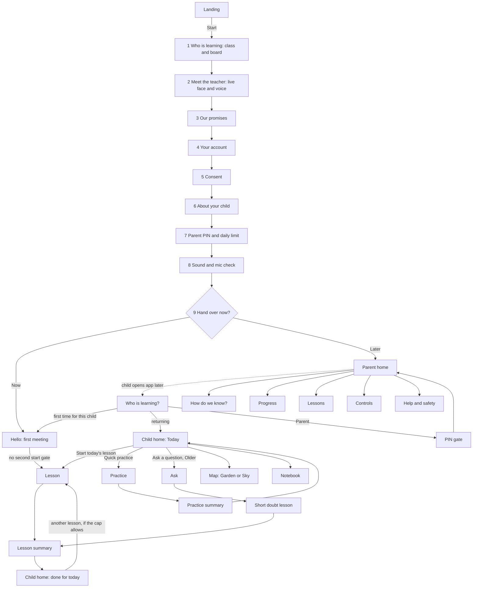
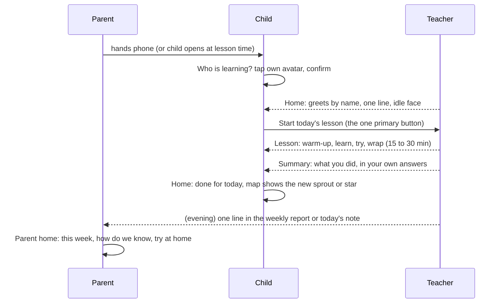

# Calm Mastery: a design direction for Taxila v2

**One-line thesis.** Taxila should feel like sitting at a quiet desk with a brilliant personal tutor. There is
one teacher you know by face, one question in front of you at a time, and one lamp that lights only when it is
your turn. Nothing on the screen is decoration that does not work, and nothing fails without saying so.

- **Status:** proposal, 2026-10-03. Written for the owner's v2 design review (`owner-design-v2-directive`). Nothing
  here is built.
- **Inputs read:** `docs/design/audit/AUDIT.md` (25 ranked problems, 174 shots), `docs/design/teacher/TEACHER-VISUAL.md`,
  `docs/research/design/PRODUCT-DESIGN.md` and its siblings, `context/rejected.md`, the `ds-*` and `avatar-*`
  entries in `context/decisions.md`, `shared/contracts.ts`, `src/styles/tokens.css`, `src/child/band.ts`.
- **Measured for this doc (2026-10-03):**
  - `calm-mastery-contrast.py` → `calm-mastery-contrast-2026-10-03.json`. WCAG 2 contrast plus CIEDE2000 under
    Machado CVD simulation, using the same maths as `visual-identity-contrast.py`. 0 contrast failures, both
    themes.
  - `calm-mastery-fonts.py` → `calm-mastery-fonts-2026-10-03.json`. The woff2 that Google Fonts serves an Android
    Chrome UA: n = 1 fetch per family. It records bytes, the `tnum` feature and x-height.
- **Markers:** [M] measured here or in `context/`. [D] a design decision this direction makes. [I] a provisional
  number that needs the named test. [R] a change to an existing `context/` decision. Every [R] states its reversal
  condition in §12.
- **Language rule:** chrome, labels, buttons and images are English only. The teacher speaks Hindi, English or
  Hinglish, and captions show what she says (§6.2 covers caption script). Teacher speech appears in this doc only as
  *shapes* (⟨greets by name, asks one question⟩), never as lines. Repo law: sentence-shaped prompt text gets
  recited. UI strings are real English copy, because they are rendered, not prompted.
- **Pronouns:**
  - In this doc, "she/her" for the teacher is shorthand. In the product every teacher pronoun comes from the
    character record (Asha: she; Arjun: he).
  - Taxila collects no gender for the child, so all copy about the child uses their first name or "they", never
    "she" or "he".

---

## 0. The direction on one screen

1. **The Desk** is the one layout idea, used at every size. Four zones, top to bottom on a phone and left to
   right on a laptop:
   - the **Teacher window** (her face and what she is saying now);
   - the **Question card** (what she asked, pinned);
   - the **Work tray** (an activity, only when one exists);
   - the **Answer dock** (how you answer).

   Zones never overlap. Her face never covers content. A zone with nothing in it does not render (§5.4).
2. **The Lamp** is the turn signal. Marigold `#FFB21E` lights exactly one thing, the Answer dock, and only in
   YOUR TURN. The word "Your turn" sits inside the lit dock. She leans in at the same frame, a soft two-note chime
   plays, and the phone gives one light tick. The lamp belongs to the child: the parent corner never uses marigold
   (§3.1, §6.1). [D, builds on `ds-status-carriers`]
3. **The question never disappears.** Every handover carries `ui.ask`, the question in displayable form. It is
   pinned on the Question card from the moment she asks until the item resolves. A speaker button on the card
   replays *the question* (not the tail of her turn). Captions show what she is saying; the card shows what she is
   asking. Those two jobs are never merged again (audit problem 1). [D]
4. **Every state is carried six ways, colour last:** face, word, shape/glyph, sound, haptic, colour. A
   greyscale screenshot must still say whose turn it is (§3.1). [D]
5. **Nothing fails silently, nothing is lost.**
   - Every answer gets a visible receipt within 150 ms.
   - Every answer gets a resolution (her reply, or a named trouble state with a retry) within 8 s.
   - A typed or spoken answer is held on the device until the server acknowledges it.
   (§3.5, audit problem 3) [D]
6. **One teacher, one person, everywhere.** A single character record (`shared/tutors.js`: id, name, pronouns,
   voice, look, class range) drives:
   - the landing, onboarding, hello, home, lesson, summary and parent corner;
   - every pronoun in copy.

   The 2D clip-art faces (`src/stage/characters.ts`, `src/ui/TeacherFace.tsx`) are retired. The lesson renders the
   3D rig, with the plate rendered *from the same rig* as its low tier (§8, audit problem 4). [D]
7. **Nothing on screen that is not working.** No placeholder ever reaches a child: no "coming soon", no empty
   boxes, no navigation to "Not available yet". If no engine exists for an item, the lesson stays in the Face
   layout with the Question card, and the tray does not render (audit problem 5). [D]
8. **Say it, show it, do it from one move.** Her voice, the card, the tray and the choices all derive from the
   same Director move. A server lint blocks a reply that says "tap" or "choose" unless tiles are mounted (§3.7,
   audit problem 6). [D]
9. **Verdicts are visible but never punitive.**
   - A verified correct answer gets a green tick shape on the child's answer and a warm or delighted face.
   - A wrong answer gets no red and no cross. The answer stays in ink, she looks curious, and the card shows
     "Let's look again".
   - An ungraded answer gets no mark at all.
   (§3.4, audit problem 13) [D]
10. **Calm by default.**
    - No pulsing rings (a single "breath" on entry, then steady).
    - No background music, no confetti, no points.
    - At most one celebration beat per 5 turns (the existing expressive budget).
    - Motion runs at 160–240 ms, transform and opacity only.

    Premium means restraint, and the richness lives in the illustration and the face. [D]
11. **Type:**
    - **Atkinson Hyperlegible Next** for all UI, questions and numerals (34 KB variable, has `tnum`) [M].
    - **Literata** for titles in Older bands and the parent corner (39 KB variable, has `tnum`) [M].
    - **Mukta** loads only when a caption is in Devanagari (62 KB) [M].
    - **Andika** stays for early-reading content in classes 1–4.
    - Baloo 2 is dropped. The Latin payload falls from ≈ 398 KB to ≈ 99 KB [M]. [R `ds-band-fork-older` type
      clause]
12. **Launch focus is classes 4–7.** So the primary design target is **B3 (classes 5–7, age 10–12)**, with B2
    (class 4) a close second. Every screen below is specified for B3 first, then for its Young variant.

### 0.1 What this direction keeps, and what it changes

| keeps (decision) | changes [R] | why |
|---|---|---|
| `ds-layout-dp-budget`: dp budgets solved at the 584 dp floor, and geometry changes only at phase boundaries | Replaces the L1–L5 geometries with two: **Face** and **Work**, plus a keyboard mode | With the Question card pinned and the PiP removed, three of the five layouts collapse into two. Fewer reflows suit tier C. |
| `ds-status-carriers`: four floor states, one marigold element, colour last | The ringed element is always the **Answer dock**, never a tile group or a module frame | One place to look. Tiles inside the tray still take the touch; the dock around them is what lights. |
| `ds-mic-tap-default`: tap to talk by default | none | |
| `ds-captions-by-reading-level` | R0 still has no caption text, but the **Question card is always on**: a picture plus a speaker for R0 | The card is the question, not a caption. A pre-reader taps it to hear the question again. |
| `ds-progress-no-meters` | Older bands get a **phase line** (four phase words, the current one in bold, no fill, no count). Young stays as specified. | Audit problem 9 and §4.4 found no sense of arc. A position cue is the reversal path the decision itself names (MW-M1). It is gated on that test. |
| `ds-band-fork-older`: earcons off for Older | The Older bands get the turn chime by default at −12 dB, with a softer timbre | Audit §4.4: there is no sound for turn changes. The chime is one of the six carriers. Gated on M-CM-4. |
| PRODUCT-DESIGN §3.14: help is the pause sheet's first row | The pause sheet leads with the title **Paused** and Continue. Help is the third row, always visible without scrolling, calm styling. The *safety-raised* help sheet (§3.5) still leads with help. | Audit problem 14: a child who wants water should not be shown helplines as the headline. Help stays one glance away and zero taps away. |
| `avatar-tutor-selection`: the child picks only when ≥ 2 tutors are eligible | none. Picker copy and placement are respecified (§5.3.9). | |
| Bagiya / Aasmaan progress worlds | Renamed **Garden** (Young) and **Sky map** (Older) in English chrome. Mechanics unchanged. | English-only chrome. |
| Parent state words (Abhi nahi / Abhyaas mein / Aa gaya / Pakka) | Become **Not started / Practising / Got it / Secure**, each with a fixed shape | English-only chrome. One shape vocabulary shared by the child's map and the parent views. |

---

## 1. Product principles

Each principle is followed by the test that says whether a screen obeys it.

1. **One question on the desk.** The child can always see what they are being asked.
   - **Test:** freeze any frame of YOUR TURN. The question (or its picture, for R0) is legible without audio.
2. **The lamp means you.** One colour, one element, one meaning: it is your turn now.
   - **Test:** at any frame, at most one element carries lamp tokens. The parent corner carries none.
3. **Said six ways.** Each floor state is carried by face, word, shape, sound, haptic, then colour.
   - **Test:** a greyscale, muted screenshot still names the state.
4. **Never lose a child's work.** Every answer gets a receipt, a resolution or a visible retry.
   - **Test:** cut the network at any point in a turn. The answer survives and the child is told plainly, within
     8 s.
5. **One teacher.** The same person, name and pronoun on every surface.
   - **Test:** grep `src/` for teacher names and gendered pronouns outside the character record. The result must
     be 0.
6. **Only what works.** No placeholders, no dead ends, no navigation to pages that do not exist.
   - **Test:** a crawl of child and parent routes finds 0 "coming soon" or "not available" strings and 0 empty
     containers above 48 dp.
7. **Show the evidence, not the score.** Every claim to a parent opens to the attempt behind it. Every success
   shown to a child is a true, specific capability, never a point.
   - **Test:** every parent headline links to an evidence row whose state agrees with it (§5.4.2).

---

## 2. The user-flow map

### 2.1 The whole product on one diagram



### 2.2 Parent first run (target ≤ 6 min to handover [I], measured M-CM-8)

The order is rebuilt around one insight: **class decides the teacher**, so class is asked first, and the parent
meets the actual person who will teach this child. Today the parent meets "her" and the child gets "Arjun" (audit
problem 4).

| step | screen | the parent's job | what fixes what |
|---|---|---|---|
| 1 | **Who is learning?** class tiles 1–9 + board (CBSE, RBSE, Other) | 2 taps | The teacher is now known: `eligibleTutors(class)`. |
| 2 | **Meet {Teacher}** | Hear her (or him) for 10 s on a warmed 3D face. Choose the language she speaks: English, Hindi, or a Hindi–English mix, each with a play button. | Language is asked once, here (audit problem 24). If two tutors are eligible, the parent sees both and the *child* chooses at hello. |
| 3 | **Our promises** | Read 4 promises (it is an AI and says so; you see what she sees; no ads or calls; delete any time) | Promises now come *before* the account (audit problem 24). |
| 4 | **Your account** | Name, phone or email, password | Field-level errors in plain English, attached to the field (audit problem 18). |
| 5 | **Consent** | Unbundled rows, nothing preselected (the strongest existing screen, kept) | The disabled reason moves next to the button. |
| 6 | **About {child}** | First name (with "Hear how {Teacher} says it"), how the teacher addresses them (Casual / Respectful, each with a sample), up to 3 interests | Opens scrolled to the top (audit problem 11). These choices are *binding*: hello shows the parent's picks for the child to confirm (audit problem 7). |
| 7 | **Parent PIN and daily limit** | A 4-digit PIN, entered twice; a daily limit (15, 30 or 45 min) | No sticky footer over the keypad. The keypad *is* the footer (audit problem 19). |
| 8 | **Sound and mic check** | Tap "Play", confirm hearing; tap the mic, say the child's name, see the meter move | Catches muted phones and blocked mics before the child sits down. Skippable, and it comes back at the first lesson if skipped. |
| 9 | **Hand over** | **Give the phone to {child} now** or **Later** | "Later" never skips the first meeting or the AI disclosure. Hello runs the first time the child opens the app (audit problem 16). |

The step counter shows "Step 3 of 9" with a 9-segment line. The add-a-child path skips 3–5, and its counter
recounts to 5 steps.

### 2.3 Child first run: Hello (target ≤ 90 s, all spoken)

1. **She appears and speaks first.** A pre-rendered greeting clip of the same rig, with no name in it, flows into a
   live line that uses the child's name. The face is large; no text is needed to proceed.
2. **The AI disclosure**, as a card with a picture: "I'm a computer teacher, not a person. Your grown-ups can see
   what we learn." Here she speaks this in the chosen language, and the card shows the English line. The child taps
   **Got it**.
3. **Confirm the parent's picks:**
   - She says the interests the parent chose.
   - The screen shows those 3 picture tiles already selected, plus **Change**.
   - The child taps **That's right**.
   - The address term the parent chose is used from her first sentence (audit problem 7).
4. **Pick a teacher**, only if ≥ 2 are eligible: two live preview clips side by side, shuffled, with no default.
5. **Straight into lesson 1.** The tap on step 2 unlocked audio, and the AudioContext is carried into the lesson
   route (same SPA context), so there is **no second start gate** (audit problem 10).

### 2.4 The daily loop



- **The home has one primary action at a time,** decided by the server (`/api/child/plan`, which returns 404 in
  production today and must ship first):
  - **Start today's lesson**;
  - **Continue your lesson** (resume, if one was left within 6 h);
  - **Done for today** (no ring, with a quiet "Practise something" link);
  - **Locked until tomorrow** (cap reached, stated without guilt).
- **No streaks, no day counts, no "we missed you".** The home looks identical after 1 day or 30 days away, apart
  from her greeting shape (`ds-progress-no-meters`, T2 absence test).

### 2.5 The lesson flow (phases)

| phase (contract `LessonPhase`) | layout | what the child does | turn shape |
|---|---|---|---|
| Arrive | Face | Sees her greet; hears today's goal | S → YT (ready) |
| Warm-up (`warmup`) | Face, or Work if the item has an engine | 2–4 quick recall items | (S → YT → L → T) × 2–4 |
| Learn (`teach`) | Work when an engine exists, else Face | Watches her explain in the tray; answers small checks | S ↔ YT micro-cycles |
| Try (`practice`) | Work | 3–6 items in the tray; feedback per item | YT → T → S (short) |
| Explain it back (`teachback`) | Face (Young) / Work with an "Explain" panel (Older) | Explains in words, voice or a drawing | S → YT → L → T |
| Wrap (`wrap`) | Face | One last success item; hears her re-voice the child's answer | S → YT (finish) |

The phase line (Older only) reads **Warm-up · Learn · Try · Wrap**, with the current word in bold ink and the rest
in `ink-2`. Explain-back sits inside Try for display. The line has no fill and no counts.

### 2.6 Practice, Ask, Map, Notebook, Milestones

- **Quick practice** (from home, or "Practise something" when done):
  - 5 items from the server's review queue;
  - **no greeting or intro** (audit §4.6);
  - the Work layout from the first frame, with a speech row of face and caption;
  - per-item feedback;
  - a 1-screen summary ("You did 5. Three on your own, two with a hint").
  - Leaving mid-way keeps the answers given.
- **Ask a question** (Older home, secondary row; Young has none, by `rj-passive-tutor`):
  - type, say or photograph a question from the textbook (the photo is shown only to the child and parent);
  - it becomes the **Question card** of a short doubt lesson that starts at once, with no start gate (audit
    problem 10);
  - the lesson title is the child's question, shortened, never an unrelated chapter name.
- **Map:**
  - Young gets the **Garden**: beds per chapter, plants by state.
  - Older gets the **Sky map**: stars per skill, edges between prerequisites, "Your class is here" marker.
  - Both have a list view that is the source of truth.
  - **Empty state** (new child): one illustrated seed bed or one first star with her line ⟨we'll plant the first
    one today⟩, never a navy rectangle (audit problem 9).
- **Notebook:** one page per lesson, ordered by lesson, not by date. Each page shows:
  - the question card from the lesson's best moment;
  - the child's own answer;
  - her one-line explanation;
  - the tray's final state as a still.

  It replaces the raw list of board strings.
- **Milestones**, the only "reward" surface:
  - **chapter seals** on the map, earned only by ledger state: every skill in a chapter at Got it or Secure;
  - at most 1 ceremony per lesson, ≤ 1,500 ms;
  - not collectible, never counted, never a currency.

  This is how the owner's "badges" request is honoured without breaking the T1–T6 motivation tests: the seal is
  a *state of the map*, not an item. [D]

### 2.7 Parent corner

| need | route | rule |
|---|---|---|
| How is my child doing? (10 s) | Home | Three blocks: **This week** (one sentence: one capability, one thing still being practised, each with **How do we know?**); **Try at home** (one 5-minute activity); **Next lesson** (the topic and when). |
| Is that true? | How do we know? sheet | The attempt, the date, whether it was on their own or with a hint, the child's own words. The headline can never contradict it (§5.4.2). |
| What are they learning? | Progress | The syllabus as chapters → skills with state shapes; the "school is here" marker. |
| What happened today? | Lessons → lesson card | A plain summary, the home task, a transcript only on request. |
| Change settings | Controls | Daily limit, lesson window, teacher address, captions, open mic (Older), tutor switching policy. |
| Data | Data and privacy | Export, delete a child, **delete the account** (needs building; the audit could not delete its test guardian). |
| Worry | Help and safety | Helplines, what Taxila does when a child says something worrying, contact. |

Five of the twelve current "More" entries lead to "Not available yet". **They are removed from navigation until
they exist** (principle 6).

### 2.8 Notifications (all addressed to the parent, never to the child)

| id | channel | when | default | lock-screen text rule |
|---|---|---|---|---|
| N1 weekly | WhatsApp utility template + in-app | Sunday at the time the parent picks | on | "Riya's week with Taxila is ready." No content on the lock screen. |
| N2 today's note | push | after the day's lesson ends | off | "Riya finished today's lesson." |
| N3 safety | push + WhatsApp + email | immediately | **always on, cannot be turned off** | "Taxila: please check in with Riya. Open the app for details." Never names the topic: on a shared phone the child may read it. |
| N4 account security | WhatsApp + email | PIN reset requested, PIN reset done, new sign-in, account deletion started | always on | plain fact plus "If this wasn't you, open Taxila." |
| N5 lesson time | push | the parent's lesson window opens | off | "It's Riya's lesson time." Never "her teacher is waiting" (banned by motivation §8.2). |

- **Quiet hours** run 21:00–07:00 IST for everything except N3.
- **Children get no push notifications.** Anything for the child lives on the child home.

### 2.9 Edge cases (each is a designed flow, not an error string)

| case | detection | what the child sees | what the parent sees |
|---|---|---|---|
| **No mic** (denied, absent, or failed the check) | `getUserMedia` error; the meter stays flat in the step-8 check | The dock swaps the mic for **Type** (Older) or picture tiles and a number pad (Young). The lesson never blocks. A one-time card: "Ask a grown-up to turn on the microphone", with a picture of the permission toggle, and **Not now**. Her moves pick tap-answerable items (`ui.answerForm` ≠ words) where the kit has them. | Controls show "Microphone is off on this phone", with steps. |
| **Mic works, speech recognition down** (the audit's silent ASR fallback) | `cascade: transcription call unavailable` | A trouble strip above the dock (§3.5 T3): "Voice typing isn't working right now. Tap your answer instead." The dock switches to tiles or type, and switches back automatically when the probe recovers, with one line from her. | none (logged) |
| **Poor network** | The voice ladder of PRODUCT-DESIGN §3.12, unchanged in timings | §3.3 latency choreography to 4 s, then T1/T2 trouble states (§3.5), then **Offline lesson** mode from the pack (tap items, her pre-recorded clips, a "Recorded" badge). | Lesson card notes "Part of this lesson was offline". |
| **Answer failed to send** | no ack in 8 s, or a fetch error | The child's answer stays on the card with **Not sent** and **Try again**. Auto-retry happens on reconnect; nothing is dropped (audit problem 3). | none |
| **Child stuck** (silent in YOUR TURN) | band timers (`glowS`, reprompt, `tapOptionsS`) | Young: 4 s re-cue by face; 8 s she re-asks shorter; 15 s the dock opens **Help** (Say it again · Show me choices · Show me how). Older: 6 s face re-cue; 12 s re-ask; **Hint** and **Wait** are always in the dock. After hint 3 she does a worked example and the item is recorded "with help". | Evidence row says "with a hint" or "worked example". |
| **Child says "I don't get it" / gives up** | words (`attune-from-words-not-tone`) | Gentle-concern face; she steps down (smaller step, picture, or choice). The card gains a step line ("Step 1 of 2" only inside a worked example; this is a structure cue, not progress). | none |
| **Child distressed** (distress, self-harm, abuse or secrecy disclosure in words) | `learner-safety-gate-first` predicate on every input path. Never from voice tone or face (`ct-no-voice-emotion-inference`). | The **Help sheet** (§5.3.4) replaces the lesson: her calm face (smile 0), "You can talk to a grown-up you trust", **Call Childline 1098**, **Call Tele-MANAS 14416**, **Talk to a grown-up at home**, and **Back to the lesson** (shown only after 10 s). The lesson is frozen. | N3 immediately; the alert card in the parent corner explains what was said in summary and what to do. |
| **Child tired or wants to stop** | "I want to stop" in words, or Pause → End | One calm closing line, no guilt, no "one more". The summary shows what was done. | Lesson card: "Ended early by Riya" (neutral). |
| **Wrong child on the profile** | "That wasn't me" on the first lesson screen, or the opener check | She asks once who is there; **Switch learner** goes to Who is learning? Evidence from the first 2 minutes is low-confidence. | none |
| **Phone muted or volume low** | Two YOUR TURN windows in a row with no tap *and* no speech, in the first lesson | A one-time strip: "Can't hear {Teacher}? Turn up the volume", with a picture of the volume keys. Captions turn on for the rest of the lesson. | none |
| **Parent forgot the PIN** | **Forgot PIN?** on the gate | none: the child's side keeps working | Password → "Your new PIN will work in 24 hours" (interim, `ds-pin-reset-interim-delay`), with a pending banner and countdown on the gate, **Cancel**, and an N4 message. An unlock with the old PIN cancels the reset. |
| **Parent forgot the password too** | **Forgot password?** | none | Email/phone reset link (**not built**: §11). Until it exists, the gate shows "Contact help@…", not a dead link. |
| **Too many wrong PINs** | 5 wrong in 10 min [I] | none (the child side is unaffected) | "Too many tries. Try again in 10 minutes." Shown as a calm full-width message with the time, no red banner. |
| **App killed mid-lesson** | an open lesson < 6 h old | Home's primary button becomes **Continue your lesson** with the question card thumbnail. Resume is at the last turn boundary. | none |
| **Low battery or hot phone** | the existing tier governor | Her face steps down a tier (H → B+ → plate → voice-only ring). A one-time line: ⟨saving battery, I'll be a still picture for a bit⟩. | none |

---

## 3. The signalling system

### 3.1 Floor states × carriers (the table the client implements)

Floor states come from the two-layer machine in TEACHER-VISUAL §7 (floor × affect). The UI listens to the
**floor**; the face combines floor and affect.

| floor state | face (TEACHER-VISUAL §6–§8) | word (dock header, visible to everyone) | shape / glyph | sound | haptic (Android) | colour | dock / buttons | caption | screen reader |
|---|---|---|---|---|---|---|---|---|---|
| **Speaking** | lips on audio; gaze at the child with intimacy aversions; prosody nods | "{Teacher} is talking" | mouth-sound glyph (3 arcs) beside her name | her voice | none | none: dock is `surface`, mic in `ink-2` outline | mic tappable (tap = barge-in: she pauses, then it is your turn) | the current phrase, one line (R1/R2) | polite region: "{Teacher} is talking" once per turn, not per phrase |
| **Yielding** (≤ 250 ms) | final rise: 3° tilt, held brow | (no change yet) | none | none | none | none | none | the caption fades to 0 over 200 ms | none |
| **Your turn** | lean-in (pitch −3°), held brow 0.14, direct gaze, stillness ×0.5 | **Your turn** (B3/B4 18 sp 700; Young 22 sp 700 + open-hand picture) | open-hand glyph | the two-note **turn chime** (§6.6) | one light tick (20 ms, amplitude 80/255) | **the lamp**: dock outline 3 dp `lampRing` + `lamp` fill wash 12%. One breath (opacity 0.7 → 1, 600 ms) on entry, then steady | mic large and centred; Hint (Older), Help (Young, after the timer), Type (Older) | empty. The Question card holds the ask | assertive, once: "Your turn. {ask}" |
| **Listening** | tilt 4°, continuer nods, contact ≤ 0.7 | **Listening…** + a live level meter | ear glyph; the mic ring width follows input level | none (her silence is the signal) | none | `listen` teal: mic fill teal, ring follows level; lamp off | mic becomes **Done** (tap to finish). A draining 3 s / 2 s silence ring shows the auto-end. | live partial transcript in the dock, `ink-2` (Older; Young none) | polite: "Listening" |
| **Thinking** (her turn, preparing) | forced `focus`; cognitive gaze aversion at +300 ms; verdict-neutral (I1) | at ≥ 600 ms: "{Teacher} is thinking" | three-dot glyph, with the dots drawn by a single slow stroke (not bouncing) | at ≥ 1.2 s, one neutral backchannel clip (§3.3) | none | `think` slate on the glyph only | mic disabled-looking but tappable: a tap shows "One moment — {Teacher} is thinking" | the child's own answer, set as **Your answer:** under the card | polite: "{Teacher} is thinking" |
| **Idle / ready** (start, between phases) | warm, breathing, blinks 17/min | none, or the ready tile's label | none | none | none | none | one large **Ready** / **Start** button (`nib` fill) | none | the button's name |
| **Paused** | idle loop stopped (WCAG 2.2.2); soft neutral still | **Paused** (sheet title) | pause glyph | her audio fades over 150 ms | none | screen dims to 40% under the sheet | Continue · End lesson | frozen | the dialog title |
| **Trouble** (§3.5) | warm with held brow (encouraging variant). Never concern: concern is for content only | a plain sentence in the trouble strip | cloud-slash / mic-slash / clock glyph | the low two-note system tone (once) | two light ticks | `trouble` brick on the glyph and the strip's left rule, never on the child's work | the strip's one action (**Try again**, **Type instead**, **Use offline lesson**) | unchanged | assertive: the strip sentence |

**Hard rules [D]:**
- YOUR TURN needs a pending hand-over (`handover` ≠ `chain`). Otherwise the honest state is THINKING or SPEAKING
  (`ds-status-carriers`).
- The lamp, the chime, the tick and the lean-in are **one event**, fired on the same frame from the same floor
  transition, and never separately.
- "Your turn" is **visible text on every band and size**. The phone's `.tx-sr`-only label is removed (audit
  problem 2).

### 3.2 Anatomy of one turn (timeline)

```
her audio  ██████████████████▁▁▁                                          ███████
floor      SPEAKING          Y  YOUR TURN ........ LISTENING ...... THINKING  SPEAKING
card       [ask pinned at first ask frame, stays] ............................ (verdict mark at her onset)
caption    phrase  phrase  — fade                                            phrase
dock       neutral           LAMP + "Your turn" → teal meter "Listening…" → "Your answer: 24,360"
face       talks             leans in, waits     nods                 looks up-left, thinks   delighted/curious
sound      voice             chime               —                    receipt tick? (A/B)     voice
haptic     —                 tick                —                    tick on Done            —
```

### 3.3 Latency masking: what the child sees in the 2–3.5 s while she thinks

Measured context: the guarded cascade turn runs a **3,055 ms median** total with `taxila-fast` (n = 30), and the
Director alone runs 1,422 ms median (n = 30) (`reply-ds41-cascade`, `reply-two-drafts`) [M]. So the child waits
about 3 s on most turns. The masking is choreographed so that the wait reads as *her thinking about my answer*,
never as the app hanging.

| t from the child's end of speech (or tap) | what happens | why |
|---|---|---|
| 0–150 ms | The dock flips from Listening to **Your answer:** with a sound-wave snapshot. A light haptic tick. The mic ring collapses into the answer chip (240 ms). | A receipt in under 150 ms: "it heard me". This is the visual 100 ms path (PRODUCT-DESIGN §4.5). |
| 150–700 ms | The final transcript replaces the wave in the chip. The child's words sit **under the pinned question**, so the desk shows question + answer together. | Seeing your answer next to the question is calming and lets the child self-check. |
| 300 ms | Her gaze moves up-left (cognitive aversion), brow `focus`. The same face for right and wrong (invariant I1). | Human thinking cue; no verdict leak. |
| 600 ms | If she has not started, "{Teacher} is thinking" fades in, with the single-stroke dots. | Not earlier, so fast replies never flash a label. |
| 1,200 ms | If she has not started, **one** neutral backchannel clip plays: a short "hmm" / "okay" / "let me see" shape in her voice, chosen from a pool of 6 with no repeat within 5 turns. It plays only in tap-to-talk mode (uplink closed, so the clip cannot reach the echo path, TEACHER-VISUAL §13). Never in open-mic mode. | Fills the dead half-second where children re-tap. Verdict-neutral. [I] gated on M-CM-5. |
| 1,200–3,500 ms | She holds the thinking face; a slow breath. The tray (if mounted) stays interactive for *looking*, not answering. | Calm. Nothing new competes for attention. |
| her first voiced frame | The verdict mark (if any) lands on the answer chip at the same frame. Face affect follows the verdict (§3.4). The caption starts. | Sound, mark and face agree. |
| 4 s | Her "one moment" hand gesture and pre-rendered clip, once. Older: the elapsed time shows in the dock in `ink-2`. | PRODUCT-DESIGN §3.12 rung, unchanged. |
| 8 s | Trouble state T1 (§3.5): "Still working on it…" with **Wait** · **Try again**. The answer is still held. | Never silent. |
| 20 s or link dead | T2 → offline lesson offer. | |

### 3.4 Feedback moments (verdict comes only from the verified-key classifier, never from a model's opinion)

| moment | trigger (contract) | answer chip | face | card | sound | haptic |
|---|---|---|---|---|---|---|
| **Correct** | `ui.verdict = correct` | green `got` tick shape at the chip's right; the chip border turns `got` | warm smile; **delighted** only after struggle or a goal met, under the expressive budget (≤ 1 per 5 turns) | ask line gains a small tick; stays 600 ms, then the next ask replaces it | Young: the payoff sound (≤ 600 ms, concept-shaped); Older: none | one medium tick (Young), none (Older) |
| **Not yet** | `ui.verdict = not_yet` | no colour change, no cross; a small `curious` glyph (magnifier) | curious (brows up, tilt): the error is information | "Let's look again" under the ask | none | none |
| **Partly** | `ui.verdict = partial` | half-tick shape (a tick with an open end) | encouraging | "Nearly. One part to fix." | none | none |
| **Ungraded** | `ui.verdict` absent | nothing | warm or neutral | nothing | none | none |
| **Hint given** | `move.kind = hint`, level n | none | encouraging | the hint appears as a second line on the card, marked by a lightbulb glyph, plus a level shape (1–3 dots) | none | none |
| **"I know this"** (Older chip) | `chipId = know` | none | warm | "Show me" check item replaces the ask | none | none |
| **With help** | item resolved after hint ≥ 2 or a worked example | tick, in outline only | warm | none | none | none |

**Never** [D]:
- red on the child's work, a cross, "Wrong", or a sad face;
- a sound that differs for right and wrong *before* she speaks (the receipt is identical);
- celebration on an ungraded answer;
- "Bilkul"-style praise on an unverified answer. This is a server rule: praise moves require `verdict = correct`.

### 3.5 Error and recovery states

All trouble states use one component, the **Trouble strip**:
- a 56 dp bar directly above the dock;
- `surface` fill, a 4 dp `trouble` left rule and a glyph;
- one sentence and at most two actions;
- it never covers the face or the card.

Her face uses the encouraging variant, and she speaks a pre-rendered clip once where noted.

| id | condition | strip copy (English) | actions | her clip | the answer |
|---|---|---|---|---|---|
| T1 | no reply 8 s after the receipt | "Still working on it…" | **Wait** · **Try again** | ⟨one moment, still thinking⟩ | held on the card |
| T2 | link down > 20 s, or `offline` event | "No internet. You can keep going offline." | **Use offline lesson** · **Try again** | ⟨our internet stopped, let's use the saved lesson⟩ | queued, sent on reconnect |
| T3 | speech recognition unavailable | "Voice typing isn't working right now. Tap or type your answer." | **Type instead** (Older) / tiles shown (Young) | ⟨you can tap your answer for now⟩ | n/a |
| T4 | send failed (HTTP error) | "Your answer didn't send." | **Send again** | none | held, with **Not sent** on the chip |
| T5 | heard nothing (ASR empty or confidence < floor) | "I didn't catch that." | **Say it again** · **Type** | ⟨say it once more?⟩ (a live line, not a clip) | none |
| T6 | her audio failed (TTS error) | "Sound didn't play. Read it on the card." | **Play again** | none | captions turn on for this turn |
| T7 | tray activity failed to load | none: the tray does not render; Face layout | none | none | the item continues by voice or tiles |
| T8 | session expired (signed out) | full screen: "Please ask a grown-up to sign in again." | **Sign in** (the parent's job) | none | the lesson is resumable after sign-in |
| T9 | server error on lesson start | full screen with her still: "We couldn't start the lesson." | **Try again** · **Go home** | none | n/a |

The **system error** tone (two low notes) plays at most once per 60 s. Raw API strings are never shown (audit
problem 18). Every error maps to one of these copies, or to "Something went wrong. Try again." with an error code
in 13 sp `ink-2` for support.

### 3.6 Progress signalling

| scope | child (Young) | child (Older) | parent |
|---|---|---|---|
| within a turn | the card's step line, only inside worked examples | same | none |
| within a lesson | spoken only ⟨she says where we are⟩; at Wrap the dock label reads **Last one** | **phase line** in the top bar: Warm-up · Learn · Try · Wrap, current in bold, no fill [R, gated MW-M1] | none live |
| end of lesson | Summary: 1–3 picture cards of things *they* did, each with their own answer | Summary: "Today you…" with up to 3 cited capabilities, each with the child's answer and the date-free evidence | Lesson card |
| across lessons | **Garden**: plant silhouettes (plot, sprout, flower, fruit). A **chapter seal** when a bed is complete. | **Sky map**: dot, ring, star, star in a ticked ring; chapter seal; "Your class is here" | Progress: the same 4 shapes, with the words Not started / Practising / Got it / Secure |
| review due | the bird silhouette on a plant (server `recheck_scheduled` only) | a small return-arrow on the star | "She'll check this again on the next lesson" (with the teacher's pronoun) |

### 3.7 Contract additions this direction needs (`shared/contracts.ts` `UiDirectives`)

```ts
interface UiDirectives {
  // existing: whiteboard, chips, status, caption, readAloud, affect
  /** REQUIRED on every hand-over (handover != "chain"): the question as displayed. Gate G-CM-1. */
  ask?: {
    text: string;            // the written question, ≤ 120 chars, in the lesson language's script; English for English lessons
    spoken?: string;         // what "Hear the question" replays (TTS of this, cached), defaults to text
    picture?: string;        // R0: an asset id from the verified library (never generated with labels)
    itemId?: string;
  };
  handover?: "chain" | "answer" | "choice" | "judge" | "ready" | "finish";
  /** How the child is expected to answer: drives the dock. */
  answerForm?: "words" | "number" | "choice" | "draw" | "read_aloud" | "tap_in_tray";
  /** Only from the verified-key classifier; absent = ungraded. */
  verdict?: "correct" | "not_yet" | "partial";
  hint?: { level: 1 | 2 | 3; text: string };
  phase?: LessonPhase;       // for the Older phase line
}
```

**Server lints** (each with a negative control):
- **G-CM-6 voice/screen agreement:** a reply that tells the child to tap, choose or pick fails unless `chips` or
  tray tiles are mounted for that turn. A reply that names a number not on the card or in the tray, when it asks
  the child to use "this number", fails too.
- **G-CM-1:** `handover ∈ {answer, choice, judge}` without `ask.text` fails.
- **G-CM-9:** `whiteboard` text that equals an objective string from the syllabus graph fails. Objectives are
  syllabus text, not child text (audit problem 6).

---

## 4. Information architecture and navigation

### 4.1 Site map

```
Public                         Parent (behind PIN)                Child (per profile)
/            Landing           /parent              Home           /c/:cid            Today (home)
/sign-in     Sign in           /parent/evidence/:id How do we know /c/:cid/hello      First meeting
/promises    Our promises      /parent/progress     Progress       /c/:cid/lesson/:lid Lesson
/help        Help & safety     /parent/lessons      Lessons        /c/:cid/practice   Quick practice
/privacy     Privacy           /parent/lessons/:id  Lesson card    /c/:cid/ask        Ask (Older)
/start/*     Set-up (9 steps)  /parent/controls     Controls       /c/:cid/map        Garden / Sky map
/who         Who is learning?  /parent/data         Data & privacy /c/:cid/notebook   Notebook
                               /parent/help         Help & safety  /c/:cid/me         Me (settings)
                               /parent/family       Children (add) /c/:cid/teacher    Your teacher
```

**Removed until built:** teaching style, PTM, saved lessons, plan/billing. They come back as entries only when
their page renders real content (principle 6).

### 4.2 Navigation patterns

| surface | phone (360) | laptop (1280) |
|---|---|---|
| Child, Young | **No tab bar.** Home is a hub with 3 large picture tiles (Today's lesson, Garden, Notebook). The house button in the top bar returns home. | Same hub, centred at max 960 width, 3 tiles in a row |
| Child, Older | **Bottom bar, 4 items, icon + label always:** Today · Map · Notebook · Ask. "Me" is the child's avatar at top-left. | Left rail, 88 wide, same 4 items + avatar |
| Child, in a lesson | **No navigation.** Pause (top-left, labelled) is the only exit and opens the pause sheet. | same |
| Parent | Bottom bar, 4 items: Home · Progress · Lessons · More. **More** holds Controls, Data, Help, Children. The child switcher sits at top-left as "Riya ▾". | Left rail, 240 wide, all 7 items visible; child switcher at the top of the rail |
| Onboarding | Back (top-left), step line, no other navigation; the primary button sits in normal flow, not a sticky footer, except the PIN keypad | same, centred card 560 wide |

- **The parent door** on child screens is a small, plain "Parent" text button (top-right, `ink-2`, 48 dp hit).
  It is not a door icon (audit §4.5).
- **The Who picker** shows each child's chosen avatar illustration (§6.5), large (B1–B2 112 dp, older 88 dp),
  with the name below. "Add a child" is behind the parent gate, not next to the profiles.

### 4.3 Label table (old → new; every child and parent label becomes English)

| old (production) | new | where |
|---|---|---|
| Ghar | Home | child top bar |
| Ruko | Pause | lesson |
| Bolo / Bas | Talk / Done | mic states |
| Bhejo | Send | typed answer |
| Phir se | Hear again (on the card) | lesson |
| Hint / Kyun? / Aata hai | Hint / Why? / I know this | Older dock chips |
| Kisi aur tarah samjhao | Explain another way | Older Hint menu |
| Chhoo kar shuru karo | (removed: no second gate) | lesson |
| Shuru karein / Chalo shuru karein | Start | buttons |
| Ho gaya (child) | Finish | lesson wrap |
| Aaj humne banaya | What you did today | summary |
| Agla | Next | home |
| Ek sawaal poochho | Ask a question | Older home |
| Abhyaas | Quick practice | home |
| Mera map / Bagiya / Aasmaan | Map / Garden / Sky map | home, nav |
| Meri notes | Notebook | home, nav |
| Main | Me | settings |
| Tumhare teacher | Your teacher | settings |
| Paath band karein? Nahi / Haan | End the lesson? Keep going / End lesson | pause |
| Aage chalein / Band karein | Continue / End lesson | pause |
| Ghar ke bade se baat karo | Talk to a grown-up | help sheet |
| Yahan likho… | Type your answer | Older dock |
| Abhi / Baad mein | Now / Later | handover |
| IS HAFTE / GHAR PAR EK KAAM / AUR DEKHEIN | This week / Try at home / More | parent home |
| Kaise pata? | How do we know? | parent |
| Abhi nahi / Abhyaas mein / Aa gaya / Pakka | Not started / Practising / Got it / Secure | parent, Older map |
| Ho gaya / Is hafte nahi (parent) | Done / Not this week | parent home task |
| हिन्दी tile, अर्जुन, वीणा | Hindi · Arjun · (book title in English transliteration: Veena) | language tiles, picker, syllabus |
| tum / aap | Casual / Respectful | onboarding, Me |

**Gate G-CM-3 (English chrome):**
- **Codepoints:** no codepoint in U+0900–U+097F in any string outside the `Caption`, `QuestionCard` and `TrayContent`
  components and Hindi-subject kit content.
- **Hinglish wordlist:** a lint over the 40 words above (Ghar, Ruko, Bolo, Bas, Bhejo, Phir, Shuru, Chalo, Paath,
  Abhyaas, Pakka, …) in chrome strings.
- **Files to delete:** the Devanagari tables in `src/child/copy.ts` and `Hello.tsx`, and the Devanagari names and
  Hindi style text in `shared/tutors.js` *display* fields. The voice-style fields stay internal.

---

## 5. Screen-by-screen spec

**Reference sizes:**
- **360:** a 360 × 640 phone, solved at the **584 dp floor** (after the status and gesture bars), with the
  comfortable 744 dp case noted.
- **1280:** a 1280 × 800 laptop with ≈ **720 px** of content after browser chrome.

Every dp column sums to its height. The rejected percentage layouts (`ds-rejected-percentage-layout`) are not used.

**Component library (new names; one design system for child, parent and onboarding, which ends the `tx-*` vs
onboarding split):**
- `TeacherWindow`, `SpeechRow` (a small face beside a caption);
- `QuestionCard`, `WorkTray`, `AnswerDock`, `AnswerChip`, `TroubleStrip`;
- `PhaseLine`, `PrimaryCard`, `PictureTile`, `ChoiceTile`, `NumberPad`;
- `Sheet`, `PinPad`, `StateShape` (the 4 progress shapes), `EvidenceRow`, `StepLine`.

### 5.1 Public

#### 5.1.1 Landing `/`
- **Purpose:** a parent understands what this is in 5 s, hears the teacher in 10 s, and starts.
- **360:**

  ```
  48  logo · Sign in
  280 hero: the cast still (Asha + Arjun, H-rig renders) on the desk background; a play button over the face
  96  "A personal AI teacher for classes 1 to 9." (Literata 28/34) + "She tells your child she's an AI. You see everything."
  56  [ Start free set-up ] (nib)                                     <- above the fold at 584 (48+280+96+56 = 480, +24 gaps)
  --- fold ---
  a real lesson screenshot (the Desk at 360, captured from the product, never a mock-up), 3 captions
  "How do we know?" sample evidence card (real component, sample data labelled "Sample")
  promises (4 rows with spot icons) · price status · FAQ · footer (Help, Privacy, Promises)
  ```
- **1280:** a two-column hero. The left 560 holds the headline, sub, CTA and a **Hear {teacher}** inline player.
  The right 640 holds the cast render with a 12 s cinematic clip (§8) muted until tapped. Below: a 3-up strip of real
  screenshots (lesson, garden, parent home).
- **Copy:**
  - Headline "A personal AI teacher for classes 1 to 9."
  - Sub "Lessons by voice, in English, Hindi or both. Your child always knows it's an AI, and you see what they
    learn."
  - CTA "Start free set-up".
  - Secondary "Hear a lesson".
- **States:** cinematic clip unavailable → hero still. Signed in → CTA "Go to Taxila".
- **Kills:** "Her face here is a drawing"; Devanagari state words; the CTA below the fold (audit problem 25).

#### 5.1.2 Sign in, Promises, Help, Privacy
- **Sign in:** one card with phone or email and password, a **Show** toggle on the password, **Forgot password?**,
  and errors on the field.
- **Promises:** the 4 promises, each expanding to detail.
- **Help:** helplines as `tel:` buttons first, then contact.
- **Privacy:** honest about what is not written yet.

### 5.2 Onboarding `/start/1…9`

Shared frame:
- the top row (48) holds Back, "Step n of 9" and the step line;
- the content scrolls and **every step opens at scroll 0 with focus on the title** (audit problem 11);
- the primary button sits in flow at the end of the content, never sticky, except on step 7;
- on 1280 it is a centred card 560 wide on the paper background with a quiet desk illustration at the right edge.

| step | 360 content (top → bottom) | copy (titles, buttons) | states |
|---|---|---|---|
| 1 Who is learning? | title; 9 class tiles (3 × 3, 96 dp); board segmented control (CBSE · RBSE · Other); | "Which class is your child in?" · button "Continue" | disabled until both chosen; the reason sits beside the button: "Choose a class and a board" |
| 2 Meet {Teacher} | TeacherWindow 280 (live 3D, warmed before the step opens), the name + "AI teacher" tag, three language tiles (English · Hindi · Hindi–English mix) each with ▶; transcript disclosure "What she said" (English text of the clip) | "Meet Arjun, Riya's teacher" · "He'll speak in:" · "Continue" | two eligible tutors → two side-by-side cards, "Riya will choose at the first lesson"; face tier D → plate render of the same rig; audio blocked → big ▶ |
| 3 Our promises | 4 rows with spot illustrations | "Our promises, before you sign up" | |
| 4 Your account | name, phone or email, password (Show), WhatsApp opt-in for N1 | "Create your parent account" · "Create account" | per-field errors: "Enter your email or phone number", "Use at least 8 characters" |
| 5 Consent | unbundled rows, each with ▶ Listen and a toggle; "What we keep" disclosure as a button row with chevron | "What Taxila may do" · "Agree and continue" | the CTA reason sits beside the CTA, not at the page bottom |
| 6 About {child} | first name + "Hear it" (TTS of the name, with "Sounds wrong? Spell it how it sounds"); "How should {Teacher} speak to Riya?" Casual ▶ / Respectful ▶; "What does Riya like?" 12 picture tiles, up to 3; captions on (for hearing needs) | "About Riya" · "Continue" | defaults: Respectful from class 5 up, with no preselection below that; interests are optional |
| 7 Parent PIN and limit | PIN dots, **PinPad pinned at the bottom (the only sticky element)**, then confirm; daily limit 15 / 30 / 45 | "Set a parent PIN" · "Only grown-ups should know it." | mismatch → "The PINs don't match. Try again." |
| 8 Sound and mic check | ▶ "Play a sound" → "Did you hear it?" Yes / No; mic button → level meter → "Say Riya's name" → "We heard you" | "Check sound and microphone" · "Continue" · "Skip for now" | mic denied → the steps to allow it, with a picture; No sound → volume picture |
| 9 Hand over | the TeacherWindow idle, waving | "Give the phone to Riya" · **Now** (nib) · **Later** | Later → parent home with a card: "Arjun will say hello the first time Riya opens Taxila." |

### 5.3 Child

#### 5.3.1 Who is learning? `/who`
- **360:**
  - top row 48 holds the logo and a "Parent" text button;
  - the title "Who is learning?" (Literata 26);
  - avatar tiles 2-up (B1–B2 112 dp illustrations; older 88), name below;
  - a tap confirms with the avatar enlarged, "Continue as Kabir?", **Yes** / **No**, and the name is spoken in the
    child's teacher's voice.
- **1280:** 4-up, centred.
- **States:**
  - one child → auto-confirm screen;
  - no children → parent gate → add a child.

#### 5.3.2 Hello (first meeting) `/c/:cid/hello`
- **360, three cards:**
  - **1. Greeting.** TeacherWindow 360 tall, the face large and speaking; no text other than her name and
    "AI teacher".
  - **2. The AI card.** A picture of her plus a "computer" spot illustration; "I'm a computer teacher, not a
    person." "Your grown-ups can see what we learn." **Got it**.
  - **3. Interests.** "Your grown-up chose these. Are they right?" with 3 preselected PictureTiles; **That's right** ·
    **Change**.
  - Then the tutor choice, if eligible: two preview clips 160 × 200, "Who would you like as your teacher?", no
    default, with "Choose for me".
- **1280:** the face at the left 520, cards at the right 560.
- **Copy rule:** chrome in English; she speaks in the chosen language.
- **States:**
  - audio blocked → the first card shows **Tap to hear Arjun**, and that tap is the audio unlock;
  - face tier D → plate.

#### 5.3.3 Child home: Today `/c/:cid`
- **360, B3, 584 floor:**

  ```
  48   [avatar: Me]                     Parent
  200  TeacherWindow 160 tall (face) · her one greeting line as caption (she speaks it once per day)
  152  PrimaryCard: subject spot illustration 72 · "Today" · topic "Fractions: equal parts" · "About 20 min" · [ Start ] 56 (nib)
  96   two tiles: Quick practice · Ask a question
  64   bottom bar: Today · Map · Notebook · Ask
  (gaps 3 × 8 = 24)                                               48+200+152+96+64+24 = 584
  below the fold: "Your sky" peek card (the last 3 stars touched, tap → Map)
  ```
- **360, Young B2:**
  - TeacherWindow 200;
  - PrimaryCard with a picture-led topic and **Start** (64 dp, the band hit);
  - then 2 PictureTiles (Garden, Notebook) at 112 dp;
  - no bottom bar;
  - the house is absent here because this *is* home.
- **1280 (Older):**
  - left rail 88;
  - main column 720 with the TeacherWindow at the left 280 and the PrimaryCard at the right 400;
  - below them, the practice/ask tiles;
  - right column 360 with the Sky map peek.
- **States (from `/api/child/plan`):**

  | state | primary card | her line (shape) |
  |---|---|---|
  | `start` | Today · topic · Start | ⟨greets, names today's topic⟩ |
  | `resume` | Continue your lesson · a thumbnail of the question card · Continue | ⟨welcome back, picks up⟩ |
  | `done` | Done for today ✓ · "You learned: …" · quiet "Practise something" link | ⟨warm close⟩ |
  | `capped` | "That's all for today" · "Your next lesson is tomorrow." | ⟨warm, no guilt⟩ |
  | `first` (never done a lesson) | "Your first lesson" · Start | ⟨first-day shape⟩ |
  | plan API down | `start` with the last cached topic, and a small "Offline" tag if the network is down | none |

#### 5.3.4 Lesson `/c/:cid/lesson/:lid`: the Desk

**Face layout** (no tray item): Arrive, Wrap, items with no engine, Explain-back for Young.

```
360 · B3 · 584                              360 · B2 (Young) · 584
48  [‖ Pause] Fractions · Learn      CC     56  [‖ Pause]  (subject pic)         CC
248 TeacherWindow (face, name + AI tag)     232 TeacherWindow
64  caption: current phrase, ≤ 2 lines      48  caption (R1 one line; R0 hidden → card grows)
88  QuestionCard: ask (20 sp), [🔊 Hear]    96  QuestionCard: picture 64 + ask (22 sp) + [🔊]
128 AnswerDock                              144 AnswerDock: [Hear again] [ MIC 96 ] [Help]
8                                            8
= 584                                       = 584
744 case (B3): 48 · 360 · 64 · 104 · 152 · 16 = 744
```

**Work layout** (a tray item is mounted): Learn and Try with an engine, Practice, Ask.

```
360 · B3 · 584                              360 · B2 · 584
48  top bar                                 56  top bar
80  SpeechRow: face 72 × 72 · caption 2 ln  88  SpeechRow: face 80 · caption
72  QuestionCard (1–2 lines) [🔊]            80  QuestionCard
248 WorkTray (engine iframe; tiles inside)  216 WorkTray (≥ 184 Young floor)
128 AnswerDock                              136 AnswerDock
8                                            8
= 584                                       = 584
744 case (B3): 48 · 96 · 80 · 368 · 136 · 16 = 744
keyboard open (Older, ≈ 260 dp keyboard → 324 visible): 48 · 64 · 72 · 48 ("Show work" strip) · 84 input dock · 8 = 324
```

**1280 × 720 (both layouts keep the two columns, so nothing jumps at a phase change):**

```
56   top bar: [‖ Pause]  Fractions: equal parts      Warm-up · LEARN · Try · Wrap        CC  ⋯
     ┌ left 440 ───────────────┐ 24 ┌ right 752 ─────────────────────────────────────────┐
440  │ TeacherWindow 440 × 440  │    │ QuestionCard 128 (ask 28 px Atkinson 600, 🔊)        │
16   │                          │    │ 16                                                  │
104  │ caption, 3 lines, 22 px  │    │ WorkTray 360  (Face layout: "Your answer" area 248  │
16   │                          │    │                 + the card grows to 240)            │
48   │ Arjun · AI teacher · ●   │    │ 16                                                  │
40   │                          │    │ AnswerDock 128                                      │
     └──────────────────────────┘    └─ 16 ────────────────────────────────────────────────┘
left: 440+16+104+16+48+40 = 664 · right (Work): 128+16+360+16+128+16 = 664 · (Face): 240+16+248+16+128+16 = 664
```

**Components and rules:**
- **Top bar:**
  - **Pause** (glyph + word, always);
  - the subject icon and a short topic (≤ 24 chars, server-supplied `shortTitle`, never a CSS-truncated chapter
    name);
  - Older: the phase line (desktop) or the current phase word (phone);
  - **CC** captions toggle;
  - "⋯" holds only: Report a problem · That wasn't me (first 2 minutes).
- **TeacherWindow:**
  - a rounded 24 dp frame on the `tray` colour, with a soft desk-lamp vignette *behind* her (an illustration
    layer, never marigold);
  - her name + "AI teacher" tag under the frame as plain text: not a pill, not tappable;
  - tapping the face does nothing.
- **SpeechRow:** the face at 72–96 dp at the left, the caption at the right. The face is never a PiP over content.
- **QuestionCard:**
  - `surface`, 1 dp `line` border, radius 16 (Older) / 20 (Young);
  - ask text in Atkinson 600;
  - 🔊 **Hear the question** button (48 dp) replays `ask.spoken`;
  - after an answer, **Your answer:** chip below the ask;
  - the hint line, when given;
  - verdict marks appear on the answer chip.
- **WorkTray:** the module iframe with its own `dusk` ground. Renders only with a mounted engine, never with a
  placeholder (T7). Her pointer cues draw here.
- **AnswerDock:**
  - a 24 dp header row with the state word left ("Your turn" / "Listening…" / "Arjun is talking"…) and, Older,
    **Wait** right;
  - the body is per `answerForm`:

    | `answerForm` | Older dock body | Young dock body |
    |---|---|---|
    | words | [Hint] [ MIC 64 ] [Type] | [Hear again] [ MIC 96 ] [Help] |
    | number | [Hint] [ MIC ] [123 pad] | MIC + a big NumberPad slides up in the tray area (no typing words) |
    | choice | tiles are in the tray; dock shows MIC (a spoken pick also counts) + Hint | tiles in the tray (2–3, picture-led); MIC |
    | tap_in_tray | "Use the activity above" + Hint; MIC available, unlit | same, with a hand pointing up |
    | read_aloud | the text to read in the card in Andika; MIC | same |

  - Lamp on the **whole dock** in YOUR TURN (§3.1).
- **Chips (Older):** Hint · Why? · I know this. They sit in the dock's left slot as a single **Hint** button whose
  sheet offers Hint, Why?, I know this, and Explain another way. That is one button, not four icons (audit problem
  17).

**States:** every floor state in §3.1, every trouble state in §3.5, and every feedback moment in §3.4. Plus:
- **Pause sheet** (bottom sheet 360 / centred dialog 1280):
  - title **Paused**;
  - **Continue** (nib, 56);
  - **End lesson** (secondary);
  - a divider, then the help row, always visible: "Need help? Talk to a grown-up · Call Childline 1098 · Call
    Tele-MANAS 14416", in `ink` at body size, with `tel:` buttons 48 dp. No red, no large tiles.
  - Escape opens pause on desktop; Space toggles the mic in YOUR TURN.
- **End confirm:** "End the lesson?" with **Keep going** · **End lesson**. Ending goes to the summary, always: the
  same destination for every child (audit §4.4).
- **Help sheet** (safety-raised, full screen, cannot be dismissed for 10 s):
  - the calm face;
  - title "You can talk to someone";
  - **Call Childline 1098**, **Call Tele-MANAS 14416**, **Talk to a grown-up at home**;
  - after 10 s, **Back to the lesson**.

#### 5.3.5 Lesson summary
- **360 B3:**
  - TeacherWindow 160 (warm, speaking her re-voice of one of the child's answers);
  - title "What you did today";
  - up to 3 **DidCards**: the question card mini, the child's own answer, and a tick if verified;
  - one line "Next time: equal parts of a group";
  - **Finish** (nib).
- **Young:** 1–3 picture DidCards, spoken; her voice reads each on tap.
- **1280:** the face at the left, cards in a row at the right.
- **States:**
  - nothing verified → cards still show what they *tried*, with no ticks: "You tried 4 questions";
  - a doubt lesson → the title is the child's question.
- **Kills:** clipped objective strings; the door icon on "Finish" (a tick glyph instead) (audit problem 12).

#### 5.3.6 Quick practice
- **Layout:** the Work layout from frame 1, with the SpeechRow showing her small face.
- **The top bar** reads "Practice · 2 of 5". This is the one place a count appears: a fixed-length drill the child
  chose, a position cue with no fill. [R `ds-progress-no-meters`, gated MW-M1]
- **Feedback:** per item, as §3.4.
- **Summary:** one screen, "You did 5. 3 on your own, 2 with a hint." The 5 answers are listed. **Done**.

#### 5.3.7 Ask a question (Older)
- **360:**
  - title "Ask Arjun a question";
  - a large text field "Type your question";
  - **Say it** (mic);
  - **Photo of the question** (camera; the image stays on the device and in the lesson only);
  - **Ask** (nib).
- **After Ask:** the Work or Face layout opens at once, with the child's question as the QuestionCard ("Your
  question"). She starts with the listening face, then speaks. There is no start gate.
- **States:** an empty field disables Ask with the reason "Type or say your question". Offline gives T2.

#### 5.3.8 Map: Garden (Young) and Sky map (Older)
- **Garden 360:**
  - a horizontal panorama of beds;
  - beds are pictures of what the skill is about;
  - plants show state by silhouette;
  - 64 dp arrows are the tap twins for the swipe;
  - the one ringed element is **Today's lesson** at the bottom. It is **not** marigold, because the lamp is for
    turns only; it uses a `nib` button.
  - A tap on a plant: she speaks one line, and the child's artefact shows.
- **Sky map 360:**
  - subject switcher;
  - the sky panel (`sky-panel` navy *with* the star art drawn, never empty);
  - the selected star shows its state word and "How I know" (the child's own evidence);
  - a list toggle.
- **1280:** the map 800 + the list 360 side by side.
- **Empty state:** one illustrated seed bed / first star with ⟨we'll plant the first one today⟩ and **Start
  today's lesson**.

#### 5.3.9 Notebook
- **Layout:** a page per lesson, newest first, as a card stack.
- **Each page holds:**
  - the topic;
  - the best question card;
  - the child's answer;
  - her one-line explanation;
  - a still of the tray.
- **Young:** pictures, and a tap reads it aloud.
- **Empty:** a notebook illustration and "Your notes will appear here after your first lesson."

#### 5.3.10 Me (settings)
Plain English rows, each with a one-line explanation. This replaces the developer panel (audit problem 21).
- Captions: Always / When needed.
- Talk mode: Tap to talk / Open mic (Older, headset only).
- Less motion.
- Bigger text.
- Dark mode (Older).
- Sounds on/off.
- Teacher's face: Moving / Still picture / Voice only.
- Your teacher (goes to the teacher screen).
- What your grown-ups can see (a plain list).
- Switch learner.

#### 5.3.11 Your teacher
- **One eligible:** her card (hero still, name, "AI teacher", one line of her voice on ▶), with no fake choice.
- **Two or more:** preview clips, shuffled, no default. A switch only between lessons. The B1 parent policy is
  respected ("Ask a grown-up to change your teacher").

### 5.4 Parent corner

#### 5.4.1 Parent home
- **360:**

  ```
  48  [Riya ▾]  Class 5 · CBSE                       (🔊 hear this page)
  ┌ This week ───────────────────────────────────────────────┐
  │ Riya can now compare fractions with the same bottom number.│  Literata 20/28
  │ Still practising: fractions of a group.                   │
  │ How do we know? ›                                           │
  └────────────────────────────────────────────────────────────┘
  ┌ Try at home (5 minutes) ─────────────────────────────────┐   nib left rule, no marigold
  │ Pick one: (roti) (₹10 note) (paper strip)                 │   picture chips
  │ Ask: "If we share this equally between 4, how much each?" │
  │ A good answer sounds like: "a quarter each"               │
  │ [ Done ]  [ Not this week ]                                │
  └────────────────────────────────────────────────────────────┘
  ┌ Next lesson ─────────────── Today, 5:00 pm · Fractions ›─┐
  bottom bar: Home · Progress · Lessons · More
  ```
- **1280:** left rail 240; this column 640; the right column 360 with "Recent lessons" (3) and "Progress" (state
  shapes per chapter).
- **States:**
  - **no lessons yet:** "Riya's first lesson is waiting." plus the Hello status;
  - **one lesson:** "Riya had her first lesson: …", with no "still tricky" claim until the claim gate allows it;
  - **offline:** the last good copy plus "Last updated 6:42 pm" in **IST**, not UTC (audit problem 20);
  - **safety alert:** an alert card above everything, `trouble` left rule, "Please check in with Riya", **See what
    happened**.

#### 5.4.2 How do we know? (evidence sheet)
- **Content:** a bottom sheet (360) or right drawer 480 (1280) with:
  - the skill in parent language;
  - its StateShape + word;
  - then EvidenceRows: the date, what was asked, the child's own words, "On their own" / "With a hint", and the
    verdict.
- **Kept from production** (the strongest screen), with the English labels.
- **Gate G-CM-10 (headline-evidence agreement):**
  - The home sentence's state for a skill must equal the state computed from the rows on this sheet.
  - "Still practising" needs ≥ 2 attempts that were not unaided-correct.
  - A single "Right · On their own" can never produce "Still tricky" (audit problem 20).
  - Negative control: the audit's own case.

#### 5.4.3 Progress, Lessons, Lesson card, Controls, Data, Help
- **Progress:**
  - chapters as rows; skills with StateShapes;
  - "School is here" marker;
  - counts as "4 of 6 Secure", never a percentage;
  - skill names in parent language (a `parentLabel` field per skill, not the NCERT objective string).
- **Lessons:** a list, by lesson (newest first): topic (the child's question for doubts), length, a one-line
  summary. A doubt is labelled "Question" and not counted as a lesson.
- **Lesson card:**
  - a plain summary;
  - what was practised (EvidenceRows);
  - the home task;
  - "See the full conversation" (on request; it re-confirms the PIN).
- **Controls:**
  - every toggle has a label and a one-line effect;
  - **Save** sits inline at the end of each changed group, not floating;
  - tutor policy (Free · Ask me · Locked).
- **Data and privacy:** Export, Delete a child, **Delete account** (password + hold, a 7-day backup notice per
  `dek-in-pitr-database`).
- **Help and safety:**
  - helplines;
  - what happens on a worrying message;
  - contact;
  - "Forgot PIN?" also lives here.

#### 5.4.4 Parent gate
- **Content:** PinPad full width at the bottom (360), with the title "Parent PIN" and **Forgot PIN?** as a text
  button.
- **States:**
  - wrong PIN: "That PIN isn't right." with the dots shaking twice, and a haptic;
  - cool-off: "Too many tries. Try again at 5:42 pm.";
  - reset pending: "Your new PIN works from 5:42 pm tomorrow." with **Cancel reset**;
  - re-lock: "Locked to keep the parent corner private." (audit §4.8).

---

## 6. Visual identity: "Lamp and Paper"

The concept: a well-lit study desk at the end of the afternoon. Warm paper, deep ink, one lamp. Richness comes
from three places:
- the painted illustrations (backgrounds, objects, the child's avatar, the garden);
- the teacher's face;
- the quality of type and spacing.

It never comes from colour noise or motion.

### 6.1 Palette tokens [M: `calm-mastery-contrast-2026-10-03.json`, 0 failures]

```css
:root {                                   /* light: every band, and the parent corner */
  --paper:#F6F3EC;   /* page ground */           --surface:#FFFFFF; /* cards, dock */      --tray:#ECE6DA;  /* teacher frame, trays */
  --ink:#1A1C22;     /* 15.37:1 on paper */      --ink-2:#4C505A;   /* 7.28:1 on paper */
  --line:#868A94;    /* borders, 3.12:1 on paper (non-text) */
  --nib:#24346E;     /* brand + primary buttons, 10.58:1 on paper; white on nib 11.72:1 */
  --nib-soft:#E4E8F4;/* selected rows; nib text on it 9.57:1 */
  --lamp:#FFB21E;    /* YOUR TURN only. One element. Child surfaces only. */
  --lamp-ring:#7A4800; /* the dock outline: 6.88:1 on paper, 4.23:1 against the lamp wash */
  --lamp-ink:#5C3600;  /* the "Your turn" word inside the lit dock, 9.56:1 */
  --listen:#0B7285;  /* mic while listening; 5.59:1 on surface */
  --think:#5B6470;   /* thinking glyph */
  --got:#2E7D32;     /* verified-correct tick on the child's answer; 5.13:1 on surface */
  --trouble:#A3341F; /* system trouble only (strip rule + glyph), never on the child's work */
  --focus:#1A1C22;   /* 2 px ring + 2 px white halo */
  --dusk:#E9E1D2;    /* module ground (unchanged from tokens.css) */
}
:root[data-theme="dark"] {                /* Older bands and the parent corner only; Young is light only */
  --paper:#121418; --surface:#1C1F26; --tray:#262A33; --ink:#F1EEE7; --ink-2:#B4B0A8; --line:#7C808A;
  --nib:#AFC0FF; --nib-soft:#2A3354;
  --lamp:#3D2C08;      /* dark: the lamp is a deep amber WASH ... */
  --lamp-ring:#FFB21E; /* ... with a marigold ring (10.22:1 on paper, 7.45:1 vs the wash) */
  --lamp-ink:#FFD27A; --listen:#5CC8D9; --think:#9AA3AF; --got:#6CCB70; --trouble:#FF8F7A; --focus:#F1EEE7;
}
```

**Reservation rules** (lint-enforced; these extend PD-G2 and the 12° hue rule of `ds-rejected-chalk-mark-gold`):
- **Lamp:**
  - lamp tokens appear only on `AnswerDock[data-floor="your_turn"]`;
  - no other token within 12° of the lamp's hue on any child screen, so the illustrations must not use marigold
    either (the Codex prompt says so, §6.7);
  - the parent corner never renders lamp tokens.
- **Trouble** is never used on child-authored content.
- **Got** is used only with the tick shape.

**CVD pairs that colour alone cannot separate** (min ΔE2000 < 15 under simulation) [M]. Every one is already
carried by a shape and a word:

| theme | pair | worst ΔE2000 | carried by |
|---|---|---|---|
| light | listen / think | 6.0 (protan) | ear + meter vs single-stroke dots; "Listening…" vs "is thinking" |
| light | got / trouble | 5.1 (deutan) | tick on the answer vs a glyph in the strip; never on the same element |
| light | listen / got | 5.1 (tritan) | mic vs tick |
| dark | got / trouble | **1.1 (deutan)** | the same, and this is why trouble is never a fill |
| dark | nib / listen | 6.5 (deutan) | button vs mic; "Listening…" |
| dark | lamp-ring / got | 8.8 (protan) | dock outline vs a tick inside a chip |

The light lamp against every other state token stays ≥ 15 under all three simulations [M]. That is the property the
turn signal needs most.

### 6.2 Type pairing (Google Fonts) [M: `calm-mastery-fonts-2026-10-03.json`, Android Chrome UA, n = 1 per family]

| role | family | why this one | served bytes (latin, variable) | `tnum` |
|---|---|---|---|---|
| UI, questions, captions (Latin), numerals: every band | **Atkinson Hyperlegible Next** (wght 400–700) | Built for low-vision legibility: I / l / 1 and O / 0 are distinct, which matters for a maths product read by 10-year-olds. A calm, serious, non-babyish voice. | **34,024** | yes |
| Titles: Older bands, parent corner, landing | **Literata** (wght 400–600) | A screen serif with book warmth: "a tutor's desk". Used only ≥ 22 sp, so its detail survives. | **39,260** | yes |
| Captions in Devanagari (Hindi-medium lessons, Hindi subject) | **Mukta** (400, 600), devanagari subset | Already measured for matra extents (visual-identity §4); loaded only when a caption is in Devanagari | 61,928 + 13,500 latin | yes |
| Early-reading content, classes 1–4 | **Andika** (400) | Single-storey a and g, for children learning letters | 12,768 | no (never used for numerals) |

- **Total:** the Latin web payload is **≈ 99 KB** (Atkinson + Literata + Mukta latin + Andika) against ≈ 398 KB
  for the current Baloo 2 + Mukta + Andika stack. The Devanagari caption subset adds 62 KB only when needed [M].
- **Rejected from the shortlist:**
  - Lexend (39,692 B): **no `tnum`** [M], so maths columns would wobble.
  - Fraunces: no `tnum` [M], and too ornamental.
  - Figtree (20,184 B, `tnum` yes): a fine fallback, but less distinct I / l / 1 than Atkinson.
- **Caption script rule [D]:**
  - English lessons: Latin captions.
  - Hinglish lessons: romanised Latin captions (what Indian children actually read in chat).
  - Hindi-medium lessons and the Hindi subject: Devanagari captions in Mukta.
  - Chrome is English in all three.

**Scale (sp; Atkinson unless marked L = Literata):**

| token | B1 (6–7) | B2 (8–9) | B3 (10–12) | B4 (13–15) | parent / adult | weight · leading |
|---|---|---|---|---|---|---|
| `display` | 34 | 30 | 28 L | 26 L | 32 L (landing 40 L) | 700 / L 600 · 1.2 |
| `title` | 26 | 24 | 24 L | 22 L | 22 L | 700 / L 600 · 1.25 |
| `ask` (QuestionCard) | 24 | 22 | 20 | 19 | n/a | 600 · 1.3 |
| `caption` | 22 | 20 | 18 | 17 | n/a | 400 · 1.35 |
| `numeral` (tray, `tnum`) | 40 | 36 | 32 | 28 | n/a | 700 · 1.1 |
| `body` | 20 | 19 | 17 | 16 | 16 | 400 · 1.45 |
| `label` / buttons | 20 | 18 | 16 | 16 | 16 | 600 · 1.3 |
| `state-word` (dock header) | 22 | 20 | 18 | 17 | n/a | 700 · 1.2 |
| `meta` | n/a | n/a | 14 | 14 | 14 | 400 · 1.4 |

- **Floors:** child text ≥ 16 sp; parent body 16.
- **Font scale:** text scales to 200% on every screen except the lesson, which follows the §5.3.4 budget rules.
  The caption and the card grow, and the tray yields first.

### 6.3 Iconography: "Desk line"

- **Older and parent:**
  - Material Symbols Rounded, weight 400, grade 0, optical size 24, shipped as an inline SVG sprite of ≈ 30
    glyphs (≈ 12 KB [I]), not the icon font;
  - 2 dp stroke look, rounded caps;
  - filled variant = selected.
- **Labels:**
  - every icon has a visible label, except Pause on 1280 (where the word sits in its tooltip *and* the
    accessible name) and the speaker on the QuestionCard;
  - icon-only controls are limited to Pause (phone keeps the word), CC, 🔊 Hear the question, and the mic, each with
    an accessible name.
- **Young:**
  - illustrated pictograms 48 dp in 112 dp tiles, painted in the illustration style (§6.4) and generated via Codex
    (§6.7);
  - each is spoken on tap;
  - the **state glyphs** (open hand, ear, three dots, mouth-sound, cloud-slash, mic-slash, tick, half-tick,
    magnifier, lightbulb) are **hand-built SVG for every band**, because they animate and must stay crisp at 20 dp.
- **Banned:**
  - on child surfaces: hamburger, kebab, gear, stars-as-reward, coins, trophies, flames, streak counters;
  - a door for Finish, and a raised palm for Now (audit problems 12, 24).

### 6.4 Illustration style: "painted desk"

- **Medium:** matte gouache-and-pencil digital painting on warm paper grain, with soft edges and visible brush
  texture at large sizes. Flat-ish at small sizes (icons, avatars).
- **Light:** one soft key light from the upper left, the same as the teacher rig's key (TEACHER-VISUAL §4), so the
  face and the world sit in one light.
- **Palette for art:** paper, deep ink blue, teal, terracotta, leaf green, dusty rose, warm greys, the skin ramp
  `skin-1…6`. **No marigold or saturated yellow-orange** (the lamp reservation), no neon, no gradients-as-style.
- **World:** everyday Indian study life, specific and unglamorous. Steel tumbler, cloth-bound notebooks, a geometry
  box, ceiling-fan shadow, a window with neem leaves, a school bag on a hook, chai at a distance for parent scenes.
  No religious iconography, no flags, no "heritage" exotica, no gendered colour coding. Avoid the owl, parrot, cow
  and pig as characters (PRODUCT-DESIGN §4.7).
- **Children in art:** varied skin tones weighted to the middle of the ramp, varied hair, glasses, one child with a
  hearing aid and one with a wheelchair across the set. Never lighten heroes. Never put the teacher in the art: she
  exists only as the rig.
- **No text, letters, digits or symbols in any image.** Labels are always live text. This follows
  `generated-media-carries-facts`: pixels never carry curriculum facts, so **no generated image depicts a counted
  quantity, a diagram or currency** (`content-safety-sole-gate` found a near-facsimile ₹50 note).
- **Detail by band:** B1–B2 are rounder, brighter and fewer objects. B3–B4 are editorial, with more negative space,
  muted, and no cartoon faces on objects.
- **Change:** [R] PRODUCT-DESIGN §4.7's "flat fills + one shade tone, no gradients" becomes painted texture at ≥ 96
  dp and flat at < 96 dp. Reverse if M-CM-7 shows the painted set reads as "for little kids" to B4, or WebP sizes
  break §6.7's per-image budget.

### 6.5 Child avatars (Who picker, Me, notebook)

There are 24 avatars, chosen once by the child: animals and objects, never human faces, so they cannot be mistaken
for the teacher or for other children.
- Red panda, tiger cub, elephant calf, Ganges dolphin, hornbill, peacock, turtle, butterfly, squirrel, camel,
  rhino, snow leopard, kite, rocket, football, cricket bat, mango, sunflower, mountain, sailboat, auto-rickshaw,
  bicycle, telescope, paintbrush.
- Painted on a circular paper disc, in 6 background tints.

### 6.6 Motion, sound and haptics

**Motion language: "settle, never bounce."** The UI is still; the teacher carries the life.

| token | value | use |
|---|---|---|
| `m.press` | 90 ms, scale 0.97 (Young 0.95), no ledge | pointer down |
| `m.enter` | 240 ms Young / 160 ms Older, `cubic-bezier(0,0,0,1)`, translateY 8 → 0 + fade | anything appearing |
| `m.exit` | 150 ms, `cubic-bezier(.3,0,1,1)`, fade | anything leaving |
| `m.layout` | 300 ms standard easing; only at phase boundaries (Face ↔ Work) | the Desk changing |
| `m.lamp` | ring + wash from 0 to 0.7 in 120 ms, then 0.7 → 1.0 over 600 ms (one breath), then **steady**; Young only: one further breath at `glowS` | YOUR TURN |
| `m.listen` | ring width follows input level, 60–80 ms smoothing | mic |
| `m.receipt` | mic ring collapses into the answer chip, 240 ms | end of the child's turn |
| `m.verdict` | tick draws as a stroke, 280 ms, starting on her first voiced frame | correct |
| `m.think` | the three dots drawn by one stroke over 900 ms, repeated; never bouncing | thinking |
| `m.seal` | ≤ 1,500 ms, ≤ 1 per lesson, interruptible | chapter seal on the map |

- **Limits:** transform and opacity only; nothing flashes more than 3×/s.
- **Reduced motion:** all of the above become 1 ms cross-fades; the lamp is a static ring; she keeps lips and
  blinks.

**Sound design.** Earcons are **synthesised at runtime in WebAudio** (zero asset bytes, identical on every device,
no decode latency), using sine plus a soft triangle partial and a 5 ms attack.

| earcon | notes | length | level (Young / Older) | when |
|---|---|---|---|---|
| **turn chime** | E5 → A5 (659 → 880 Hz), felt-marimba envelope | 90 + 40 gap + 120 ms | −12 / −18 dBFS | entering YOUR TURN, every time, identical |
| **receipt** (A/B against none, M-ONB-6) | a single 1.6 kHz wood click | 30 ms | −24 / −26 dBFS | end of the child's turn; identical for right and wrong |
| **payoff** | concept-shaped, ≤ 600 ms, from the engine | ≤ 600 ms | −14 / off | a solved tray item, Young only |
| **system tone** | A4 → F4 (440 → 349 Hz) | 2 × 120 ms | −16 dBFS | trouble strip, ≤ 1 per 60 s |
| **seal** | three rising notes C5 E5 G5 | 450 ms | −14 / −18 | chapter seal |

- No music, no ambient loop, no escalating chains.
- Silent when the phone is on silent (Android ringer mode via the native shell).
- "Sounds off" in Me silences everything except her voice.

**Haptics** (Capacitor Haptics on Android; `navigator.vibrate` on the web; off when the system haptics setting is
off):
- YOUR TURN: one light impact (20 ms).
- Done on the mic: one light impact.
- Correct (Young): one medium impact.
- Trouble: two light impacts, 80 ms apart.
- Wrong PIN: two medium impacts.
- **Never on wrong answers.**

### 6.7 The Codex image prompt pack (paste once; images land in `public/assets/gen/`)

**Paths.** Shipped UI art goes to `public/assets/gen/**`, per `owner-design-v2-directive`. Teacher concept art
stays under `art/gen/teacher/` (TEACHER-VISUAL Appendix A) and never ships.

**After generation, before any image reaches a child:**
- `node scripts/gen-assets.mjs` (to be written) converts each PNG to WebP at 1× and 2×, checks the per-image byte
  budget below, and runs an OCR **no-text presence check**. That is the only valid OCR use (`generated-media-carries-facts`).
- A human reviews every image against §6.4 (representation, no marigold, no currency, no text).

```
You are generating illustration assets for Taxila, a calm, premium AI-tutor app for Indian children aged 6-15.
Save every image as PNG at the exact path given, at the exact size given. Make one image per line item.

GLOBAL STYLE (apply to every image unless the item says otherwise):
- Matte gouache-and-pencil digital painting on warm paper grain; soft edges; gentle visible brush texture.
- One soft key light from the upper left; calm late-afternoon mood.
- Palette: warm paper (#F6F3EC), deep ink blue (#24346E), teal (#0B7285), terracotta, leaf green (#2E7D32), dusty rose,
  warm greys, and natural Indian skin tones from light to deep brown. NEVER use marigold, saffron, bright yellow-orange
  or neon. No gradients used as decoration.
- Everyday Indian home and school life, specific and unglamorous: steel tumbler, cloth notebooks, geometry box,
  school bag on a hook, ceiling-fan shadow, window with neem leaves.
- ABSOLUTELY NO text, letters, numbers, digits, symbols, logos, signage, watermarks, clocks with numerals, book titles,
  writing on pages or screens. Pages and screens are blank or show soft abstract marks only.
- No currency notes or coins. No flags, maps, religious symbols, temples, deities or national emblems.
- No adult teacher figure in any image. Children, where present, are varied in skin tone (mostly medium), hair,
  and include glasses; across the whole set include one child with a hearing aid and one using a wheelchair.
- No resemblance to real people, brands, or copyrighted characters.
- "Transparent" means a PNG with a real alpha background and no drop shadow. Otherwise fill the frame edge to edge.

Write public/assets/gen/<folder>/provenance.json listing each file, the prompt used, the date and the tool.

A. BACKGROUNDS (no people unless stated; quiet enough for text on top; keep the left-centre area calm)
A1 public/assets/gen/bg/desk-light.png 2560x1600 - top-down view of a warm wooden study desk with a closed cloth notebook, a pencil, a steel tumbler, soft lamp light pooling from the upper left; very low contrast.
A2 public/assets/gen/bg/desk-dark.png 2560x1600 - the same desk at night, deep blue-grey, a soft warm pool of light, very low contrast.
A3 public/assets/gen/bg/teacher-wall-young.png 1600x1600 - a softly blurred, bright classroom-corner wall behind a head-and-shoulders portrait position: a pinboard with blank coloured paper shapes, a potted plant, daylight; the centre is plain.
A4 public/assets/gen/bg/teacher-wall-older.png 1600x1600 - a softly blurred study wall: a bookshelf with blank spines, a window with neem leaves, evening light; the centre is plain and muted.
A5 public/assets/gen/bg/home-young.png 1440x2560 - a bright morning room seen from a child's desk: window, bag on a hook, a few toys on a shelf; the top third is calm sky through the window.
A6 public/assets/gen/bg/home-older.png 1440x2560 - the same room for a 12-year-old: fewer toys, a cricket bat in the corner, books, a desk lamp switched off; muted.
A7 public/assets/gen/bg/onboarding.png 1200x2400 - a quiet edge strip: a parent's hand resting near a phone on a kitchen table with a cup of chai; very low contrast; the subject sits on the right edge.
A8 public/assets/gen/bg/landing-hero.png 2400x1400 - a warm desk scene at dusk with an empty space centre-right where a portrait will be composited; a child's notebook and pencil at lower left.
A9 public/assets/gen/bg/garden-panorama.png 4800x1200 - a gentle home kitchen-garden panorama in morning light: low brick-edged beds of bare soil in a row, a tap and bucket, a neem tree at one end; no plants in the beds (plants are separate assets); seamless left-right edges.
A10 public/assets/gen/bg/sky-panel.png 2400x1600 - a calm deep-navy night sky (#0F1A33) with faint painted clouds near the bottom edge and a far city skyline silhouette with no lit signs; NO stars (stars are drawn by the app).

B. CHILD AVATARS (transparent, 512x512, a single subject centred on a painted circular paper disc, friendly but not cartoonish; disc tints rotate through teal, rose, leaf, sky, terracotta, sand)
B1-B24 public/assets/gen/avatars/<name>.png for: red-panda, tiger-cub, elephant-calf, river-dolphin, hornbill, peacock, turtle, butterfly, squirrel, camel, rhino, snow-leopard, kite, rocket, football, cricket-bat, mango, sunflower, mountain, sailboat, auto-rickshaw, bicycle, telescope, paintbrush.

C. INTEREST TILES (transparent, 512x512, one object or a small scene, no people's faces in close-up)
C1-C12 public/assets/gen/interests/<name>.png for: cricket (bat, ball and stumps on grass), football, space (a planet and a small rocket), animals (a dog and a cat together), drawing (crayons and a blank sketchbook), music (a harmonium and a small drum), dance (ghungroo ankle bells and a twirling dupatta, no person), cooking (a rolling pin, a small bowl of flour), trains (a blue passenger train on a bridge), stories (an open book with blank pages and a small lamp), building (wooden blocks in a tower), nature (a leaf, a ladybird and a pebble).

D. SUBJECT SPOTS (transparent, 768x768, still-life objects only)
D1 public/assets/gen/subjects/maths.png - a geometry box open with a compass, a protractor without markings and a pencil.
D2 public/assets/gen/subjects/science.png - a glass jar with a sprouting bean, a magnifying glass, a magnet.
D3 public/assets/gen/subjects/english.png - two cloth-bound books and a fountain pen; blank pages.
D4 public/assets/gen/subjects/hindi.png - a slate board with a soft blank surface, a chalk stick and a small brass bell; no script.
D5 public/assets/gen/subjects/evs.png - a potted mint plant, a watering can, a small bird on the rim.
D6 public/assets/gen/subjects/social-science.png - a globe with soft abstract continents and no borders, an old compass, a clay pot.

E. EMPTY AND SYSTEM STATES (transparent, 1024x768, calm, small scene, generous empty space)
E1 public/assets/gen/states/notebook-empty.png - a closed cloth notebook with a ribbon, waiting on the desk.
E2 public/assets/gen/states/garden-empty.png - a single bed of bare soil with a seed packet (no printing) and a small trowel.
E3 public/assets/gen/states/sky-empty.png - a child's telescope on a windowsill pointing at a dark sky, no stars.
E4 public/assets/gen/states/no-internet.png - a paper boat resting on a still pond, a few ripples.
E5 public/assets/gen/states/mic-off.png - a microphone lying on a soft cushion, quiet.
E6 public/assets/gen/states/sound-off.png - a small speaker with a paper flower in front of it.
E7 public/assets/gen/states/done-for-today.png - a closed school bag by the door, evening light, shoes neatly placed.
E8 public/assets/gen/states/rest-until-tomorrow.png - a desk lamp switched off and a window with a moon (crescent, no face).
E9 public/assets/gen/states/something-wrong.png - a tangled ball of wool with a cat paw reaching in, gentle and funny.
E10 public/assets/gen/states/lessons-empty-parent.png - an adult's hand placing a fresh notebook on a child's desk.
E11 public/assets/gen/states/ai-teacher-card.png - a friendly, rounded laptop on a desk with a soft glow and a small potted plant beside it; the screen is blank and warm; no face on the screen.
E12 public/assets/gen/states/talk-to-grown-up.png - a child and a grown-up sitting side by side on a step, seen from behind, the grown-up's arm around the child; calm, safe, warm.
E13 public/assets/gen/states/permission-mic.png - an abstract phone-settings toggle switch on a blank panel, switching on, no text.
E14 public/assets/gen/states/volume-keys.png - a hand holding a phone, thumb on the side volume button, the screen blank.

F. GARDEN PLANTS (transparent, 512x768, the plant growing from a small mound of soil, bottom-centred, consistent scale)
F1-F12 public/assets/gen/garden/<kind>-<stage>.png for kind in [rose-bush, tomato, guava-tree] and stage in
[seed (a mound with a seed packet without printing), sprout (two leaves), bloom (flowers), fruit (ripe fruit)].
F13 public/assets/gen/garden/bird.png - a small brown sparrow-like bird perched, looking curious, 256x256.
F14 public/assets/gen/garden/chapter-seal.png - a woven bamboo garden gate with a hanging bell, 768x768, transparent.

G. SKY ART (transparent)
G1 public/assets/gen/sky/chapter-seal.png 768x768 - a softly glowing constellation crest shape made of light (no stars as points, no letters), like a gentle halo of dust.

H. YOUNG PICTOGRAMS (transparent, 256x256, a single bold object, thick soft outline, very readable at 48 px)
H1-H24 public/assets/gen/picto/<name>.png for: house, pause-hand (a palm facing forward inside a soft circle - for Pause only),
microphone, ear-with-sound, tortoise (slower), open-hand-offering (your turn), finger-tap, eraser, pencil, speech-lines (captions),
seed-packet, sprout, flower, fruit, notebook, garden-gate, finish-flag (a plain flag with no symbol), water-glass (break),
stretching-arms (break), grown-up-and-child (help), phone-and-grown-up (call), speaker-on, speaker-off, lightbulb (hint).

I. LANDING AND PROMISES (I1-I3 full-bleed 1600x1200; I4-I7 transparent 768x768)
I1 public/assets/gen/landing/listening.png - a 10-year-old child at a desk with a phone propped up, listening and smiling, notebook open with blank pages, evening lamp light.
I2 public/assets/gen/landing/parent-reading.png - a parent at a kitchen table reading a phone with a calm, pleased expression, chai beside them; the screen is blank light.
I3 public/assets/gen/landing/notebook.png - a child's hands drawing in a notebook with a pencil, soft abstract marks only.
I4 public/assets/gen/promises/ai-honest.png - a small rounded laptop with a gentle glow next to a child's hand giving a high-five to the air.
I5 public/assets/gen/promises/you-see.png - a window open into a bright room, a grown-up's silhouette looking in kindly.
I6 public/assets/gen/promises/no-ads.png - a quiet phone face down on a cushion beside a teacup.
I7 public/assets/gen/promises/delete.png - a paper being folded into a small paper bird that flies away.

J. HOME TASK OBJECTS (transparent, 384x384, for the parent's "Try at home" picture chips; everyday objects, NO money)
J1-J10 public/assets/gen/home/<name>.png for: roti, steel-plate, paper-strip, bowl-of-grapes, matchbox-closed (plain, no print), measuring-cup,
water-bottle, rope, ladoos-on-plate, chocolate-bar-plain-wrapper.
```

**Budgets after WebP conversion** [I], checked by `scripts/gen-assets.mjs`:
- backgrounds ≤ 120 KB at 1×;
- spots, states and tiles ≤ 40 KB;
- avatars and pictograms ≤ 16 KB;
- **a first-run child screen loads ≤ 350 KB of art in total** (the low-end data budget).

On tier D, backgrounds are replaced by the flat `paper` colour.

---

## 7. Age-band variants

Launch focus is classes 4–7, so B3 (classes 5–7) is the reference design and B2 (class 4) the Young reference.

| aspect | Young: B1–B2, ages 6–9 (classes 1–4) | Older: B3–B4, ages 10–15 (classes 5–9) |
|---|---|---|
| reading assumption | R0 / R1: she says everything; the card has a picture plus a few words | R2: everything readable; captions on |
| home | a hub of 3 picture tiles; no tab bar | 4-tab bar; Today, Map, Notebook, Ask |
| the Desk | Face layout preferred; trays hold tiles and pads; **no typing**, ever | Work layout common; type, pad and draw available |
| answer forms | voice, 2–3 picture tiles, number pad, tap in tray | voice, type, pad, tiles (up to 4), draw, explain panel |
| dock | Hear again · MIC 96 · Help (Help appears at 15 s, or on tap of a visible "?") | Hint · MIC 64/56 · Type; Wait in the header |
| turn timers (`band.ts`, unchanged) | glow 4 s, re-ask 8–10 s, help options 15 s | glow 6 s, re-ask 12 s, options on request |
| lamp | breath on entry and again at 4 s | breath on entry only |
| turn chime | on, −12 dBFS | on, −18 dBFS [R, gated M-CM-4] |
| feedback | tick + payoff sound + medium haptic on correct; she celebrates (budgeted) | tick only; she's warm; delighted is rarer (band scale 0.7 / 0.55) |
| progress | Garden (plants); spoken position; "Last one" at wrap | Sky map (stars); phase line; "Practice 2 of 5" |
| type | Atkinson 700 for titles, Andika for reading content | Literata titles, Atkinson UI |
| illustration | brighter, rounder, more objects, painted pictograms | editorial, muted, Material Symbols |
| teacher face | expression amplitudes ×1.0 / ×0.9 | ×0.7 / ×0.55 (TEACHER-VISUAL §6) |
| dark mode | never | available, child-controlled |
| teacher | Asha (classes 1–4) by current sheets | Arjun (5–9); a third tutor (owner names `uma` or `nandini`) for 7–9 when her voice passes |
| tutor choice | parent policy "Ask me" by default for B1 | free by default |
| address term | set by the parent | the child can change it in Me |
| parent visibility | full | the child sees the list "What your grown-ups can see" in Me |

**The anti-babyish rule for Older** (the NN/g + ICO finding behind `ds-band-fork-older`):
- no mascots;
- no cartoon faces on objects;
- no rounded-bubble type;
- no exclamation marks in chrome;
- the vocabulary of a good study tool ("Practice", "Notebook", "Map").

---

## 8. Staging the teacher face, screen by screen

Rules for every screen:
- **One renderer:** the TEACHER-VISUAL rig at its tier. The D plate and the hero stills are rendered *from the same
  rig*.
- **One person.** The face is never a PiP over content.
- **Never more than one live face on a screen.** Pickers use clips.

| screen | size at 360 / 1280 | tier rule | allowed floor × affect | what she does |
|---|---|---|---|---|
| Landing | hero still 280 / cinematic clip 640 wide | pre-rendered (Cycles/EEVEE clip of the H rig) | n/a | a 12 s muted clip; on tap, unmuted with the "AI teacher" label and provenance |
| Onboarding 2 "Meet" | 280 / 440 live | live, warmed before the step | speaking, idle; warm | speaks 10 s in the chosen language, then idles with eye contact |
| Onboarding 9 "Hand over" | 200 / 320 live | live | idle; warm, playful (a wave) | waves once, then idles |
| Who is learning? | none | n/a | n/a | absent: this screen is about the *child* |
| Hello | 360 / 520 live | live; never over a still (`avatar-tutor-selection`) | speaking, your_turn, idle; warm, delighted (once, on "That's right") | greets, discloses, confirms interests |
| Tutor picker | 2 × 160×200 clips / 2 × 280×350 | pre-rendered preview clips | n/a | each says one shape line in its own voice |
| Child home | 160 / 280 live | live at B+ (H not needed at this size) | speaking (one greeting/day), idle; warm | one greeting line, then idle; glances at the Start button once (gaze cue) |
| Lesson, Face layout | 248–360 / 440 | H if allowed, else B+ | all states (§3.1); every affect per the TEACHER-VISUAL §7.3 matrix | the full performance |
| Lesson, Work layout | 72–96 SpeechRow / 440 (desktop keeps the large face) | B+ assets at ≤ 160 px (TEACHER-VISUAL §10) | all floor states; affect amplitudes ×0.8 at ≤ 96 px | glances at the tray when she points; lean-in reads as a head nod at small sizes |
| Practice | 72 SpeechRow / 320 | B+ | speaking, your_turn, listening, thinking; warm, encouraging, curious | brief; no greeting |
| Ask | 248 at open, then the Desk | live | listening first (she *receives* the question), then thinking | the listening face while the child types or speaks |
| Summary | 160 / 360 | B+ | speaking; warm, delighted (≤ 1) | re-voices one of the child's answers |
| Pause sheet | the face stays visible, dimmed, behind the sheet | idle loop stopped | paused | still, soft neutral |
| Help sheet (safety) | 200 / 320 | live or plate | speaking (calm variant, smile 0), idle | calm, direct gaze, no expression peaks |
| Trouble strip | unchanged size | may step down a tier | encouraging variant | one clip where §3.5 says so |
| Map | 96 corner portrait / 160 | B+ or plate | idle; speaking on tap of a plant or star | says one line about the tapped skill |
| Notebook | none (her lines are text) | n/a | n/a | absent |
| Parent corner | hero still 96 avatar on the lesson card; "Meet the teacher" reel in Help | stills and clips only, never live | n/a | the parent sees the same person the child sees |
| Low battery / voice-only | RMS ring + name + "AI teacher" | E | n/a | voice only |

**Until the S3h hero character exists** (30–40 artist-weeks, TEACHER-VISUAL §14), the lesson ships with the M0
procedural 3D head at tier B and its plate. This is still **one** person per child across every screen. The interim
must not wait for the art: identity consistency is a copy-and-routing fix (audit problem 4).

---

## 9. Accessibility

Target: WCAG 2.2 AA on every surface, with these product-specific contracts:

1. **State is never colour-only and never screen-reader-only.**
   - "Your turn", "Listening…" and "{Teacher} is thinking" are visible words on every band and size.
   - Greyscale + muted screenshots of each state are part of gate PD-G6.
2. **Live regions:**
   - one **assertive** region for floor changes to YOUR TURN and for trouble (once per change);
   - one **polite** region for captions (phrase-level, only when captions are on);
   - one polite region for verdicts.
   - The stale `spoken` region of today is removed (audit §5).
3. **Focus:**
   - entering YOUR TURN moves focus to the mic (Older) or the first tile (Young), but only if focus was inside the
     lesson;
   - it never steals focus from a sheet;
   - the focus ring is 2 px `focus` + a 2 px white halo, ≥ 3:1 on every ground [M];
   - every step and sheet opens with focus on its title.
4. **Keyboard (1280):**
   - Space = talk/done in YOUR TURN;
   - Enter = send typed;
   - H = hear the question;
   - Esc = pause;
   - all shown in a "Keyboard shortcuts" row in Me, off by default for Young.
5. **Hearing:**
   - the "Captions always" switch is offered at onboarding step 6 and in Me;
   - the Question card makes every question readable regardless;
   - every earcon has a visual twin;
   - the TTS failure (T6) forces captions on.
6. **Motor:**
   - tap-to-toggle talk, never hold-to-talk;
   - targets 64 dp Young / 48 dp Older, with 16 / 8 dp gaps;
   - the parent hold gate gets a non-hold alternative (type the word "parent");
   - drags in trays have tap twins.
7. **Vision:**
   - text to 200% outside the lesson;
   - the lesson budget yields the tray first, then the face (down to `faceMin` 64), never the card or the dock;
   - Atkinson for UI;
   - high-contrast mode swaps `line` to `ink`;
   - forced-colours keeps the lamp as an outline (it is never a box-shadow).
8. **Cognitive:**
   - one question at a time;
   - one primary action per screen;
   - no timers shown to the child;
   - no countdowns;
   - "Wait" (Older) pauses the turn timers.
9. **Motion:** reduced motion is honoured from the OS and from Me ("Less motion"); her idle stops on pause.
10. **Screen-reader names** for every control. This fixes today's `button ""`, the checkboxes announced as "on", and
    the ". Press and hold for 1.5 seconds." label (audit problem 17).
11. **Language:**
    - `lang="hi"` on Devanagari captions;
    - `lang="en-IN"` on chrome;
    - romanised Hinglish captions get `lang="hi-Latn"` so TalkBack picks a sensible voice [M: verify on TalkBack].

---

## 10. What success looks like, measurably

Each line is logged to `context/measurements.md` with n, method and date when run. Targets marked [I] are starting
bars to be revised from the first pilot.

### 10.1 Build gates (automated, each with a negative control; block a release)

| id | gate | negative control |
|---|---|---|
| G-CM-1 | every hand-over in 200 simulated lessons carries `ui.ask.text`; the QuestionCard renders it in 100% of YOUR TURN frames (Playwright) | the audit's "End mein Bittu ko sikhaogi." case: a hand-over without `ask` must fail |
| G-CM-2 | 0 placeholder strings ("coming soon", "not available", "jald") and 0 empty containers > 48 dp in a crawl of every child and parent route, for 3 seeded children | inject the old placeholder |
| G-CM-3 | English chrome: 0 Devanagari codepoints and 0 wordlist hits outside the caption, card and tray | a Hinglish label must fail |
| G-CM-4 | ≤ 1 element with lamp tokens per frame over a 30-turn scripted lesson; 0 lamp tokens on `/parent/*` | ring a tile group and the dock together |
| G-CM-5 | chaos test: cut the network at 6 points in a turn × 10 runs. **0 answers lost**, and a visible state ≤ 8 s every time | today's build (the audit's dashed bubble) |
| G-CM-6 | voice/screen agreement lint on 500 Director replies: 0 "tap/choose" without tiles | an injected reply |
| G-CM-7 | one teacher: 0 hard-coded teacher names or gendered pronouns in `src/` outside the character record; all screens render the same `teacherId` for a child | a hard-coded "she" |
| G-CM-9 | no syllabus objective string on any child surface | the audit's ledge chip |
| G-CM-10 | parent headline state = evidence-sheet state for every skill in 3,000 simulated ledgers | the audit's "Still tricky" vs "Right · On their own" |
| G-CM-11 | the art budget: every `public/assets/gen` WebP within §6.7 budgets; OCR finds no text | a PNG with a word in it |
| G-CM-12 | layout fit (extends PD-G1): every column in §5.3.4 fits at 360 × 584 and 744, font scale 1.0 / 1.3 / 2.0, keyboard open | a 15 px caption line forced to 3 lines |

### 10.2 Human measures (pilot; children with consent, parents)

| id | what | method | n | target |
|---|---|---|---|---|
| M-CM-1 | **Whose turn is it?** | freeze-frame test: 12 lesson frames (4 states × 3), shown muted for 3 s each; the child points: "her", "me", "she's thinking" | 20 per band (B2, B3) | ≥ 95% correct for B3, ≥ 90% for B2 [I] (today, unmeasured; the audit judged it failing) |
| M-CM-2 | **What's the question?** | at a random YOUR TURN, pause and ask the child to say what they're being asked | 20 per band | ≥ 90% [I] |
| M-CM-3 | missed turns | the share of YOUR TURN windows that reach the re-ask timer, from telemetry | all pilot lessons | ≤ 12% B3, ≤ 18% B2 [I] |
| M-CM-4 | Older turn chime | A/B chime on vs off at −18 dBFS: missed turns and an annoyance item | 30 per arm | keep the chime if missed turns drop ≥ 3 pp with annoyance ≤ 1 in 5 |
| M-CM-5 | backchannel clip at 1.2 s | A/B: re-taps during THINKING, "did she hear me?" | 30 per arm | keep if re-taps fall ≥ 30% |
| M-CM-6 | same teacher | show the landing hero, the onboarding face, the lesson face and the parent still: "is this the same teacher?" | 20 children, 20 parents | ≥ 90% "same" (this complements M-SEL-11) |
| M-CM-7 | anti-babyish | B4 children rate the home and lesson screens "for kids my age / for little kids" | 15 | ≤ 15% "for little kids" |
| M-CM-8 | parent set-up time | install to handover, timed | 20 parents | median ≤ 6 min; ≥ 90% finish without help |
| M-CM-9 | **10-second parent read** | open the parent home; "How is Riya doing, and how do you know?" | 20 parents | ≥ 80% correct in ≤ 10 s, with the evidence named |
| M-CM-10 | first lesson completed | telemetry | all first lessons | ≥ 85% reach the summary [I] |
| M-CM-11 | trouble recovery | of lessons with a trouble state, the share that continue to the summary | telemetry | ≥ 80% [I] |
| M-CM-12 | trust | parent item "I'd let my child use this on their own" (5-point), after the first week | 40 | median ≥ 4 |
| M-CM-13 | return | week-4 return for children whose first lesson completed (lagging; never optimised by streak mechanics) | all | reported, with no target until a baseline exists |

---

## 11. Build order, open questions, what the owner supplies

### 11.1 Build order

Signalling first, art in parallel, the hero face last.

1. **Week 1–2: the signalling skeleton (no new art needed).**
   - `ui.ask` / `handover` / `verdict` / `answerForm` in the Director;
   - QuestionCard, AnswerDock + lamp, TroubleStrip, visible state words;
   - the latency choreography, the answer hold-and-retry, and the no-second-start fix;
   - Face/Work layouts, with the tray only when mounted;
   - gates G-CM-1, 2, 4, 5, 6, 12.
2. **Week 2–3: English copy and identity.**
   - the label table (§4.3), deleting the Devanagari tables;
   - one character record driving all screens and pronouns, and the M0 3D head in the lesson;
   - the onboarding reorder (class first);
   - `/api/child/plan` and `/api/child/map` shipped;
   - gates G-CM-3, 7, 9, 10.
3. **In parallel:** the owner runs the §6.7 Codex pack. Then `scripts/gen-assets.mjs` and a human review.
4. **Week 3–4:** the type and palette swap (tokens.css), the icon sprite, the Garden and Sky art, empty states,
   summary DidCards, the Notebook. Then the M-CM-1/2/6 pilot.
5. **Months 2–5:** the S3h hero teacher (TEACHER-VISUAL pipeline), dropped into the same rig contract.

### 11.2 Open questions

- **Account deletion** and **password reset** do not exist. Both are needed for the parent locked-out flow and the
  Data page (the audit could not delete its guardian). Building them is a backend task outside this doc.
- **The parent picks address terms in English** ("Casual / Respectful"). Does a Hindi-medium parent understand this
  labelling? It is covered by the English-only reversal clause in `owner-design-v2-directive` and needs a 10-parent
  check.
- **Romanised Hinglish captions:** is `hi-Latn` read sensibly by TalkBack? Needs a device check.
- **The backchannel clip** must be recorded in each tutor's live voice (the owner's voice pipeline,
  `own-teacher-voice-record-once`).
- **Codex output terms and India's synthetic-media labelling** need a legal read before shipped pixels (TEACHER-VISUAL
  §14 raised the same for the teacher).

### 11.3 The owner supplies

- the Codex run of §6.7, about 140 images;
- the third tutor's name;
- 20 children per band and 20 parents for the M-CM pilot;
- a sound check of the synthesised earcons on two budget phones.

---

## 12. Proposed `context/` entries (for the main loop to merge; this workflow writes only to docs/)

- **`cm-desk-layout` (decision):**
  - **What:** the lesson is two layouts, Face and Work, with four non-overlapping zones (TeacherWindow or
    SpeechRow, QuestionCard, WorkTray only when mounted, AnswerDock). The face is never a PiP over content.
  - **Rationale:** audit problems 1, 5 and 23, and the dp budgets in §5.3.4.
  - **Supersedes:** the L1–L5 geometries in `ds-layout-dp-budget`, which keeps its budget method.
  - **Reverse if:** M-CM-1/2 show no gain over the L-layouts at n = 20 per band, or G-CM-12 cannot fit at font
    scale 2.0.
- **`cm-ask-pinned` (decision):**
  - **What:** every hand-over carries `ui.ask`, pinned until the item resolves. "Hear the question" replays the ask,
    not the turn.
  - **Gate:** G-CM-1.
  - **Reverse if:** M-CM-2 at n = 20 per band shows no difference vs caption-only, which would be surprising.
- **`cm-lamp-dock` (decision):**
  - **What:** the lamp lights only the AnswerDock, with the word "Your turn" inside it. Chime, haptic and lean-in
    fire on the same transition. Child surfaces only.
  - **Amends:** `ds-status-carriers`, whose ring target was the tile group, mic or module.
  - **Reverse if:** M-CM-1 shows tile-group ringing beats dock ringing by ≥ 5 pp for B2.
- **`cm-no-silent-failure` (decision):**
  - **What:** a receipt ≤ 150 ms, a resolution or trouble state ≤ 8 s, and answers held until acknowledged. Trouble
    strip copy as in §3.5.
  - **Gate:** G-CM-5.
  - **Reverse:** never. This is the floor.
- **`cm-type-atkinson-literata` (decision, [M] here):**
  - **What:** Atkinson Hyperlegible Next (UI and numerals, 34,024 B, `tnum`), Literata (titles, 39,260 B, `tnum`),
    Mukta (Devanagari captions only), Andika (early reading). Baloo 2 is dropped.
  - **Amends:** `ds-band-fork-older` type clause.
  - **Reverse if:** M-CM-7 or a Young panel rates Atkinson titles as cold or hard to read vs Baloo 2 by > 15 pp.
- **`cm-older-phase-line` and `cm-practice-count` (decision, provisional):**
  - **What:** Older children see the phase line (4 words, no fill), and practice shows "n of 5".
  - **Amends:** `ds-progress-no-meters`.
  - **Gated on:** MW-M1.
  - **Reverse if:** MW-M1 shows lower free-choice persistence or a goal-gradient pattern (speeding near the end, a
    drop after it).
- **`cm-older-turn-chime` (decision, provisional):**
  - **What:** the Older bands get the turn chime by default at −18 dBFS.
  - **Amends:** `ds-band-fork-older` "earcons off".
  - **Reverse if:** M-CM-4 fails its bar.
- **`cm-pause-leads-with-paused` (decision):**
  - **What:** the pause sheet is titled Paused and leads with Continue. The help row is third and always visible.
    The safety-raised Help sheet still leads with help.
  - **Amends:** PRODUCT-DESIGN §3.14.
  - **Reverse if:** a pilot shows children in distress used pause-help less than the old layout (count of help taps
    via pause per 1,000 lessons, with the predicate-raised sheet unchanged).
- **`cm-painted-illustration` (decision):**
  - **What:** gouache-texture art at ≥ 96 dp, flat below that, with no marigold in art.
  - **Amends:** PRODUCT-DESIGN §4.7.
  - **Reverse if:** M-CM-7 fails, or G-CM-11 budgets cannot be met.
- **`cm-palette-lamp-paper` (measurement):** `calm-mastery-contrast-2026-10-03.json`, 0 WCAG failures in both
  themes, with the CVD pairs listed in §6.1. Method: the Machado 2009 severity-1.0 simulation plus CIEDE2000, the
  same code as `visual-identity-contrast.py`. 2026-10-03.
- **`cm-font-payloads` (measurement):** `calm-mastery-fonts-2026-10-03.json`. Google Fonts CSS2 woff2 for an
  Android Chrome 128 UA, n = 1 fetch per family, latin bytes: Atkinson Hyperlegible Next 34,024; Literata 39,260;
  Lexend 39,692 (no `tnum`); Fraunces 36,560 (no `tnum`); Figtree 20,184; Mukta latin 13,500 and devanagari
  61,928; Andika 12,768. 2026-10-03.
- **`cm-rejected-lexend-for-maths` (rejection):**
  - **Tried:** Lexend as the UI family (it was chosen for reading fluency).
  - **Broke:** the served font has no `tnum` feature [M], so numeral columns in maths trays and the parent "4 of 6"
    counts would not align.
  - **Reverse if:** a Lexend release adds `tnum`.
