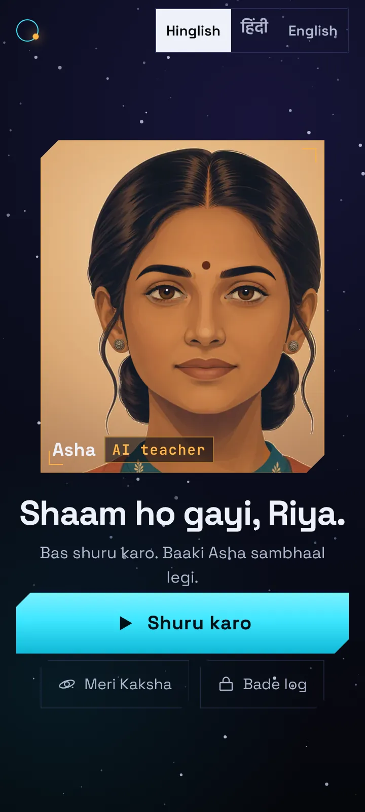
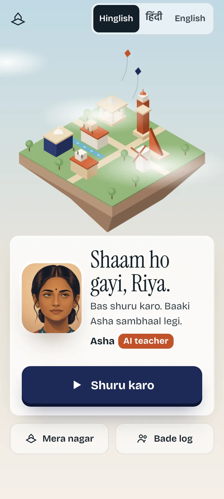
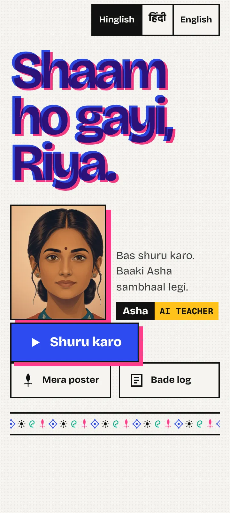

# U1 · three gamified app directions: compare and pick

**Date:** 2026-10-10. **Branch:** `claude/r4-app-design`. **Stream:** U1, owner pick pending.

**Honesty first.**
- No child has seen any of this.
- Every score below comes from **model judges** (advisory, not children and not the owner) or from my own lint.
- The game screens are stills from the research prototypes. They are not running games.
- Asha is a light DOM puppet built over the real lamp1 layers.

## The three directions

Open each `index.html` in a browser at phone width. Section 6 is a URL jump table.

### A · Kaksha (कक्षा: an orbit, and a classroom)

**What it is:** a premium dark game client. A three-layer parallax starfield, hairline glass panels, chamfered HUD
corners and one plasma-cyan "your move" colour. Asha's warm kesar light sits in a lit "comms" window.

**The world:** your own planet with three orbits (Ganit, Vigyan, Bhasha). Every secured idea docks as a station,
and the planet's night side gains city lights.
- The *Kal / Aaj* toggle shows today's station docking and its lights coming on.
- The Hangar holds hulls, jet trails and board themes for Antariksh, each opened by a named skill.

**Motion:**
- Asha's window morphs between screens (a View Transition shared element).
- The camera drifts through the starfield on every screen change.
- Hold-to-launch fills the button; release early and it drains.
- A warp of star streaks, with a flash, cuts into the game.
- The plan locks on with HUD brackets.
- The session-end ship docks.

**Best at:** "cool". In both judge families' ranking passes it was the coolest and the overall first choice, **10/10**.
It continues straight into Antariksh with no change of world, so the lesson and the game feel like one product.

**Risks:**
- Dark sci-fi skews to a gamer, and possibly a male, reading. It is untested with girls and with classes 1-4.
- GPT flagged "small, low-contrast secondary text" 5/5. My lint finds 0 contrast failures after the fixes, so this
  is perception, not a measured fail. It still needs bigger secondary type in the build.
- The GPT judge marked "mascot present" 5/5 although there is no mascot. It is probably reading Asha or the orbit
  logo as one; recorded as is.
- A space world for every subject is a metaphor stretch for Hindi and SST.

### B · Nagar (नगर: a city)

**What it is:** a floating sandstone island in clear daylight, drawn as a live isometric SVG diorama with kites,
drifting clouds and a shimmering canal. The type is editorial: Instrument Serif with Tiro Devanagari, and Bricolage
for the UI. The primary action is an indigo slab with a hard extrusion. The game opens through an arch-shaped gate
reveal.

**The world:** every secured idea raises a real Indian structure.
- Equivalent fractions build a **baoli** of equal steps.
- Angles build a **jantar**, and primes a **minar**.
- A summary builds a library, and magnets a windmill.
- Today's baoli rises with a spring and sparks, and its blueprint draws itself on the end screen.
- The *Naksha-pothi* (blueprint book) shows the buildings to come as dashed blueprints that name the skill which
  opens each one. There are no locks and no counters.

**Best at:**
- Premium: Kimi gave it the highest absolute score, 4.40.
- Least childish (Kimi absolute pass).
- India feel.
- Its world teaches: the structure is the idea, such as equal steps for equal parts.

**Risks:**
- Both judges called it "restrained / editorial / slightly adult": calm rather than exciting for a 12-year-old.
- In GPT's absolute pass it was the most "childish" of the three at 1.60, and 2/5 GPT runs saw a "mascot".
- It is the most art-hungry to build: every skill needs a structure.
- The lamp-lit Prakash world was already dropped once. Nagar is daylight, isometric and buildable, but it is still a
  world.

### C · Chhaap (छाप: a print, an impression)

**What it is:** a risograph print studio. Two inks (fluoro rani pink and riso blue) and black on bright stock, with
halftone dots and hard 2 px rules with misregistered ink shadows. The greeting is set in huge type whose pink plate
snaps into register on load.
- The game is "printed in" by three ink rollers sweeping across.
- The checkpoint stamp lands with a thunk.
- The parent view is a one-page newspaper.

**The world:** each secured idea opens a carved wooden block-print stamp (buti, sun, jaal, kairi), echoing Asha's
own block-print kurta.
- Your poster prints a new pass with each block, under your name set huge.
- You pick the ink, which gives identity and choice without currency.
- On the end screen the new block presses down and leaves its print.

**Best at:** identity and making. It is the most distinctive look of the three, and its print motif ties to Asha
herself.

**Risks:**
- It was the weakest in both ranking passes: 0/10 first.
- Kimi called it "craft app for much younger kids", "scrapbook" and "visually noisy" (cool 3.60, childish 1.80).
- GPT flagged crowding 4/5.
- The poster is the least "game" of the three worlds.

## Judge table (MODEL JUDGES, advisory)

**Method:** blind, with no names and no direction labels.
- **Absolute pass:** six separate 360x800 @2x screens of one direction per call (Open, Intake, Lesson board, Game
  launch, End, World), n = 5 calls per judge per direction.
- **Ranking pass:** the three directions as contact sheets in shuffled order with neutral letters, n = 5 per judge.
- Open answers come before the scales, and binary atomic items sit beside the 1-5 scales (rj-holistic-model-judge-gate).
- **Judges:** two model families on Azure, `taxila-brain` (GPT family) and `taxila-kimi26` (Kimi K2.6).
- **Run:** 2026-10-10, 0 errors. Raw and summary data are in `judge/raw.json` and `judge/summary.json`; the
  harness is `_src/judge.mjs`.

**Scales are mean ± sd (n = 5). Childish: lower is better, bar ≤ 1.**

| item | Kaksha GPT | Kaksha Kimi | Nagar GPT | Nagar Kimi | Chhaap GPT | Chhaap Kimi |
|---|---|---|---|---|---|---|
| cool to a 12-year-old (1-5) | 4.00 ± 0 | 4.00 ± 0 | 4.00 ± 0 | 4.00 ± 0 | 4.00 ± 0 | 3.60 ± 0.49 |
| premium (1-5) | 4.00 ± 0 | 4.00 ± 0 | 4.00 ± 0 | **4.40** ± 0.49 | 4.00 ± 0 | 4.00 ± 0 |
| childish (1-5, lower is better) | **1.00** ± 0 | 1.40 ± 0.49 | 1.60 ± 0.49 | 1.40 ± 0.49 | 1.20 ± 0.40 | 1.80 ± 0.40 |
| clarity (1-5) | 4.00 | 4.00 | 4.00 | 4.00 | 4.00 | 4.00 |
| India feel (1-5) | 5.00 | 5.00 | 5.00 | 5.00 | 5.00 | 5.00 |
| feels like a real game / premium app | 5/5 | 5/5 | 5/5 | 5/5 | 5/5 | 5/5 |
| teacher reads as an adult professional | 5/5 | 5/5 | 5/5 | 5/5 | 5/5 | 5/5 |
| kiddie palette / bubbly font / worksheet | 0/0/0 | 0/0/0 | 0/0/1 of 5 | 0/0/0 | 0/0/0 | 0/0/0 |
| mascot present (there is none) | 5/5 | 0/5 | 2/5 | 0/5 | 2/5 | 0/5 |
| text hard to read | 5/5 | 0/5 | 1/5 | 0/5 | 4/5 | 0/5 |
| reward economy visible (points, coins, streaks) | 0/5 | 0/5 | 0/5 | 0/5 | 1/5 | 0/5 |

**Ranking pass (n = 5 per judge):**

| judge | coolest to a 12-year-old | least childish | most premium | first overall |
|---|---|---|---|---|
| GPT | Kaksha 5 | Kaksha 4, Chhaap 1 | Nagar 4, Kaksha 1 | **Kaksha 5** |
| Kimi | Kaksha 5 | Kaksha 3, Nagar 2 | Kaksha 3, Nagar 2 | **Kaksha 5** |

**How to read this:**
- The absolute 1-5 scales saturate. Almost every cell is 4, with sd 0, so they barely separate the directions. The
  forced ranking is where the judges disagree with each other's ceilings.
- The "childish ≤ 1" bar is met only by **Kaksha, GPT (1.00)**. Every other cell is 1.20-1.80, below 2, but not ≤ 1.
- By the brief's own bar, none of the three is measured as fully met on both judges.

**Common weaknesses the judges named (all directions):**
- The phone lesson board is "static, mostly empty below the line" (Kimi, 7 of 15 runs).
- The intake and end screens are text-dense.
- These are layout fixes for whichever direction is picked: the board should carry the next beat's picture, and
  the end screen should shed lines.

**Run 1, superseded and kept in `judge/run1-sheets/`:**
- It used one downscaled contact sheet per direction.
- GPT flagged "text hard to read" on every direction, an artefact of the 1x sheet.
- Kimi returned no JSON within 3,000 tokens (14 errors).
- Its ranking pass agreed: Kaksha first, 10/10.

## Own lint (sizes, targets, overflow, contrast)

**Harness:** `_src/lint.mjs`, Playwright Chromium with computed styles and reduced motion. It covers 8 journey
states × 3 languages (Hinglish, हिंदी, English) × 2 viewports (360x800, 1366x768), which is 48 page states per
direction. Results are in `<dir>/shots/lint.json`.

| finding | Kaksha before → after | Nagar before → after | Chhaap before → after |
|---|---|---|---|
| text < 14 px | 12 → **0** | 12 → **0** | 12 → **0** |
| Devanagari < 16 px | 4 → **0** | 0 → **0** | 0 → **0** |
| touch targets < 44 px | 48 → **0** | 48 → **0** | 48 → **0** |
| WCAG contrast fails (4.5 : 1, or 3 : 1 for large text) | 54 → **0** | 126 → **0** | 72 → **0** |
| pages with horizontal overflow | 0 → **0** | 0 → **0** | 6 → **0** |

The pages checked hold 921 / 921 / 945 text elements.

**What the "before" findings were:**
- Board numerals at 10-12 px on a phone. The board now refits its coordinate space below 700 px, so numerals render
  at about 21 px and fractions at about 25 px.
- Segmented controls at 38-42 px tall.
- Grey labels at 3.8 : 1 (Nagar).
- Pink and mint text at 3.0 : 1 (Chhaap).
- An off-screen stamp animation causing overflow (Chhaap).
- The first contrast pass also over-counted: it guessed translucent gradient stops against grey. The lint now
  composites each stop over the real background beneath it.

**Not measured:** a real phone, frame rate, and motion quality. A headless video capture blacked out about 30 s of
the flow, so I removed it rather than ship a misleading clip. The motion is in the prototypes themselves.

## Recommendation (mine, for the owner to overrule)

**Pick Kaksha as the shell**, for three reasons:
- It was the only direction that both judge families ranked first (10/10), and it met the childish bar with GPT.
- It flows straight into Antariksh, the first real engine being built.
- Its HUD vocabulary (comms window, lock-on, hold-to-launch) carries game energy into the lesson itself.

**Steal from Nagar for the world, if the owner wants it:** a world whose objects *are* the ideas (equal steps for
equal parts) teaches. Kaksha's stations are only lights.

**The hybrid, an owner decision:** Kaksha's planet surface becomes a small buildable Nagar-style settlement on the
night side.

**Before scale, run the cheap child test from TEARDOWN §3.2:** a five-second "who is this app for?" with 20 class 4-5
and 20 class 7-8 children. Include girls and class 4-5. That is Kaksha's real risk, and no model judge can measure it.

## 6. Jump table

`index.html#s=<screen>&at=<state>&lang=<hing|hi|en>`

| screen | `s` | states |
|---|---|---|
| Open | `open` | n/a |
| Intake | `intake` | `at=plan` (already agreed) |
| Lesson | `lesson` | live beats; `at=check` (waiting for a tap); `at=ok` (answered) |
| Game | `game` | `at=play` (after launch) |
| End | `end` | n/a |
| World | `world` | `at=before` (yesterday) |
| Parent | `parent` | n/a |

Shots: `<dir>/shots/<state>__360x800.webp` and `__1366x768.webp`, with 12 states each, including Hindi intake and
Hindi parent.
