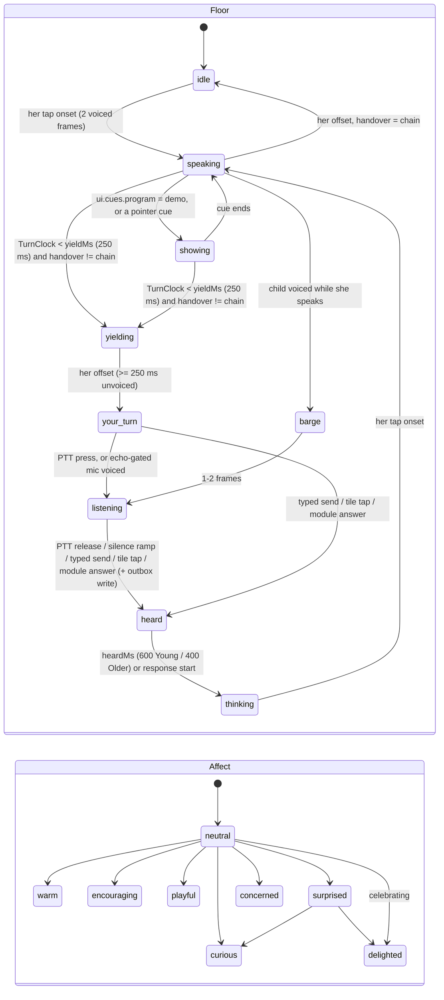

# TEACHER-VISUAL.md: what the teacher looks like, and why it is not video

Date: 2026-10-03. Status: **decision + build spec** (proposed; the main loop merges the `context/` entries in §16).
Revised 2026-10-03 after the adversarial design critique: the face is verdict-neutral in every row (§6, §7), the floor
states match PRODUCT-DESIGN-V2 §4.1 (`showing`, `heard`, the 250 ms `yielding`), a teacher-register rule is added (§4.2),
and Appendix A defers to the one generated Codex prompt.
Owner directives this answers (2026-10-03, `context/decisions.md#owner-design-v2-directive`):
- use video for the teacher if the cost works;
- if it does not, build a "crazy level" 3D teacher: highly detailed, expressive, a human face that visibly changes
  when she speaks, listens, thinks and feels, so the child forms a visual connection;
- UI chrome is English only (her captions are whatever she says); rich illustration is fine, and the owner
  bulk-generates images with Codex.

Builds on (and does not repeat): `docs/research/avatar/AVATAR.md` (the v1 build spec),
`video-avatar-v2.md` + its graphics review, `behaviour-expressiveness.md`, `audio-to-face-ml.md`,
`character-creation.md`, `performance-android.md`, `docs/research/market/pricing-unit-econ.md`.

Evidence tags: **[M]** measured this session (script in this folder), **[V]** verified in a primary source this
session, **[R]** carried from a cited research doc, **[U]** assumption or estimate, **[D]** a decision this doc makes.

Files in this folder:

| file | what it is |
|---|---|
| `azure_prices_pull.py` → `azure-prices-2026-10-03.json` | every Azure Retail Prices API row cited below (272 rows, 5 queries) |
| `teacher_cost.py` → `teacher-cost-2026-10-03.txt` | the cost tables in §2, rerunnable from the JSON |
| `bench/measure.mjs`, `bench/hero-proxy.html` → `bench/measure-2026-10-03.json` | the M0 render measurement and the tier-budget proxies in §3 and §10 |
| `m0-asha-close-2026-10-03.png` | M0 today, close framing, tier B, mid-speech |

---

## 0. The decision on one screen

1. **No live video teacher. [D]** Re-priced today, the cheapest licence-clean live video (MuseTalk 1.5 on an Azure
   A100 in Central India, pooled) costs **$22 per student-month for full lessons** and **$2.30–24.45 for "hybrid"**
   (live only during two-way dialog), against **$2.64–13.23 of net revenue** per student-month at ₹299–1,499 [M].
   Holding GPUs for the evening peak raises that to **≈ $49 per student** even at 10,000 students [M]. The Azure TTS
   avatar is $0.50–0.80/min and does not take our voice. Sora 2 rejects face images, invents its own audio and its
   Azure deployment retires 2026-10-15. Nothing changed since 2026-10-02 that moves the verdict (§2).
2. **The teacher is a real-time 3D "hero" character [D]**: photoreal-leaning stylised ("S3h", §4), head and
   shoulders, built once per character at film-like detail and shipped as four runtime levels from that one source:
   **H** (hero, capable phones), **B+** (the ₹10k phone, baked from the same sculpt), **B-lite** and the **D** plate,
   plus **E** voice-only.
3. **Video survives in one form that does fit: cinematic moments of the same 3D character, rendered offline [D].**
   Greetings without a name, chapter openers, celebrations and the picker previews are rendered once in Blender from
   the H rig with full skin scattering and strand hair, about $0.3–30 per character for a moments library [M/U].
   Every child sees the same clip, and because it is the same character it does not break identity (§13).
4. **The face is driven by one compositor**: lips from the audio stream, emotion layered on top, a two-layer state
   machine (floor × affect) for the seven states the owner named, and measured micro-behaviours (§6–§9).
5. **M0 today is far from this**, measured: 24 of the 52 ARKit keys, 3 morph targets, a flat rebuilt-per-frame mouth,
   Lambert shading, 16 draw calls (§3).
6. **Reverse this** (full list in §16): if licence-clean live video falls to **≤ $0.0029 per session-minute**
   (20% of ₹999 net revenue at 610 dialog minutes), about 8.6× below today's best; or if a ≥ ₹2,999 tier with ≥ 600
   subscribers shows an A/B lift for video. Ship the S2 look instead of S3h, for a band, if the M-AV-1 panel rates S3h
   weirder than S2 in that band.

---

## 1. What "video" would have to mean here

A video teacher only counts if it obeys the same constraints as the 3D one:
- **It is driven by our own voice.** That is the `gpt-realtime` or cascade audio that was chosen by ear.
- **It obeys the latency floor** (`avatar-v2-prerender-first`):
  - at most 250 ms p50 added before her first audible sound;
  - at most 150 ms from barge-in to silence.
- **It runs on Azure.** Third-party avatar APIs are excluded.
- **It respects the parent's data plan.** At 4.31 MB per video-minute [M], a 45-minute lesson is about 190 MB.

Three shapes were costed:

| shape | what is video | what is computed per child |
|---|---|---|
| **full** | the whole lesson (20 × 45 = 900 min/month) | everything, live |
| **hybrid** | live video only while she is in two-way dialog; shared narration is pre-rendered | the tier's dialog minutes: 92 / 388 / 610 / 980 at ₹299 / 699 / 999 / 1,499 (`pricing-unit-econ.md` §0.4) [R] |
| **moments** | about 2 min per lesson (greeting, celebration) | 40 min/month, live if personalised; ≈ 0 if shared |

---

## 2. Video cost, re-verified (2026-10-03)

### 2.1 What was re-checked

- **Every price was re-pulled from the Azure Retail Prices API today** (`azure-prices-2026-10-03.json`) [V]:
  - **All 10 Speech avatar meters match 2026-10-02**: real-time $0.50 / $0.70 / $0.60 / $0.80 per minute; batch
    $1.00 / $1.35 / $2.00 / $2.70; custom hosting $0.60/h; photo-avatar creation $2,000 per 1K.
  - **The meters moved services:** they now sit under `serviceName = 'Foundry Tools'`, not `'Cognitive Services'`.
    A filter on the old name returns 0 rows. Fix any script that uses it.
  - **GPU VMs, Central India:**
    - NC24ads A100 v4: $5.142/h, Spot $0.950.
    - NV36ads A10 v5: $4.48/h.
    - NC24lds RTX PRO 6000 ¼ slice: $1.582/h.
    - H100: $9.772/h.
    - T4: $0.579/h.
  - **Egress:** $0.11/GB.
- **New since 2026-10-02:** a Container Apps meter "Standard NC A100 v4 GPU Usage" now exists **in centralindia**, at
  $0.000741/s ($2.67/h).
  - The ACA serverless-GPU doc (updated 2026-09-24) still lists **Central India A100 = No**; T4 only [V].
  - The nearest regions with A100 are Australia East and Sweden Central.
  - A price row is not availability. The cost table keeps this row as "not available".
- **Sora 2** (`Azure OpenAI Media`):
  - $0.10 per second (global standard), $0.11 per second (data zone); Sora 2 Pro $0.30 per second [V].
  - Earlier Sora 1 meters run $0.15–3.60 per second.
- **No other generative video model is sold direct by Azure.** A search of the `Foundry Models`, `Foundry Tools` and
  `Cognitive Services` meters for "Video" returns only Video Indexer, Video Translation, Content Understanding and
  Video Analyzer. These analyse or translate video; none generates a face [V].
- **`video-avatar-v2-cost.py` re-ran unchanged.** It reproduces its published tables exactly.
- **`teacher_cost.py` replaces it for this decision.** Changes:
  - the market doc's FX (₹96, not ₹87) and the market doc's tiers;
  - revenue net of 18% GST;
  - the review's pinned-session capacity (R1.8);
  - Wav2Lip dropped, because it is non-commercial (R1.3);
  - a peak-window fleet (GPUs held for 5 h, not billed by the average minute).

### 2.2 Live video per student-month (marginal cost, before any warm-GPU floor) [M]

| renderer | $/session-min | full (900 min) | hybrid at ₹299 / 699 / 999 / 1,499 | moments (40 min) | licence |
|---|---|---|---|---|---|
| Azure TTS avatar, standard, real-time | 0.500 | $450.00 | $46 / $194 / $305 / $490 | $20.00 | first-party, but it renders **its own TTS voice**, not our audio |
| Azure TTS avatar, HD / custom | 0.70 / 0.60 | $630 / $540 | — | $28 / $24 | custom needs limited-access approval, an actor and $0.60/h hosting per endpoint |
| MuseTalk 1.5, A100 VM, pinned 2 sessions/GPU | 0.0433 | $38.98 | $3.98 / $16.81 / $26.42 / $42.45 | $1.73 | MIT code and weights: clean |
| MuseTalk 1.5, A100 VM, pooled 3.5/GPU | 0.0249 | $22.45 | $2.30 / $9.68 / $15.22 / $24.45 | $1.00 | clean; needs a per-utterance GPU-pool scheduler (3–4 weeks) |
| MuseTalk 1.5, ¼ RTX PRO 6000 slice | 0.0268 | $24.15 | $2.47 / $10.41 / $16.37 / $26.29 | $1.07 | clean; NVENC in a vGPU slice is unmeasured (E-13) |
| MuseTalk 1.5, A10 VM, 1 session | 0.0751 | $67.62 | $6.91 / $29.15 / $45.83 / $73.63 | $3.01 | clean; throughput unmeasured |
| Ditto, A100, 1 session | 0.0862 | $77.55 | $7.93 / … / $84.44 | $3.45 | **not clean**: InsightFace detector, and the HF weights declare no licence |
| LivePortrait driven by our `FaceFrame`, A100 | 0.0433 | $38.98 | — | $1.73 | **not clean** until InsightFace is swapped; the retarget model is research |
| (ACA serverless A100, if it ever lands in India) | 0.0227 | $20.42 | $2.09 / … / $22.24 | $0.91 | not available in Central India today [V] |

### 2.3 Against revenue [M]

| tier | net revenue per student-month | MuseTalk pooled, hybrid | share of net | MuseTalk pinned, moments | share | Azure avatar, moments | share |
|---|---|---|---|---|---|---|---|
| ₹299 | $2.64 | $2.30 | **87%** | $1.73 | 66% | $20.00 | 758% |
| ₹699 | $6.17 | $9.68 | **157%** | $1.73 | 28% | $20.00 | 324% |
| ₹999 | $8.82 | $15.22 | **173%** | $1.73 | 20% | $20.00 | 227% |
| ₹1,499 | $13.23 | $24.45 | **185%** | $1.73 | 13% | $20.00 | 151% |

The market model already spends the gross margin on the voice lanes. It targets 55%, and voice is what price buys.
So even the "20% of revenue" budget used on 2026-10-02 is generous.

Reading the tables:
- **Full and hybrid live video cost more than the student pays, at every tier.**
- **Live moments** cost 13–28% of revenue at ₹699–1,499. They still need a warm GPU floor, a self-hosted SFU and
  server-side voice transport. The graphics review estimates 5–7 engineer-months for that, and it changes the audio
  floor the portfolio protects.

### 2.4 The warm floor (peak window, pinned) [M]

GPUs must be allocated for the 5 h evening window. They cannot be billed per average minute (review R1.8).

| students on a video tier | hybrid (₹999 dialog minutes) | full |
|---|---|---|
| 100 | 7 A100s, $5,399/mo → **$54/student** | $77/student |
| 1,000 | 64 A100s, $49,363/mo → **$49/student** | $73/student |
| 10,000 | 636 A100s → **$49/student** | $72/student |

There is no scale economy past the first few GPUs. The cost is linear in peak concurrency.

### 2.5 Pre-rendered, shared clips (one-time per character) [M; throughput factors R/U]

| renderer | $/video-min | 40-min moments library | 30,000-min narration library | blocking problem |
|---|---|---|---|---|
| MuseTalk 1.5 offline, Spot A100 | 0.0066 | **$0.26** | **$198** | needs base clips of a photoreal person, which is a different person from the live 3D face (identity break, review R3) |
| LatentSync-class diffusion, Spot A100 | 0.158 | $6.33 | $4,751 | InsightFace detector (non-commercial) |
| Azure TTS avatar batch, standard / custom | 1.00 / 2.00 | $40 / $80 | $30,000 / $60,000 | Azure's stock or actor avatar, Azure voice: not our teacher |
| Sora 2 / Sora 2 Pro (one take) | 6.00 / 18.00 | $240 / $720 | $180k / $540k | **input images with human faces are rejected** [R, Azure doc]; no identity across clips; it generates its own audio, so it cannot lip-sync to our voice; the deployment retires 2026-10-15 (`rejected.md#sora-for-curriculum`) |
| **Offline render of our own 3D hero (Blender)** | ≈ 0.01–0.5 [U] | ≈ $0.3–20 | not needed | none: same rig, same identity (§13) |

Streaming 15 min of pre-rendered video per lesson costs about $0.14 per child-month in egress. The parent pays
**1.26 GB/month** of mobile data for it [M], which is why narration stays audio plus the 3D face by default.

### 2.6 Verdict per option

| option | verdict | why |
|---|---|---|
| Azure TTS avatar (real-time) | **rejected** for lessons and moments | $20 per student-month for moments alone; it drives its own TTS voice (no "send your own PCM" input) [R] |
| Azure TTS avatar (batch) | **rejected** | it is not our character, and not our voice |
| MuseTalk 1.5 live, self-hosted | **gated v2b** (gates unchanged, `avatar-v2-prerender-first`) | costs more than revenue for hybrid; the latency bar will probably fail (review R2) |
| MuseTalk 1.5 offline | **not for v1** | cheap, but it needs a photoreal person the live 3D face cannot match. Revisit only if a photoreal character is adopted |
| LatentSync | **rejected** until the detector is swapped | InsightFace |
| Ditto / LivePortrait | **rejected** until licence-clean | InsightFace, plus undeclared weights (Ditto) |
| Sora 2 | **rejected** | faces rejected, own audio, retiring |
| **3D hero, real time** | **adopted** | $0 marginal compute, ≈ 4 MB once per device, no added latency, no change to the audio path |
| **3D hero, offline cinematic moments** | **adopted** | the only video that fits, and the same person as the live face |

---

## 3. M0 today, measured

**Method.**
- `bench/measure.mjs` ran on `/dev/avatar` (vite dev, `VITE_DEV_ROUTES=1`) in headless Chromium 1194 with
  **ANGLE SwiftShader: software WebGL2, no GPU**, in a 4-vCPU container.
- Other workstreams were loading the machine (load average 4–8). Treat timings as noisy, CPU-rasteriser figures. They
  are **not phone numbers**.
- Two runs:
  - (a) the shipped capped loop for 10 s;
  - (b) a fresh page, 300 ms after the stage exists (before the 2 s probe can demote it), with the stage's loop
    stopped, then 90 frames × 3 rendered back to back. Each frame is followed by a 1-pixel `readPixels`.
    `gl.finish()` did not block under ANGLE and read 0.1 ms; that is a trap for any future harness.

| arm | draw calls | triangles | canvas px | uncapped ms/frame p50 (3 reps) | capped loop (10 s) |
|---|---|---|---|---|---|
| Asha, B, 360×640, medium | **16** | 19,114 | 127,680 | 33.4 / 30.3 / 34.0 | 30 fps p50, interval p95 66.6 ms; the governor dropped DPR to 0.85 |
| Arjun, B, 360×640, close | 16 | 22,846 | 100,800 | 46.7 / 38.0 / 35.7 | **probe demoted B → D** under contention |
| Asha, B, 1280×800 | 16 | 19,114 | 212,800 | 32.1 / 20.7 / 20.6 | probe demoted B → D |

Scene inventory [M]:
- **1 morphed mesh, 3 morph targets** (`jawOpen`, `cheekL`, `cheekR`) on 3,187 vertices.
- Materials: `MeshLambertMaterial` plus `MeshBasicMaterial`.
- 16 meshes.
- The rig reads **24 of the 52 ARKit keys**:
  - jawOpen, mouthClose;
  - mouthSmile, mouthStretch, mouthPress (both sides);
  - mouthFunnel, mouthPucker, mouthPress;
  - cheekSquint, eyeBlink, eyeWide, eyeSquint (both sides);
  - browInnerUp, browOuterUp L/R, browDown L/R.
- The mouth is **one flat mesh whose positions are rebuilt on the CPU every frame** (interior, teeth and tongue
  strips, lips).
- Lids are rotating hemispheres; brows are capsules.
- The prior clean measurement (`avatar-m0-fps-headless-2026-10-03`) holds 30/30/20 fps on the same harness.

Findings:
1. **The probe demotes a healthy B face to the 2D plate on a busy CPU.** This is correct by its own rule:
   interval p90 > 80 ms on SwiftShader under load.
   - The reason string reads "probe failed (work p90 1.9 ms)" even when the *interval* tripped it
     (`src/avatar/tier.ts` `probeVerdict`). Fix the label to name the signal that fired, or telemetry will blame
     the wrong cause.
2. **Against the target, M0 lacks:**

| target (§5) | M0 |
|---|---|
| 52 ARKit + 15 visemes + correctives, sculpted | 3 morph targets; 24 keys mapped onto procedural parts |
| modelled lips, teeth, gums, a tongue with tip and blade | a 2D strip mouth rebuilt per frame |
| an eye with cornea, iris parallax, limbal ring, wet line, caruncle, AO shell | flat circles on a sphere with a painted catch-light |
| skin with a pre-integrated scattering LUT, normal, micro-detail and wrinkle maps | Lambert with vertex colour |
| hair cards with a lit strand texture | spheres and a shell |
| ≤ 5 draws (B+) / ≤ 8 (H) | 16 draws |
| a sculpted, identity-specific face | an ellipsoid with a tapered jaw |
| prosody-coupled head, breathing, saccade main sequence | behaviour is present and good (spring nods, gaze, blinks); breathing is body-scale only |

**What to keep:**
- the whole driver stack: tap → `LipDriver` → floor FSM → `Behaviour` → `Compositor` → `rig.apply`;
- the tiers and governor;
- the rig contract: ARKit-named weights, head [p, y, r], gaze.

`avatar-m0-procedural-head` already made `head.ts` the only file a factory GLB replaces. That stays true here.

---

## 4. The look: "S3h", photoreal-leaning stylised

### 4.1 Where it sits

| level | shape | eyes | materials | used for |
|---|---|---|---|---|
| S2 (AVATAR §5.2) | real proportions, slightly large head | ×1.15–1.2, painted | painted albedo, Lambert, no normal maps | the fallback arm, B-lite, D |
| **S3h (this doc, default)** | **real adult proportions; a head ≈ 3% large; slightly simplified planes** | **×1.03–1.06, physically built** (cornea, iris depth) | **measured skin: scattering, specular, pores at low amplitude, wrinkle maps** | H and B+ |
| photoreal | scan-real | real | scan | not used: uncanny risk for under-9s, likeness risk, and no Mali-G52 path |

### 4.2 Rules [D]

- **Shape and material move together.**
  - Realistic materials on stylised shapes reduce appeal (Zell 2015 [R, `character-creation.md`]).
  - S3h therefore raises both together: eyes come down to ×1.03–1.06 *because* skin goes up.
  - It never pairs film skin with cartoon eyes, or the reverse.
- **Appeal comes from the face, not from glamour.**
  - Clear, readable planes: cheekbone, the nasolabial region, the lid crease.
  - Slightly softened pores.
  - No make-up beyond what the MST band carries naturally.
  - No beauty-filter skin.
  - Asymmetry of 3–8%, seeded per character.
- **The voice is exactly human, so the face must not be robotic.**
  - Mitchell 2011 found a realism mismatch between voice and face eerie [R].
  - With a human voice, a more human face *reduces* mismatch.
  - The risk moves to motion: dead eyes and mechanical blinks.
  - So §8 is half of the realism budget.
- **Age band caution.**
  - Children older than about 9 rate very human-like *robots* creepier (Brink 2019 [R]). Classes 4–7 are ages 9–12,
    right on that boundary.
  - S3h ships as the default because the owner asked for it. It is tested against S2 in M-AV-1 (E-T1), with a
    per-band reversal.
- **She is visibly an AI teacher.** Every lesson surface carries the non-interactive "AI teacher" label (PRODUCT-DESIGN-V2
  §6.3.4: under the TeacherWindow in the Face layout, as an "AI" tag on the face in the SpeechRow), and her introduction
  says so. There is no human backstory (safety floor).
- **Teacher register, never companion register (safety floor).** Every character is a professional teacher at work:
  modest everyday clothes, no glamour styling, no make-up beyond what the MST band carries, no seductive, coy,
  flirtatious or romantic expression, pose or framing, no "missing you" or longing faces. Lookdev (H13) and the emotion
  sheet (G15) are signed off against this rule as well as against quality; a reviewer who would find a still odd for a
  children's teacher fails it.

### 4.3 Per-character notes

These apply the code cast in `shared/tutors.js`, which is canonical for ids.

| id | brief | S3h signature details |
|---|---|---|
| `asha` (24 F, MST 6) | kurti with a denim jacket, high ponytail, small studs | ponytail with flyaways (cards); lively brows; a faint dimple on smile |
| `arjun` (26 M, MST 7) | check shirt over a tee, curls, round glasses | curl clumps; real glasses with a thin rim, lens reflection on H only; light stubble *texture* (no cards) |
| `uma` (34 F, MST 8; draft) | handloom saree, low bun | pallu as a skinned mesh; calm brows; fine lower-lid detail |

AVATAR §5.1 calls the third tutor `nandini` and adds a `senior-m`. The code ships `uma` as a draft. The owner must
settle names (§14).

---

## 5. Rig and asset specification

### 5.1 Geometry

| part | H (hero) | B+ (₹10k) | notes |
|---|---|---|---|
| head (face mask + scalp) | ≤ 16k tris; morphed "mask" ≤ 7k vertices | ≤ 8k tris; mask ≤ 5k vertices | MPFB topology at subdivision 1 (H) or 0 (B+). This keeps the lid and lip loops that decimation destroys (`avatar-asset-dead-ends` #3) |
| eyes | 2 × (sclera/iris ball + cornea dome + wet-line strip + AO shell) ≈ 2.5k | 2 × ball + cornea ≈ 1k | eye bones rotate the balls; `eyeLook*` morphs drive the lids at follow gain only (AVATAR §4.2) |
| teeth + gums | upper on the skull, lower on the jaw bone, ≈ 2k | ≈ 0.8k | darkened by `jawOpen` (mouth-bag occlusion uniform) |
| tongue | 4-bone chain + morphs, ≈ 0.8k | ≈ 0.4k | see §5.2 |
| mouth bag | ≈ 0.3k | ≈ 0.2k | dark, unlit gradient |
| hair | ≤ 12k tris of cards + an opaque core shell | shell + ≤ 3.5k tri fringe cards | cards with alpha-to-coverage under MSAA; never alpha-blend (Mali Early-Z, `performance-android.md`) |
| brows, lashes | cards (≈ 1.2k), skinned to brow bones + lid morphs | painted + lash card strip | lashes carry blink, squint and wide only |
| body + garment | ≤ 8k | ≤ 3.5k | unmorphed, split at the collar (AVATAR S9); pallu, dupatta and jacket collar skinned, with no cloth simulation |
| **total in view** | **≤ 45k tris, ≤ 8 draws** | **≤ 18k tris, ≤ 5 draws** | |

### 5.2 Morph targets (position-only on every tier; shading for creases comes from wrinkle maps instead of morph normals)

| group | count | names | ships on |
|---|---|---|---|
| ARKit 52 | 52 | the standard set, including `tongueOut`, `cheekPuff`, `mouthRollUpper/Lower`, `mouthShrugUpper/Lower`, `noseSneer*`, `jawForward/Left/Right` | H, B+ |
| visemes (Oculus 15) | 15 | `sil PP FF TH DD kk CH SS nn RR aa E I O U` | **H ships them as morphs. B+ folds them into ARKit through the per-character `lipMatrix`** (AVATAR decision) |
| tongue extras (Hindi) | 3 | `tongueTipUp` (dental t, th, d, dh against the upper teeth); `tongueCurl` (retroflex ṭ, ṭh, ḍ, ḍh, ṇ, ṛ); `tongueWide` (open ā and e with the jaw open) | H; B+ gets `tongueTipUp` only |
| correctives | 7 | `jawOpen×mouthClose` (lip seal under an open jaw); `jawOpen×mouthSmile`; `eyeBlink×eyeLookDown`; `eyeBlink×eyeSquint`; `mouthFunnel×jawOpen`; `browInnerUp×browDown` (worry knot); `cheekSquint×eyeBlink` | H all 7; B+ the first 3. glTF has no drivers, so each corrective's weight = the product of its parents, computed in `rig.apply` from `runtime.json` |
| **total** | **H 77, B+ 55** | | |

**Memory** (16 B per morphed vertex per target, ×2 for three's retained JS copy; `performance-android.md` C-1) [U arithmetic]:

| tier | morph cost | budget headroom |
|---|---|---|
| H | 7k × 77 × 16 B = 8.6 MB → **17.2 MB** | inside H's 45 MB resident budget |
| B+ | 5k × 55 × 16 B = 4.4 MB → **8.8 MB** | inside the 20 MB tier-B line |

### 5.3 Skeleton

- MPFB / TalkingHead-compatible upper-body skeleton, Mixamo-style names, root `Armature`.
- Plus: `jaw`; `eye.L/R`; `tongue01–04`; `brow.L/R` (2 bones each, for the brow ridge slide); `lid` helper bones are
  not used (lids are morphs).
- Dynamic chains on **H only** (≤ 16 bones): ponytail, curl clumps, pallu edge, earrings. Damped springs in the
  controller tick, never a physics engine. B+ has none (AVATAR budget).
- Breathing: `spine02/03` + `clavicle.L/R`, driven by the controller.

### 5.4 Materials (one custom shader family, `TaxilaSkin`, GLSL ES 3.0, WebGL2)

| map / term | H | B+ | B-lite |
|---|---|---|---|
| albedo | 2048² UASTC (→ ASTC) | 1024² ETC1S | same as B+ |
| normal (baked from the sculpt) | 2048² UASTC | **1024² UASTC** (new for tier B: an amendment, gated by E-T2) | off (vertex normals) |
| micro-normal (tiled ×12, procedural) | 512² | — | — |
| wrinkle normals: compress + stretch | 2 × 1024² | 1 × 512² (compress only) | — |
| region masks (forehead, glabella, crow's feet L/R, nasolabial L/R, chin, neck) | 512² RGBA × 2 | 256² RGBA × 2 | — |
| packed cavity / roughness / thickness | 1024² | 512² | — |
| diffuse | **pre-integrated skin LUT** (Penner 2011; 128 × 64, computed by our script) indexed by N·L and curvature | the same LUT | wrap Lambert |
| specular | dual-lobe GGX (roughness 0.35 / 0.6, mix 0.85 / 0.15), cavity-masked | single GGX | none (matcap highlight) |
| back-scatter | ears and nostrils via the thickness map | — | — |
| emotion flush | ≤ 0.04 red bias on cheeks for `delighted` only | — | — |
| lighting | key directional + L1 spherical harmonics (9 coefficients baked per stage background) + rim | key + hemisphere | key + hemisphere |
| tone mapping | Neutral | baked into the textures | baked |
| shadows | none; baked AO + a contact shadow texture under the chin and jaw | baked | baked |

**Eyes** (`TaxilaEye`):
- an iris plane under a cornea dome, with a parallax offset that fakes refraction (one extra UV computation, no
  transmission pass);
- limbal ring darkening, sclera veins at ≤ 0.1;
- a wet-line strip with a sharp specular;
- an AO shell that darkens the eyeball near the lids (H) or bakes it (B+);
- the catch-light is the key light's real specular on the cornea (H) or a matcap (B+).

**Hair** (`TaxilaHair`): alpha-to-coverage, Kajiya-Kay dual shifted highlights from a tangent / flow map, and a
depth-tested opaque core. There is no per-frame sort.

**Why a custom shader and not `MeshPhysicalMaterial`.** The proxy (§10) measured the hero geometry at **≈ 101–144 ms
in Lambert vs ≈ 555–750 ms with MeshPhysical** (sheen, clearcoat, anisotropic hair, PMREM environment) on SwiftShader.
That is 4–6× for terms skin does not need [M, CPU raster]. `TaxilaSkin` keeps only the LUT diffuse, one or two GGX
lobes and three to five extra texture fetches. Its real cost must be measured on device (E-T2).

---

## 6. Emotional range

All amplitudes are ARKit deltas at intensity 1, before the band scale (B1 1.0 / B2 0.9 / B3 0.7 / B4 0.55,
amplitudes only).

Rules that apply to every row:
- **Every smile carries `cheekSquint` and a lower-lid raise** (the Duchenne marker).
- **Envelopes are cosine.** A new emotion cross-fades with the old one, which decays as its own layer.
- **Each emotion has a pool of 3–5 parameterised variants** with habituation decay, so 40–80 praise moments in a
  lesson never repeat one face.
- **The expressive budget holds** (AVATAR §4.4):
  - at most one big expression (intensity ≥ 0.6) per 30 s;
  - `delighted ≥ 0.6` at most once per 5 turns.

| emotion | used when (source) | face (ARKit deltas) | wrinkle zones | head, gaze | attack / hold / release, ms |
|---|---|---|---|---|---|
| **warm smile** | greeting; explaining; the default positive affect; `move.kind` wrap or break | mouthSmile 0.30, cheekSquint 0.18, eyeSquint 0.12, mouthDimple 0.05 | crow's feet 0.4, nasolabial 0.5 | tilt 2°, contact 0.70 | 600 / 1500 / 900 |
| **encouraging** | a hint at levels 1–2; the child is trying (Director `effort` tag, verdict-blind) | mouthSmile 0.22, browInnerUp 0.12, mouthPress 0.05, one 2° nod at onset | nasolabial 0.3 | lean-in 0.3, contact 0.80 | 400 / 1200 / 800 |
| **curious** | the child asks a question; `ui.affect = insight`; a puzzle or a planted mistake is on the table. **Never keyed to a wrong answer** (ReactionGate: the face is verdict-neutral) | browInnerUp 0.28, browOuterUp 0.22, eyeWide 0.06, mouthSmile 0.08 | forehead 0.5 | tilt 6°; contact 0.85, capped at 0.7 while listening | 350 / 1800 / 700 |
| **thinking** (her concentration while the child's answer is being judged, and before a considered explanation) | floor THINKING; `move.kind` explain after a pause | browDown 0.06, browInnerUp 0.06, mouthPress 0.08, mouthLeft 0.04 | glabella 0.2 | cognitive gaze aversion (§8), head-led on small tiles | 300 / ≤ 3500 / 300. **Identical for right and wrong answers** (invariant I1, verdict-neutral) |
| **listening nod** (a gesture, not an emotion) | floor LISTENING, open turns only | browInnerUp 0.08, mouthSmile 0.06; continuer nods of 2.5° on child pauses ≥ 300 ms after ≥ 0.7 s of speech, ≤ 1 per 3 s | none | tilt 4°, stillness ×0.7, contact ≤ 0.7 | per nod: 120 / 0 / 280 |
| **gentle concern** | content difficulty; "I don't get it"; repair moves; hint ≥ 3. A safeguarding hand-off uses the calm variant with a smile of 0 | browInnerUp ≤ 0.30, browDown 0.06, mouthPress 0.12, mouthSmile 0.05 (warmth stays) | glabella 0.3 | tilt 5°, head gain 0.7, contact 0.75 | 700 / 2500 / 1200 |
| **delighted** (= `celebrating`) | `ui.affect ∈ {effort, insight}`; `goal_met` after visible effort; a caught planted mistake; `celebrate` moves (budgeted). Never a plain "correct" (PRODUCT-DESIGN-V2 §4.6: the tick on the work carries correctness) | mouthSmile 0.55, cheekSquint 0.35, eyeSquint 0.22, browOuterUp 0.25, eyeWide 0.08 (onset only), jawOpen +0.08 (open smile); flush ≤ 0.04 (H) | crow's feet 0.9, nasolabial 0.9 | head up 3° + a bounce of 1.35 gain; shoulders up 4 mm, once | 350 / 1200 / 900 |
| **playful** | jokes, games, puzzle reveals (`ui.cues` playful); never during a wrong answer; never at the child's expense | asymmetric smile (one side 0.35, the other 0.20), one browOuterUp 0.30 (a raised eyebrow), one-side eyeSquint 0.10 | crow's feet on one side | tilt 8° + yaw 4°; a sideways glance, then back to the child | 300 / 1000 / 600 |
| **surprised** (positive only) | an unexpected idea or strategy from the child (`insight` tag); resolves into delighted or curious | browInnerUp 0.40, browOuterUp 0.45, eyeWide 0.35, jawOpen 0.15 | forehead 0.8 | head back 3° | **120 / 400 / 500**; at most 1 per 2 min; never startled or fearful |

**Verdict-neutral face (ReactionGate, PRODUCT-DESIGN-V2 §0.7 and §4.6).** No row above is triggered by `verdict` alone.
Correctness lives on the child's work (the tick, the concept payoff). Her face reacts to effort, insight and content
difficulty, and its program after a correct and a wrong commit has the same distribution (G-WAIT-1, PD-G7).

**Never** (unchanged from AVATAR §4.4):
- a sad face;
- head shakes (ambiguous with the Indian head wobble, and they read as a scold);
- mimicry of the child;
- recognising anyone's emotion;
- longing or "missing you" faces;
- impatience in YOUR TURN;
- `concerned` used for behaviour (it is for content difficulty only).

**Contract change:** `FaceEmotion` (`shared/contracts.ts`) grows from `warm | curious | excited | concerned | proud`
to add `encouraging | playful | surprised | focus`. `excited` and `proud` become `delighted` variants. Unknown programs
are still dropped and logged.

---

## 7. State machine

### 7.1 Two layers, so the seven owner states never fight

The owner named seven states: idle, listening, thinking, speaking, your_turn, celebrating, concerned. Five of them are
**floor** states: who has the turn. Two are **affect**: how she feels. Merging the two layers would force "celebrating"
to steal the turn, so they stay separate. The face is `floor × affect`.



The floor states and their triggers are the ones in PRODUCT-DESIGN-V2 §4.1; that table wins on any difference. Two
timing notes reconcile this doc with AVATAR §5:
- AVATAR's **pre-yield face cue** (direct gaze, no aversions, held brow for a question) starts when the TurnClock says
  < 2.41 s of her audio remain. It is a face cue *inside* `speaking`, not a floor state, so nothing in the UI changes.
- The floor state `yielding` is only the last `yieldMs` (250 ms), so face, Question card, dock and sound change on the
  frame her voice ends.

### 7.2 Owner states → implementation

| owner state | floor | affect | what the child sees (the signal) | entered on (local signal first; link events are hints) |
|---|---|---|---|---|
| **idle** | idle | neutral / warm | slow breathing, soft contact, blinks 17/min, glances at the module if one is mounted | session start; her offset with `handover = chain` |
| **speaking** | speaking | any allowed | lips on the audio; prosody nods and brow flashes; re-gaze 0.75 s after onset; 26 blinks/min, phrase-locked | her tap onset |
| **your_turn** | yielding → your_turn | the affect she was in, decaying to warm | **lean-in (pitch −3° + forward), a held brow of 0.14, direct gaze at the child, stillness ×0.5.** The UI's lamp lights the Answer dock on the same frame, with the visible words "Your turn" (PRODUCT-DESIGN-V2 §4.2). Her body carries the question; the Question card carries its words | her offset with `handover ≠ chain` |
| **listening** | listening | neutral + listening nod | tilt 4°, contact ≤ 0.7, continuer nods (open turns only), blinks ≤ 250 ms | child onset (PTT press, or echo-gated mic) |
| **heard** (receipt) | heard | the listening affect, held (≤ 0.3) | one 2° "got it" nod, **identical for every answer**; no smile change | child commit (local), with the outbox write |
| **showing** | showing | as speaking | gaze to the tray; gaze leads her chalk mark by 200 ms | `ui.cues.program = demo` or a pointer cue |
| **thinking** | thinking | **forced `focus`; every other affect released within 300 ms** | cognitive gaze aversion (up 45% / side 35% / down 20%) at +0.3 s, ≤ 3.5 s, then soft contact if no reply has started within silence + 300 ms | child offset (local) |
| **celebrating** | speaking or your_turn | delighted | §6 delighted, plus one shoulder beat | `ui.affect ∈ {effort, insight}` or `goal_met` after visible effort, under the praise cap. Never `answer.correct` alone (§6, ReactionGate) |
| **concerned** | speaking, listening or your_turn | concerned | §6 gentle concern; never escalates while it is the child's turn | `move.kind` repair, hint ≥ 3, child distress phrase → Director |

### 7.3 Allowed combinations (the compositor enforces them; CI checks them)

| floor ↓ / affect → | warm | encouraging | curious | focus | playful | surprised | delighted | concerned |
|---|---|---|---|---|---|---|---|---|
| idle | ✓ | — | — | — | — | — | — | — |
| speaking | ✓ | ✓ | ✓ | ✓ | ✓ | ✓ | ✓ | ✓ |
| showing | ✓ | ✓ | ✓ | ✓ | ✓ | — | — | ✓ |
| yielding / your_turn | ✓ (decays) | ✓ | ✓ | — | ✓ (≤ 0.5) | — | ✓ (only if armed by an effort/insight tag) | ✓ (held, never rising) |
| listening | ≤ 0.3 | — | ≤ 0.5 | — | — | — | — | ≤ 0.3 |
| heard | ≤ 0.3 (held from listening) | — | — | — | — | — | — | — |
| thinking | — | — | — | ✓ only | — | — | — | — |
| barge | release 200 ms + "oh?" brow 0.15 | | | | | | | |

New CI invariants are added to `tests/avatar-behaviour.mjs`, each with a mutation that must trip it:
- **I15:** no affect outside this matrix.
- **I16:** `surprised` is at most 1 per 120 s and holds ≤ 400 ms.
- **I17:** `playful` is never armed within 2 turns of any graded answer, right or wrong (verdict-blind, so the face
  never leaks the verdict).
- **I18:** over 200 simulated turns, the affect distribution after `heard` does not differ between correct and wrong
  commits (χ² p > 0.2); the mutation "curious after wrong" must trip it.

---

## 8. Micro-behaviours (what makes her look alive)

| behaviour | rule | source |
|---|---|---|
| **saccades** | Main sequence: duration ≈ 2.2 ms/° + 21 ms (10° → 43 ms); eye peak velocity profile is a minimum-jerk curve. Shifts > 15° are **eye-led, then head** (50–100 ms lag, the head carries the excess beyond ±25° yaw). Shifts > 30° carry a blink at p 0.6 | Bahill 1975 [S]; AVATAR §4.2 clamps |
| **micro-saccades** | 1.5–3° (visible size) every 0.5–2 s, only when the face is ≥ 220 px tall; none below that (they shimmer at DPR 1) | AVATAR §4.3 [R] |
| **gaze timing** | comfort look-aways (Andrist's "intimacy-regulating" aversions: brief glances away that keep mutual gaze comfortable) 1.96 s every 4.75 s while she speaks; contact 1.14 s with breaks every 7.2 s at idle; continuous mutual gaze ≤ 4 s per 60 s (I12) | Andrist 2014, Ho 2015 [R] |
| **blinks** | gamma intervals (k = 3) at 17 / 26 / 20 / 18 / 18 / 22 per min (idle / speaking / yielding / your_turn / listening / thinking). Shape: close 75 ms, closed 40 ms, open 135 ms (asymmetric); 12% doubles; an event (phrase boundary, gaze shift) *advances* a scheduled blink, and a state change time-warps it | Bentivoglio 1997 [S]; AVATAR §4.2 [R] |
| **lid follow** | the upper lid tracks vertical gaze at gain 0.5, the lower at 0.25; lids never cover the pupil at rest | |
| **pupil** | baseline 0.45 of iris; hippus ±3% at 0.3 Hz; +8% over 1.5 s for curious or delighted; no light response (lighting is constant) | H only |
| **breathing** | rest 14 breaths/min (sinusoid, inhale 40%). Speech breathing: a quick inhale of 300–450 ms at each phrase start after a pause ≥ 400 ms, then a slow exhale through the phrase. Chest scale ≤ 0.6%, shoulders 2–3 mm, nostril flare 0.04 on inhale. A pre-speech inhale with lips parting 0.05 is armed by the `teacher_audio_start` hint (harmless if late) | |
| **head coupled to prosody** | an F0 tracker (autocorrelation over the existing 2048-sample tap window, ≈ 0.3 ms per frame [U]) plus RMS. **Accent** = RMS rise > 4 dB over a 120 ms baseline AND F0 > phrase mean + 1.5 st → a pitch nod impulse of 1.5–3° (spring k 120, ζ 0.6, 4 ms substeps) and a brow flash at p 0.35 (refractory 1.2 s). **Phrase-final fall** → a 2° downward settle. **Final rise** (a question) → 3° tilt + held brow (yielding). **Sustained loud phrase** → lean 0.2 | Busso 2007, Cavé 1996 [R, `audio-to-face-ml.md` §6.2] |
| **idle life** | a weight shift every 20–40 s (shoulder roll 1°); one module glance per 7 s when a module is mounted; a swallow (jaw + throat, 600 ms) at most every 3 min, idle only | |
| **asymmetry** | seeded per character: 3–8% L/R amplitude difference on smile, brow and squint; I11 bounds it | |
| **secondary motion** | H: ponytail, curls, pallu and earrings on damped springs, driven by head motion. B+: none | |
| **reduced motion / gentle face** | unchanged from AVATAR §6.5: lips and blinks stay; head and expressions ×0.3; gentle face never touches brows, blinks or visemes | |

---

## 9. Lip-sync from the audio stream, with emotion layered on

**Signal chain (unchanged; it is the audio floor).**
- The `<audio>` element plays.
- One analysis-only `AnalyserNode` taps the LevelMeter's analyser (`avatar-m0-tap-chain`).
- No AudioContext is added, and audio is never delayed. The face is delayed by the per-route `faceDelay`.
- Pass bar: −125 ms ≤ offset ≤ +45 ms (BT.1359).

**From audio to mouth.**

| layer | v1 | v1.5 (behind `FaceFrame`) |
|---|---|---|
| jaw | normalised RMS, τ 50 ms, × `jawCeiling` (`avatar-m0-lip-normalised`) | the student's `jawOpen` |
| lip shape | HeadAudio classes, retrained on our Hindi tutor voices → visemes → `lipMatrix` → ARKit | the distilled causal student: 26 mouth, jaw and tongue channels |
| visemes on H | the classes drive the 15 viseme morphs directly at reduced weight, plus the ARKit mouth keys | same |
| tongue | `tongueTipUp` on dental classes, `tongueCurl` on retroflex. Visible only when `jawOpen > 0.15` | the student's tongue channels |

**Emotion on top of visemes**, as compositor rules extending AVATAR §4.5:

```
final = clamp01( rest_c + intent(t)·E(floor) + prosody(t) + autonomic(t) + lipGain_c(emotion) ⊙ lip(t − faceDelay) + correctives(final) )
  - lip owns jawOpen, mouthClose/Press/Roll/Funnel/Pucker/Stretch/UpperUp/LowerDown, tongue*; intent never attenuates jawOpen
  - mouthClose ≤ jawOpen every frame; closure frames (PP class, /p b m bh/) force mouthClose → jawOpen within 1 frame
  - closure factor (≥ 60 ms attack, ≥ 120 ms release) scales ONLY mouthSmile* down to ×0.4, so a smile never stops a bilabial
  - lipGain_c(emotion): per-emotion modifiers on the lip channels:
      warm / delighted: mouthStretch ×0.7 (the smile already widens), corner lift +0.1 on open vowels
      concerned: jaw amplitude ×0.9, mouthPress floor 0.05 between words
      playful: smile asymmetry carried into speech at 50%
      surprised: jawCeiling +0.1 for the burst
  - wrinkle-map weights are driven from the FINAL weights (cheekSquint → crow's feet, mouthSmile → nasolabial,
    browInnerUp+browDown → glabella), so speech-driven smiles crease the face too
  - per-frame |Δ| ≤ 0.06 on non-lip, non-blink keys; weights < 0.01 → 0
```

**Hindi specifics for the bench** (E-T5 extends `evals/avatar/lip-bench.mjs`):
- **Bilabials** p, b, m, bh: closure on ≥ 90% of frames for the closure bar.
- **Labiodental / approximant** v (va): allowed as either FF or a light round.
- **Aspirates:** hold the release shape for 40–60 ms.
- **Retroflex vs dental:** tongue only. These sounds are invisible at SpeechRow size, so they are not gated there.

---

## 10. Performance tiers

### 10.1 Tiers

| tier | device class (AVATAR §6.3 detection) | assets | runtime |
|---|---|---|---|
| **H: hero** | `MEDIA_PERFORMANCE_CLASS ≥ 33`, or a GPU allow-list (Adreno 7xx, Mali-G7x MC ≥ 7, Immortalis) **and** RAM ≥ 6 GB, **and** the probe passes at H | GLB ≤ 6 MB (KTX2 UASTC + zstd, meshopt); resident ≤ 45 MB | 30 fps; DPR ≤ 1.5 (≤ 0.5 Mpx); MSAA ×4 + alpha-to-coverage; full `TaxilaSkin`, `TaxilaEye`, `TaxilaHair`; dynamic chains |
| **B+: the ₹10k phone** | everything not known-bad (the AVATAR rule) | GLB ≤ 2.2 MB; resident ≤ 20 MB | 30 / 30 / 20 fps; ≤ 0.22 Mpx; `TaxilaSkin-lite` (LUT + one GGX lobe + normal + one wrinkle fetch) |
| **B-lite** | the B-lite regex list, or the probe below B+ | same GLB as B+ | DPR 1.0, no MSAA, 20 fps, wrinkle and normal off, no micro-saccades |
| **D: plate** | AVATAR rules (no WebGL2, context lost twice, thermal SEVERE, battery < 15%) | ≈ 75 KB: a plate + 5-cell mouth strip + blink overlay, **rendered from the B+ runtime** so that B+ → D keeps the same person | DOM only |
| **E: voice-only** | thermal CRITICAL, battery < 10%, child or parent choice | none | RMS ring + name + "AI teacher" |

Placement rules:
- **On-screen size beats device class.** When the Desk switches to the Work layout and the face moves into the SpeechRow (≤ 160 px;
  never a PiP over content, PRODUCT-DESIGN-V2 §6.3.4), H drops to B+ assets and shading. Skin detail is invisible at that size, and the module needs the GPU.
- **Hero stills** (Blender renders of the H rig) are used only where nothing swaps live: picker cards, the parent
  corner, onboarding. B+ → D swaps keep using the B+-rendered plate.

### 10.2 Measured proxy cost [M, SwiftShader, CPU raster; relative only]

`bench/hero-proxy.html` reproduces each tier's *cost shape*: triangles, draws, morph count, material model, texture
fetches, alpha-to-coverage, MSAA and canvas pixels. It uses noise geometry, so it says nothing about looks.

| arm | tris | draws | canvas | ms/frame p50 (3 reps) | ms per Mpx | vs B+ Lambert |
|---|---|---|---|---|---|---|
| M0 (real page, Lambert, 16 draws) | 19.1k | 16 | 0.128 Mpx | 30–34 | ≈ 250 | ≈ 1.25× |
| B+ geometry, Lambert, DPR 1.24, MSAA | 19.7k | 6 | 0.221 Mpx | 44 | ≈ 200 | 1.0× |
| **B+, Standard + normal + 3 wrinkle/mask fetches** | 19.7k | 6 | 0.221 Mpx | 72–76 | ≈ 335 | **≈ 1.7×** |
| B+ at B-lite knobs (DPR 1.0, no MSAA) | 19.7k | 6 | 0.144 Mpx | 33 | ≈ 230 | ≈ 1.15× |
| H geometry, Lambert, DPR 1.5, MSAA | 45.0k | 6 | 0.324 Mpx | 101–144 | ≈ 390 | ≈ 2× |
| H with `MeshPhysicalMaterial` (sheen, clearcoat, anisotropy, PMREM env) | 45.0k | 6 | 0.324 Mpx | 555–750 | ≈ 2,000 | **≈ 10×** |

What this tells us, and what it cannot:
- **Normal plus wrinkle shading costs about 1.7× Lambert per pixel** on a CPU rasteriser. On a tiler GPU, texture
  fetch is cheaper relative to ALU, so the true ratio is unknown. E-T2 measures it on a Helio G85 at minute 30, against
  the AVATAR bars (GPU ≤ 6 ms, ≤ 0.4 W).
- **MeshPhysical is the wrong tool**: about 5× the hero geometry's Lambert cost. Hence the custom shader (§5.4).
- **M0's 16 draws** show up as a per-pixel cost close to a 6-draw scene with the same triangles. Draws matter more on
  the phone driver than on SwiftShader. Merging to ≤ 5 is still required.
- **None of this is a phone measurement.** The device lab (E-P3/E-P5) is still owed from M0.

### 10.3 Battery and heat

- **H is for plugged-in or high-end sessions.** The governor (AVATAR §6.4) demotes H → B+ assets at the next silence
  on thermal LIGHT or headroom > 0.85. This is a tier change inside one GLB family: H and B+ ship together on H
  devices, about 8 MB, which the APK bundles.
- **B+ must meet AVATAR's ≤ 0.4 W bar.** If it fails, B+ reverts to the AVATAR tier-B material (Lambert + baked
  normal detail in the albedo) with the same mesh.

---

## 11. License-clean sourcing (every asset)

| asset | source | licence | notes |
|---|---|---|---|
| base mesh, topology, Faceunits 01, Visemes 02 | MPFB 2 (MakeHuman for Blender) | assets and output **CC0**; the plugin code is GPLv3, run offline only [R] | already decided (`avatar-cast-shared-mpfb-s2`) |
| identity sculpt, expressions, correctives, wrinkle sculpts | our contracted artist | **work-for-hire, copyright assigned** in the contract | |
| skin albedo | painted by the artist over our own Codex / `gpt-image-2` references, projected and repainted | ours | Record provider, prompt and date in `provenance.json`. No scanned faces of real people |
| skin micro-detail | procedural (Blender noise → baked tiles) | ours | **no** Texturing.xyz, 3D Scan Store or other scan libraries (real-person likeness, plus redistribution terms) |
| eyes (mesh, iris, sclera) | our model; irises painted or generated | ours | |
| teeth, tongue, gums | MPFB helpers (CC0), refined | CC0 → ours | |
| hair | Blender hair curves → our card generator (Geometry Nodes); strand textures rendered in Blender | ours | no paid hair packs with per-seat redistribution limits |
| garments, accessories, glasses | our models; CC0 Glasses 01 as a base for `arjun` [R] | CC0 / ours | fabric swatches from Codex: no logos, no text |
| skeleton | MPFB skeleton / TalkingHead `mpfbskel` [R] | CC0 / MIT | |
| animation | authored in-house (idles, nods, beats) | ours | **no Mixamo at runtime** (AVATAR §1.5) |
| shaders (`TaxilaSkin`, `TaxilaEye`, `TaxilaHair`), skin LUT | written by us; techniques from Penner 2011, Kajiya-Kay, Jimenez | ours (techniques are not licensed) | |
| lip classes | HeadAudio, vendored [R] | MIT | retrained on our audio |
| v1.5 face labels | NVIDIA Audio2Face-3D [R] | NVIDIA Open Model License (commercial use and distillation allowed) | offline only; ship the notice |
| cinematic renders | Blender Cycles / EEVEE | GPL tool; output is ours | |
| **never** | **MetaHuman** (the EULA ties it to Unreal Engine rendering, so a three.js runtime cannot use it [S]); Reallusion Character Creator (needs a per-title export licence; avoid); Daz (interactive licence); Ready Player Me (dead); Avaturn, MetaPerson, VRoid; TRELLIS.2 stock pipeline, Hunyuan3D; Meshy, Tripo, Rodin, Polywink; InsightFace models; any scan or photo of a real person; any image with text in it | | add MetaHuman and Character Creator to the AVATAR §1.5 CI denylist |

**Amendment, flagged:** `avatar-cast-shared-mpfb-s2` says "concept art comes from the Azure image model only". The
owner's 2026-10-03 directive allows Codex-generated images saved into the repo.
- Concept and texture **references** may now come from Codex.
- Shipped pixels are always repainted or baked by the artist, and provenance is recorded.
- Counsel should read Codex's output terms once before launch (§14).

---

## 12. The character pipeline, step by step

Owner per step: **O** = owner, **AD** = art director, **A** = contracted character artist, **G** = agent.

| step | what | who | tool | gate / output |
|---|---|---|---|---|
| H0 brief | `characters/<id>/brief.json`: age, MST band, attire, signature details (§4.3), faceStyle, budgets per tier. The voice must have passed the ear test first | G, O signs | — | schema lint; name cleared |
| H1 concept | Codex batches B11–B13 of `docs/design/assets/CODEX-PROMPT.md` (Appendix A): turnaround, 13-face emotion sheet, 18-viseme sheet, eye / skin / hair / fabric / wrinkle close-ups, pose sheets, a colour script on the stage backgrounds | O generates, AD picks | Codex | `art/gen/teacher/<id>/…` + `provenance.json` |
| H2 clearance | resemblance check against public figures (reverse image search plus a panel); community review for markers | G + AD | — | a written pass |
| H3 base | MPFB human from macro sliders (1.3 s headless [R]); Faceunits / Visemes CC0 packs; helpers kept | G | `bpy` 4.2 | `base.blend` |
| H4 sculpt | identity at multires 4–5: primary and secondary forms, then tertiary (lid creases, lip lines, nasolabial). Eyeballs scaled rigidly | **A** | Blender | AD sign-off on a turntable |
| H5 expressions | 52 ARKit + 15 visemes + 3 tongue + 7 correctives, sculpted on the subdivision-1 topology, starting from the CC0 packs. **Compress and stretch wrinkle sculpts** for the 8 mask regions | **A** | Blender, Faceit (paid tool, output ours) | G1–G6 (AVATAR): lid seal by render, lip seal ≤ 0.3 mm, no intersections |
| H6 bake | the sculpt → H (sd1) and B+ (sd0) normals; cavity, AO, curvature, thickness; wrinkle normals (expression minus neutral); region masks; every key baked through the identity (`identity(neutral + δk)`) | G | `bpy` | lid leak 0.0% (`avatar-asset-dead-ends` #2) |
| H7 textures | layered albedo (melanin base matched to the MST band; haemoglobin zones on cheeks, nose, ears and lips), roughness, specular cavity | **A** + G | Blender paint | **G9: rendered L\* inside the MST band, under `TaxilaSkin`** |
| H8 eyes, mouth, brows, lashes | §5.1, §5.4 | A + G | Blender | new **G13: eye check** (iris parallax visible at 0°, 20° and 25° gaze; no sclera through the lids) |
| H9 hair | curves → clumps → cards (H ≤ 12k, B+ ≤ 3.5k); a baked strand texture and flow map | **A** | Geometry Nodes | ≤ budget; no alpha-blend |
| H10 garments | modelled and skinned; no cloth simulation | **A** | Blender | — |
| H11 rig | skeleton, jaw, eyes, tongue chain, dynamic chains (H); corrective products in `runtime.json` | G | `bpy` | — |
| H12 export | H and B+ GLBs from one source; meshopt + quantize + KTX2 (UASTC for normals, ETC1S for B+ colour); morph normals stripped; split normals cleared | G | `build-tutor.mjs` | G7 budgets, G8 GPU/Blender vertices ≤ 1.3, G10 licence hash list |
| H13 lookdev | `TaxilaSkin` parameters per character; SH probes per stage background; Neutral tone map | A + G | the browser (`/dev/avatar`) | AD sign-off on device screenshots, never Cycles |
| H14 drive QA | the real driver on Opus-degraded Hinglish audio → QA sheets of the 50 most-seen poses; a vision agent flags; the artist fixes | A + G | Playwright | G11, G12; **new G14: wrinkle trigger** (each mask region fires on its source keys only); **new G15: emotion sheet** (9 emotions × 3 variants, AD sign-off) |
| H15 derived media | D plates and mouth strip (from B+); picker previews (from the runtime, AVATAR §7.3); hero stills; **cinematic moments** (§13) | G | Playwright, Blender, ffmpeg | G-PREV; same-teacher check (E-T8) |
| H16 panels | M-AV-1 (S2 vs S3h by age band), M-AV-2 voice-face pairing | O recruits, G runs | — | §15 |

**Effort [U]:**
- **Character 1:** ≈ 10–14 artist-weeks plus a 2–3 week pipeline shakedown.
  - Breakdown: sculpt 2, expressions and correctives 4, textures 1.5, hair 1.5, garments 1, lookdev and QA 2.
  - This is about twice AVATAR's S2 estimate; the expression and wrinkle work is the difference.
- **Each later character:** ≈ 6–8 weeks.
- **Engineering:** ≈ 6–8 weeks for the shaders, the corrective and wrinkle drivers, the H tier, cinematic tooling and
  gates. This runs in parallel with character 1.
- **Order:** do not sculpt characters 2 and 3 until E-T1 (S2 vs S3h) has read out on character 1.

---

## 13. Cinematic moments: the video that does fit

- **What:**
  - shared clips with no child's name in them: a chapter opener, "let's begin", praise and celebration variants,
    transitions, story beats;
  - the picker previews;
  - the parent-corner "meet the teachers" reel.
- **How:**
  - the same H rig, driven by the face track of the clip's real tutor audio (rendered once in the live voice);
  - the v1 driver offline, or NVIDIA A2F-3D labels once v1.5 exists;
  - rendered in Blender EEVEE (or Cycles for heroes), with strand hair and true subsurface scattering;
  - muxed with the audio; HLS in Blob Storage, keyed by `(clipId, characterId, voiceId, lookRev, renderVersion)`.
- **Cost [U]:**
  - 40 min of clips at 25 fps is 60,000 frames;
  - EEVEE at 0.5–2 s/frame on a Spot T4 ($0.164/h) is ≈ $1.4–5.5;
  - Cycles at 10–30 s/frame on a Spot A100 ($0.95/h) is ≈ $160–475;
  - either way, a one-time cost per character.
- **Rules:**
  - Play only while the realtime uplink is disabled (AVATAR §3.7: a local clip is not in the AEC reference).
  - Barge-in pauses the clip and the live face takes over **on the same frame pose** (the clip's last face weights
    are known).
  - Every clip carries the "AI teacher" label and C2PA provenance (MeitY 2026 synthetic-media rules [R]).
  - The quality gap between a Cycles clip and the live B+ face must not read as a different person. E-T8 gates it;
    if it fails, render with `TaxilaSkin` in the browser instead.

---

## 14. What the owner must supply

1. **Approval of the decision**, and of two amendments:
   - B+ adds a normal map and one wrinkle map to tier B, gated by E-T2;
   - S3h becomes the default look, gated by E-T1.
2. **A contracted senior real-time character artist**, face specialist, with copyright assigned, plus an art director
   at 0.3–0.5 FTE. Budget for about 30–40 artist-weeks for three characters.
3. **Codex image batches** B11–B13 of `docs/design/assets/CODEX-PROMPT.md` (Appendix A), saved to
   `art/gen/teacher/<id>/<sheet>/` (not under `public/`, which ships). UI stills are never generated: they are rendered
   from the rig into `public/assets/gen/teacher/<id>/` by `scripts/teacher-stills.mjs`.
4. **Names**: the third tutor (`uma` vs `nandini`) and any senior tutor. Also: which characters are in the launch
   cast, bounded by the voices that pass the ear test.
5. **A device lab**:
   - one Helio G85/G88 ₹10k phone (B+);
   - one Snapdragon 7-series or Dimensity 7xxx phone (H, low end);
   - one flagship Android (H).
6. **Panels**: children by age band (6–8, 9–12, 13–15) and their parents, for E-T1, E-T4 and E-T8; 30 or more
   families.
7. **Counsel**:
   - Codex output terms for commercial use;
   - MeitY synthetic-media labelling for the cinematic clips.
8. **Optional GPU quota** (Spot T4 or A100, Central India) for cinematic renders and the v1.5 A2F labels.

---

## 15. Experiments and gates (log each to `context/measurements.md` with n, method and date)

| id | question | method | pass bar |
|---|---|---|---|
| E-T1 (extends M-AV-1) | S3h vs S2 | voiced real-time captures of character 1 at both levels, blind; split by age band | S3h "feels like a real teacher" ≥ S2; "weird / creepy" ≤ 10%; 6–8 band AI probe ≥ 95%. Else that band ships S2 |
| E-T2 | shader cost on device | B+ on a G85 at minute 30; H on an SD-7 class phone | B+: GPU ≤ 6 ms at 0.22 Mpx and ≤ 0.4 W. H: GPU ≤ 8 ms at 0.5 Mpx |
| E-T3 | do wrinkle maps matter at phone size? | blind A/B of smile and concern, with and without wrinkle maps, at B+ size | ≥ 65% prefer "with"; else drop them from B+ |
| E-T4 | emotion legibility | 2 s silent clips of the 9 emotions; children and adults pick from a list | ≥ 70% correct per emotion. encouraging/warm and thinking/concern may pool if confused, and must then be redesigned |
| E-T5 | does emotion damage lip-sync? | the lip bench with smile or concern intent active | r(open) within 0.02 of neutral; bilabial closure ≥ neutral − 2 pp |
| E-T6 | prosody head | blind A/B: prosody-coupled vs Perlin drift | ≥ 65% prefer prosody |
| E-T7 | memory | resident MB per tier on device | H ≤ 45, B+ ≤ 20 |
| E-T8 | cinematic vs live identity | "same teacher?" after a clip → live handover | ≥ 85% (the M-SEL-11 bar) |
| E-T9 | probe label | unit test: the reason string names the signal that fired | passes |

---

## 16. Decision, reversal conditions and proposed `context/` entries

**Decision `teacher-visual-3d-hero` [D] (2026-10-03).**
- The teacher is a real-time 3D S3h hero character per character.
- It ships as H / B+ / B-lite / D / E from one source.
- The only video is offline cinematic moments of the same rig.
- Live video stays a gated v2b under `avatar-v2-prerender-first`.

**Reverse if any of these hold:**
1. Licence-clean live video reaches **≤ $0.0029 per session-minute** on Azure, i.e. 20% of ₹999 net revenue at 610
   dialog minutes (≈ 8.6× below MuseTalk pooled today). It must also pass the latency and Hindi lip-sync bars.
2. The owner opens a tier at ≥ ₹2,999 with ≥ 600 subscribers, and an A/B shows that video lifts retention or learning
   over the 3D hero.
3. Azure ships a first-party avatar that takes our audio at ≤ $0.003/min.
4. E-T1 shows S3h worse than S2 for a band. That band ships S2, warp-derived from the same character.
5. E-T2 fails on the G85. B+ then reverts to AVATAR tier B (Lambert, detail baked into the albedo), with the same mesh.
6. E-T8 fails. Cinematic moments then render with the runtime shader instead of Cycles.

**Proposed entries** (for the main loop to merge; this workflow writes only `docs/design/**`):
- **decision `teacher-visual-3d-hero`**: as above.
- **decision amendment to `avatar-cast-shared-mpfb-s2`**: S3h is the default; S2 is the fallback arm; concept
  references may come from Codex (owner, 2026-10-03), and shipped pixels are always artist-made.
- **decision amendment to `avatar-v1-stack`**: tier B → B+ (normal map + one wrinkle map, `TaxilaSkin-lite`), gated
  by E-T2; new tier H.
- **measurement `teacher-video-cost-2026-10-03`** (method: `teacher_cost.py` over `azure-prices-2026-10-03.json`,
  Retail Prices API, 5 queries, 272 rows):
  - MuseTalk pooled $0.0249/session-min; pinned $0.0433;
  - hybrid $2.30–24.45 against $2.64–13.23 of net revenue;
  - peak-window fleet ≈ $49 per student;
  - Azure avatar meters unchanged, now under the `Foundry Tools` service;
  - an ACA A100 price row exists in centralindia, but the doc says the GPU is not offered there.
- **measurement `teacher-m0-render-2026-10-03`** (method: §3; n = 3 reps × 90 frames per arm; SwiftShader, loaded
  host):
  - M0 has 16 draws, 19.1–22.8k triangles, 3 morph targets and 24 of 52 ARKit keys;
  - proxy ratios: B+ shading ≈ 1.7× Lambert; MeshPhysical ≈ 5× the hero's Lambert cost;
  - `gl.finish()` does not block under ANGLE/SwiftShader;
  - the probe demotes B → D under CPU contention, with a mislabelled reason.
- **rejection `meshphysical-for-skin`**:
  - Tried: the hero proxy with MeshPhysical (sheen, clearcoat, anisotropic hair, PMREM).
  - Broke: ≈ 5× the hero geometry's Lambert frame cost on SwiftShader.
  - Instead: the custom `TaxilaSkin`.
  - Reverse if: a device measurement shows MeshPhysical within 1.3× of `TaxilaSkin`.
- **rejection `sora-for-teacher-video`**: face images are rejected; Sora generates its own audio and cannot keep one
  identity; the deployment retires 2026-10-15; $6 per video-minute.
- **rejection `metahuman-assets`**: the EULA limits MetaHuman to Unreal Engine; the runtime here is three.js.

---

## Appendix A: Codex prompt pack (teacher concept references)

**The prompt to paste is `docs/design/assets/CODEX-PROMPT.md` (batches B11–B13), not this appendix.** An earlier draft
of this appendix carried its own prompt (34 images per character at 2048²). It was retired on 2026-10-03 because two
prompts for the same files disagreed on sizes, counts and sheets. One generator (`docs/design/assets/build-manifest.mjs`)
now writes both `MANIFEST.json` and the prompt, so they cannot drift. Edit the generator or
`codex-prompt.template.md`, never the prompt.

What the pack holds per character (52 references, all under `art/gen/teacher/<id>/`, which never ships):

| sheet | count | drives |
|---|---|---|
| `turnaround/*` (front is the identity anchor; every later image uses it as a reference) | 4 | H4 sculpt |
| `emotions/*`: the 9 emotions of §6 + 4 floor faces (speaking, your-turn, got-it-nod, calm-help) | 13 | H5 expressions, G15 |
| `visemes/*`: the 15 Oculus visemes + 3 Hindi tongue shapes (§5.2) | 18 | H5, the lip bench |
| `detail/*`: eye, flat iris, skin, lips and teeth, hair, fabric (tiles), 2 wrinkle references, 1 accessory | 9 | H7–H9 lookdev |
| `poses/*`: wave, reading, watering-can, telescope, one-moment, point-to-tray | 6 | the rig-rendered stills |
| `stage/*`: classroom-wide, on-stage (the colour script for the stage light probe) | 2 | H13 |

Plus one cast lineup. Masters are 1024² (stage 1536×1024), the image tool's native canvas; re-run at 2048² if the tool
supports it natively.

Rules the prompt enforces, restated here because they are character rules, not image rules:
- No text, letters, numbers, logos or watermarks; no resemblance to any real person.
- Identity lock: face, skin hex, eyes, hair, signature accessory and outfit stay identical; only expression, pose,
  framing and camera change.
- **Register lock (safety floor):** a professional teacher at work for children aged 6–15. Never glamorous,
  seductive, coy, flirtatious or romantic; no wink, smirk or pout; no framing tighter than head and shoulders outside
  the clinical `visemes/*` and `detail/*` sheets. `playful` is a teacher sharing a gentle joke with a class.
- Character data (skin, hair, iris, outfit, accessory, signature colour) comes from `MANIFEST.json.characters`, which
  mirrors §4.3 and `shared/tutors.js`. Asha: teal kurti, denim jacket, small stud earrings. Arjun: slate-blue check
  shirt, round thin-rim glasses. Uma (draft name): plum handloom saree, low bun.

## Appendix B: reproducing the measurements

```
cd /home/user/Taxila
python3 docs/design/teacher/azure_prices_pull.py          # re-pulls prices (public API, no key)
python3 docs/design/teacher/teacher_cost.py                # cost tables of section 2
VITE_DEV_ROUTES=1 npx vite --port 5287 &                   # dev routes for /dev/avatar
PLAYWRIGHT_BROWSERS_PATH=/opt/pw-browsers node docs/design/teacher/bench/measure.mjs http://localhost:5287 docs/design/teacher/bench/measure-$(date +%F).json
```

Run the render bench on an idle machine. On 2026-10-03 the host was shared with other test suites (load 4–8 on
4 vCPU), which is why the probe demoted two arms and why the timings carry ±30% between repetitions.
