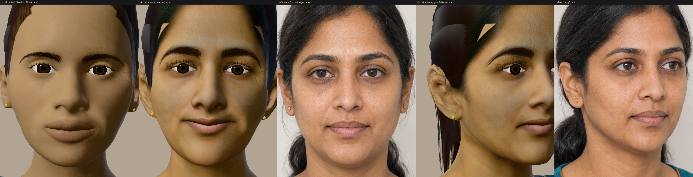

# Bakeoff: ai-portrait-wrap (identity and detail from AI portraits, rig from our pipeline)

Date 2026-10-03. Look built: **teal** (the TEACHER-VISUAL §4.3 row 1 design; warm Indian woman teacher, owner target
mid-30s, MST 6). slate and plum were **not** built. Tags: **[M]** measured here, **[U]** judgement.

## Verdict

It is the first version of this teacher that looks like a specific person and not a stock CG face. Two things do it:
the face shape now follows the reference (frontal landmark error 2.03% → 0.96% of the eye-corner distance [M]), and the
skin, brows, lips and ears are projected from the reference images instead of made from procedural noise. All the
build-time gates still pass on the spec's own numbers (G1-G5, G9, budgets), and the rig, keys and runtime contract are
unchanged.

**It does not fully get away from the generic look.** The hair is still MakeHuman's card helmet, with a light
skin-coloured wedge at the parting that I could not remove. The garment is still offset-skin shells. The eyes still read
as CG: the sclera is bright, the iris looks small and the lid has no shadow. The emotion self-check rose from 43% to 57%
under the same protocol, but it is still below the 70% bar: encouraging and delighted are read as warm 6 out of 6 times.
So the face is no longer the main problem. Hair, eyes and garments are what now look generic, and this approach does
nothing for them.

## What was done

| step | how | evidence |
|---|---|---|
| 1 reference set | `taxila-image` (gpt-image-2) via the Azure v1 endpoint. The front view is generated from a text prompt and each other view is an `images/edits` of that front ("the same woman"). This keeps the identity consistent across views [M: the bundle adjustment below reprojects every neutral view within 0.6-1.0% IOD]. Views: front, front_smile, q3_left, q3_right, profile_left, q3_left_smile, at 1024x1536, quality high | `art/character/bakeoff/ai-portrait-wrap/refs/teal/*.png`, prompts in `refs.json` |
| 2 shape reconstruction | **Fallback path.** No GPU was available (see Azure below). MediaPipe Face Landmarker (Apache-2.0) finds 478 landmarks per view. An orthographic bundle adjustment (`recon.py`) then solves the 468 3D landmarks and the per-view cameras. Face-contour points constrain the frontal view only, the far half of turned views is dropped, and MediaPipe's own depth is a weak prior | `refs/teal/recon.json`: reprojection rms front 2.56 px, q3_left 1.76, q3_right 2.63, profile 5.14 px (yaw 0 / 19 / 22 / 68°) |
| correspondence | MediaPipe is run on a neutral render of the current pipeline teal. A ray is cast for each landmark pixel, and each hit is snapped onto `base.blend` as 3 MakeHuman vertex ids plus barycentric weights. Because this is topology-level, it holds for any identity built on the MPFB base | `corr.json`: 468 of 468 mapped, surface distance p99 0.058 mm [M] |
| 3 wrap | `wrap.py`, called by one hook in a fork of `build_look.py` right after the identity sculpt and **before** the head scale, face units, visemes, proxies, correctives and lip seal. All 82 keys are then built by the pipeline itself on the wrapped basis (delta transfer with no frame rotation). The target is a similarity-aligned thin-plate RBF through the landmarks. Contour points move in the frontal plane only. The field tapers with distance from the landmarks and below the jaw, and is symmetrised on the pipeline's topological mirror (keepAsym 0) | `reports/teal.json` → `wrap` |
| closed-loop fit | `fitloop.py` renders the build, runs MediaPipe on the render, and feeds the 2D error back into the wrap targets as a per-landmark correction (front view: x and z; yaw-24 view: depth). Step 0.6, 3 iterations | `refs/teal/fitloop.json`: front interior NME 1.97 → 1.09 → 0.81 → 0.72% |
| resting lid | a second hook. 0.35 × eyeBlink is baked into the basis and every key, on skin only, and eyeBlink is shortened by the same amount, so a blink of 1 still lands on the closed lid | eye opening 0.140 → 0.114 IOD (reference 0.110) [M]; G4 still 0% |
| 4 projection + bake | `project.py`, one hook in a fork of `texture.py`. Per view: an affine camera from our landmark points to the image landmarks, plus a TPS residual warp; a z-buffer of our own face for visibility; (n·v)² facing weight; a skin/face mask with the eye openings removed; hair pixels allowed on scalp texels; each view also sampled at the mirrored texel at half weight. De-light: divide by the masked low-pass skin luminance (σ = 0.12 IOD) and clamp speculars above p97. **G9 anchor**: the projected albedo is scaled per channel so its mean over the G9 patches equals the procedural MST-anchored albedo, then `g9.mjs --solve` was re-run. Normal detail comes from the de-lit image's fine high-pass luminance, through the pipeline's `normal_from` | `reports/teal.json` → `projection`: 73.3% of skin texels at alpha > 0.5. Affine rms 2.1-2.7% IOD; the profile is poor at 13% IOD (weight 0.2) |
| budgets | photo detail does not compress like procedural noise (H 7.43 MB, B+ 2.35 MB at the pipeline's settings [M]). In a fork of `finish.mjs` the face albedo and normal take UASTC RDO 3, and on H they are 1536² instead of 2048². That is still above the source resolution: the reference face is 472 px wide and the 1536 face chart is about 680 px | `tiers` in `reports/teal.json` |

Everything else is the pipeline's own code: shaders, rig, presets, the renderer, gates and the `src/avatar` driver stack.
The forks are generated by `fork.mjs` through explicit string replacement, so only paths and the hooks differ, and every
fork names its source.

## Gates and numbers (teal, final asset)

| gate | bar | pipeline teal (iteration 2) | **ai-portrait-wrap teal** |
|---|---|---|---|
| G1 names (H) | 82/82 | 82/82 | **82/82** |
| G2 bounded, finite, non-empty | all | pass | **pass** |
| G3 mirror (max over L/R pairs) | ≤ 0.5 mm | 0.16 | **0.15** |
| G4 lid seal at blink (also + lookDown / squint + correctives) | 0% | 0 / 0 / 0 | **0 / 0 / 0** |
| G5 lip gap p95 (rest / PP / jaw 0.3 + close 0.3) | ≤ 0.3 mm | 0.21 / 0.16 / 0.20 | **0.25 / 0.24 / 0.25**, aperture 0 / 0 / 0, pass |
| G6 tooth/tongue vertices outside the lips (300 sampled; rest → worst viseme) | no increase | 3 → 4 | **4 → 12 (fails the "no increase" reading)**: the thinner reference lips show more teeth |
| lid vertices inside the eyeball, increase over rest (worst) | 0 | +12 | **+11** (lookDown) |
| G9 rendered skin vs MST 6 (L\* / C\*) | ±3 / ±4 | 54.8 / 27.8 | **54.8 / 27.9** (dL −0.3, dC 0.0), pass |
| teeth L\* p90 at jaw 0.3 | ≤ 80 | 43 | **12** (darker: the teeth sit deeper behind the thinner lips) |
| garment penetration (inner outside outer) | 0 | 21 | **27** |
| bilabial closure in the clip (visemes / RMS arm) | ≥ 90% | 9/9 · 1/9 | **9/9 · 1/9** |
| H bytes / tris / draws (≤ 6 MB / 45k / 8) | | 5.93 MB / 23840 / 5 | **5.77 MB / 23849 / 5** |
| B+ (≤ 2.2 MB / 18k / 5) | | 1.92 MB / 16960 / 5 | **2.17 MB / 16980 / 5** (0.03 MB margin) |
| B-lite | | 0.77 MB | **0.83 MB** |
| morph targets H / B+ | 82 / 58 | 82 / 58 | **82 / 58** |

Frame cost: tris and draws are the same as the pipeline, so cost should be the same too. The host was loaded (loadavg
5-10 on 4 vCPU while other work ran), and back-to-back runs on that host measured pipeline teal at H 279-380, B+
211-217, B-lite 62-70 ms, and this bakeoff at H 202-400, B+ 123-160, B-lite 33-37 ms (p50, 3 × 90 frames). That is
noise, not a difference [M, `renders/measure-pipeline-teal-same-host.json` vs `renders/measure-2026-10-03.json`].

### Likeness to the reference (MediaPipe on neutral renders vs on the portraits, 2D similarity-aligned, NME in % of the eye-corner distance)

| view | pipeline teal: interior / contour | **ai-portrait-wrap: interior / contour** | note |
|---|---|---|---|
| front (yaw 0) | 2.03 / 6.94 | **0.96 / 2.11** | the closed loop is fitted on this view, so it is not held out |
| q3_left (render yaw 24) | 3.73 / 8.74 | **3.33 / 7.06** | used for the depth term of the loop |
| q3_right (render yaw 27, **held out**) | 4.07 / 9.79 | **3.69 / 6.66** | small gain only |

Proportions, reference → after (pipeline before): face width 1.518 → 1.489 (1.531); nose-to-chin 0.815 → 0.786
(0.756); mouth width 0.580 → 0.575 (0.577); brow-to-eye 0.232 → 0.245 (0.184); eye opening 0.110 → 0.114 (0.130).
**Caveat:** in the turned views the nose-to-chin ratio comes out 1.01-1.03 against 0.85-0.90 on the references, so the
lower face reads too long, or the pitch is off, at 3/4. The depth term of the loop is weak (yaw 24°, divided by
sin 24°), and the profile view could not be used (its affine fit is 13% IOD). The likeness is good from the front only.
The source is `art/character/bakeoff/ai-portrait-wrap/reports/likeness.json`.

### Emotion self-check (`emotion-check.mjs`, taxila-brain vision, blind forced choice of 9, n = 6 per emotion, one look)

| | warm | encouraging | curious | thinking | listening | concerned | delighted | playful | surprised | overall |
|---|---|---|---|---|---|---|---|---|---|---|
| pipeline teal, same protocol, same day | 67 | 0 | 33 | 100 | 83 | 0 | 0 | 0 | 100 | **43%** |
| **ai-portrait-wrap teal** | 100 | 0 | 17 | 100 | 17 | 100 | 0 | 83 | 100 | **57%** |

5 of 9 emotions now reach the 70% bar, against 3 of 9 before. Encouraging and delighted are still read as warm 6 out of
6 times, so they are not fixed. The presets are shared with the pipeline, so this is CHARACTER-PIPELINE §10 item 1 and
not something the face can solve. Listening fell (83 → 17, read as curious or playful). This is a proxy with n = 6:
it can flag a pooled pair but cannot pass a child panel [U].

## Evidence (all under `docs/design/teacher/bakeoff/ai-portrait-wrap/renders/`)

- `before-after.png`: pipeline warm | bakeoff warm | reference front | bakeoff yaw 24 | reference q3
- `teal/contact.png`: the standard sheet (turntable, 9 emotions, 7 states, 15 visemes + 3 tongue keys, tiers, lip-sync strip)
- `teal/emotions/*.png`, `teal/states/*.png`, `teal/visemes/*.png`, `teal/turntable/*.png`, `teal/turntable.mp4`
- `teal/lipsync.mp4` (forced-aligned visemes, the same TTS sentence `renders/audio/teal.mp3`) and `teal/lipsync-rms.mp4` (M0 driver)
- `teal/tier_{H,Bplus,Blite}.png`, `teal/render.json`, `measure-2026-10-03.json`, `emotion-check.json`, `emotion-check-baseline-pipeline-teal.json`
- Assets: `public/assets/teacher-bakeoff/ai-portrait-wrap/teal/{H,Bplus,Blite}.glb`, `runtime.json` (same schema, written by the forked `runtime-json.mjs`), `plate/*` (tier D)
- Sources and records: `art/character/bakeoff/ai-portrait-wrap/{looks/teal.json, refs/teal/*, corr.json, mp_regions.json, reports/{teal,likeness,g9-solve}.json}`
- Scripts: `scripts/character/bakeoff/ai-portrait-wrap/` (`run.mjs` is the order the steps were run in; `gen-refs.mjs`, `landmarks.py`, `recon.py`, `shoot.mjs`, `corr.py`, `wrap.py`, `fitloop.py`, `project.py`, `likeness.py`, `fork.mjs` → `fork/`)

## Defects visible in the renders [U, my read of the sheets]

1. **The light wedge at the hair parting.** It is part of the face mesh: it stays when the hair cards are hidden. It
   survived two fixes, a hair-pixel mask on scalp texels and a hair zone above the forehead landmark. Not resolved. It is
   the first thing a viewer sees above the face.
2. **Eyes.** The opening now matches the reference, but the sclera is still bright and there is no lid shadow on the
   eyeball, so the eyes read as CG next to a photographic skin. The fix is in `shaders.js` (lid-occlusion term, sclera
   tint), which is shared and was not changed here.
3. **Brows on H look drawn on.** The H brow cards lie over brows that are already projected from the reference. B+
   (projected brows, no cards) looks more natural. The H brow cards should be dropped or thinned for this approach.
4. **Colour reads olive-grey next to the reference.** The reference renders lighter than MST 6 (cheek about sRGB
   218/163/130: the generator drifted light despite "MST 6"). G9 correctly pulls the result back to the MST 6 band
   under the stage rig, and the rig's solved gain is blue-heavy (1.16, 1.29, 1.56). The colour is right by the gate. The
   warmth is lost in the light rig, not in the asset.
5. **Lips.** The upper-lip line projects as a dark edge, and the lower lip as a pink highlight, in the viseme row (baked
   shading from the reference). The de-light removes only low frequencies.
6. **Forehead creases** appear on brow raises (encouraging, surprised), because `ageYears` 35 turns on the static
   wrinkle term. Mid-30s is the owner target, but the creases may be stronger than this face carries.
7. **B-lite** shows a pale patch on the right cheek (ETC1S on photo detail).
8. **Turned views**: the lower face is too long at 3/4 (see Likeness), and the profile was barely used.

## Azure GPU, TRELLIS / TripoSR, licences

- **No GPU could be created inside `rg-raghavsharma1729-7190`** [M, 2026-10-03, SP from `.env.local`]: the subscription
  (Sponsored) has `Microsoft.Compute` **NotRegistered**, so VM quota usages return empty; Container Apps reports
  `SubscriptionDedicatedNCA100Gpus 0/0`. Registering a resource provider is a subscription-scope change, outside the
  RG-only remit, so I did not do it. Nothing was created, so there was nothing to delete.
- **TRELLIS** (MIT) needs a CUDA GPU. **TripoSR** (MIT) could run on CPU (torch-cpu is installed), but it needs about
  2.5 GB of weights and dependencies on a disk with 3-6 GB free, and its single-image 256³ output has less face
  detail than the landmark fit. **Not run, so its value here is not measured** [U]. **Hunyuan3D-2**: not used (licence
  note in `art/character/LICENSES.md`).
- Licences: `art/character/LICENSES.md` § "Bakeoff ai-portrait-wrap". The new inputs are the generated portraits
  (Azure grant; output owned by the customer; not a photo of a real person) and MediaPipe (Apache-2.0, build time
  only). Open risk [U]: a generated face can resemble a real person by chance. A likeness and reverse-image review
  before anything ships is owed.
- No names: nodes, meshes, materials and files carry only part names and the look id `teal`.

## Two findings for the main pipeline (measured here; nothing outside the bakeoff folders was changed)

1. **The resting-smile bake has no effect.** `build_look.py` writes `faceStyle.restSmile` into the shape-key Basis and
   every key, but not into the mesh vertices. A later Blender operation re-bases every key on the mesh, which undoes it.
   Measured: two teal builds with restSmile 0.03 and 0 have identical bases (0.000 mm max difference in the Basis key and
   the mesh). So CHARACTER-PIPELINE §2.3's "resting smile baked into the basis per look (plum 0.05 so its neutral no
   longer reads stern)" is not true of the shipped assets. Fix: `h.data.vertices.foreach_set("co", key_co(_kbs[0]).ravel())`
   after the bake (the bakeoff fork does this). My resting-lid hook hit the same trap first: a Basis-only edit shortened
   eyeBlink and failed G4 with 14% escape.
2. **`keys.expression_correctives` needs a symmetric basis.** It takes the mouth corner as the extreme-x lip vertex on
   each side. An unsymmetrised wrap moved that choice onto different topological vertices per side, and G3 went to
   6.6-7.0 mm on mouthSmile [M]. Any future identity fit (the §10.5 reference fit included) should symmetrise its field
   on the topological mirror, as `wrap.py` does, or pick the corner by vertex id.

## Rejected inside this run (each a measured break)

- **Exact thin-plate interpolation through all 468 landmarks**: 249 face triangles turned more than 60°, which showed as
  visible folds at the mouth corners and jowls. Uniform smoothing 1e-2 gave 0 such triangles, and 0 above 35°. Tighter
  pinning of eyes, lips and brows (3e-4) brought back 266 triangles above 35°.
- **An open-loop wrap only**: MediaPipe places landmarks differently on a CG render than on a photo, so the open loop
  left the eye opening at 0.143 against 0.110 and a front NME of 1.97%. The closed loop fixed both.
- **Pairing L/R landmarks by mirrored nearest neighbour** to symmetrise: p95 twin mismatch was 4.4 mm and G3 still
  failed. Symmetrising the vertex field on the topological mirror works (G3 0.04-0.15 mm).
- **The pipeline's map sizes for photo-derived maps**: H 7.43 MB and B+ 2.35 MB. RDO 3 alone gave 6.88 MB. 1536² face
  maps on H got it to 5.77 MB.
- **A border-colour background mask (distance 0.06)** missed the backdrop gradient. Replaced by a brightness and
  low-saturation mask, which did not fix the wedge (defect 1).

## If this approach continues (in payoff order) [U]

1. Fix the parting wedge first. Find which scalp texels or faces it is (render the face mesh's UV-island ids) and give
   them hair albedo, or pull those vertices under the cards.
2. An eye pass in `shaders.js`: lid occlusion and a sclera tint sampled from the reference's sclera. Drop or thin the H
   brow cards when brows are projected.
3. Generate references that hold the light **and** the MST band: ask for MST 6 against a printed swatch, or solve the
   reference's own exposure to MST 6 before projection, so G9 does not have to fight the generator.
4. Better depth: generate a true 90° profile and a 45° view, and add a silhouette term to the loop.
5. The same reference set can drive hair (a strand-card groom fitted to the reference's silhouette) and the garment
   colours and weave. This bakeoff did neither, and they are now what looks generic.
6. slate and plum: the scripts take `--look`; about 1 h of compute per look on 4 vCPU (texture about 12 min per pass,
   two passes, render about 20 min).
